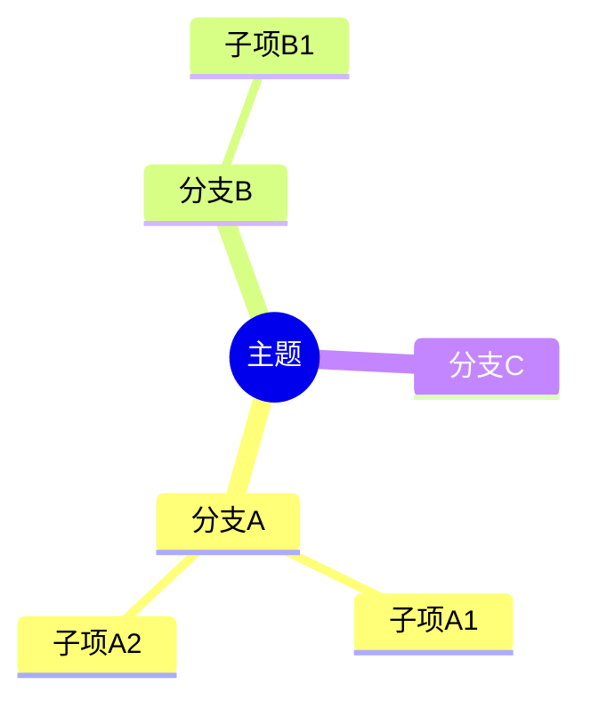
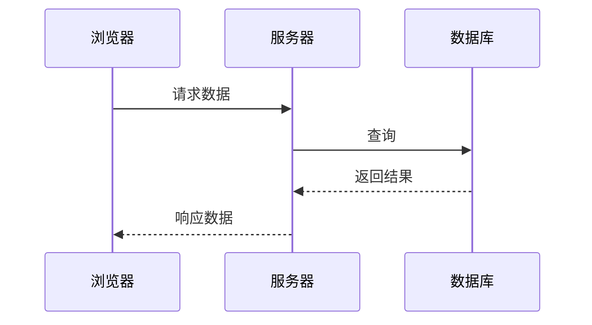
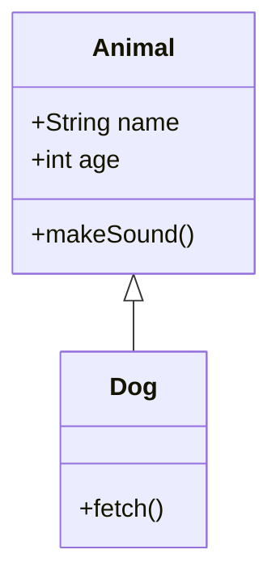
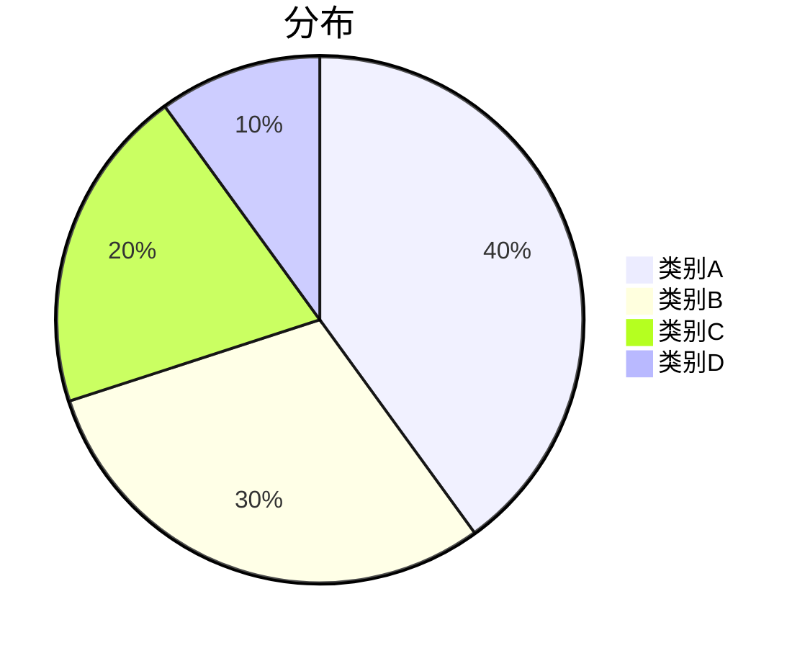
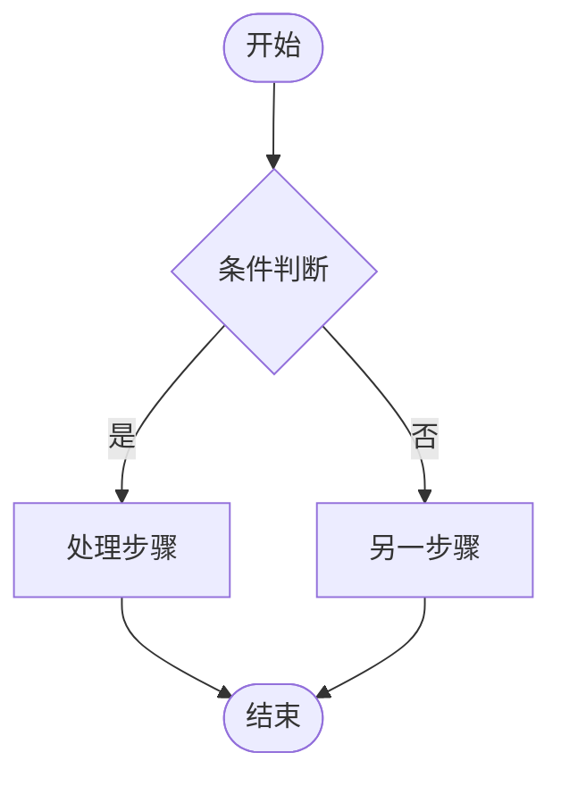
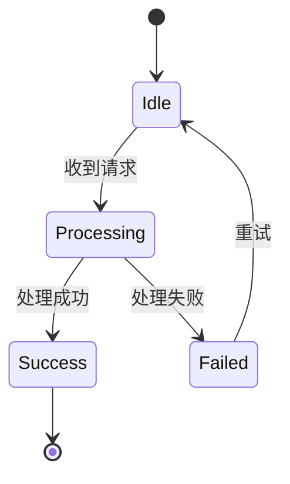

<a id="s-e0afe64ca7f20b4c"></a>

## SKILL.md


# whiteboard

## 执行约定

沿用当前连接的飞书工具。日常专用工具合适时直接使用；其他操作先 `feishu_search_tools`，再 `feishu_get_tool_schema`，按返回的 `call_with` 选择 `feishu_read_tool` 或 `feishu_call_tool`。宿主可能给工具添加连接器前缀，使用实际发现的名称。

先解析真实对象和操作范围；只在对象、范围或必要输入仍不明确时补充询问。用户的明确授权持续有效。读取或起草不自动授权发送、发布、删除或改变分享范围。

检查分页、截断和部分失败；写入超时先核对同一对象，保留已创建 ID，不盲目重试。返回结果必须区分已读取、已提交、任务处理中、已完成和未能验证。

业务参考中的命令名称、flag、脚本、路径和命令输出是来源协议示例，不是可直接执行的步骤。只复用其中的对象语义、字段约束、格式和恢复规则。先按工具合同转换 `path`、`params`、`data`；不要运行 CLI、安装 CLI、读取本机凭据、执行 shell 示例或把本机路径传给远端工具。参考中的默认发消息、强制新增流程、确认 gate 和身份切换不扩大用户请求。工具 schema 与本入口的执行约定优先于来源示例。

若当前连接没有某项工具，指出具体动作、缺少的接口/传输/身份或运行条件，保留可完成的部分。不能把工具目录、模拟结果或新建替代品说成原任务已完成。

## 任务流程

1. 先取得原画板 token，读取节点、文本、坐标、连接关系。空文档正文不代表嵌入画板为空。

2. 更新复用原 token 和节点 ID，保留其他节点；已有画板不得新建空板替代。写入前查当前目录是否包含节点 create/update/delete。

3. 当前连接若只有 board.v1.whiteboardNode.list，只能确认节点读取；说明缺失的写入动作，保留已准备好的变更，不能把读出内容称为已修改。

## 按需参考

- [工具与合同](lark-whiteboard-0.md#s-8a20ea95d15a91e9)：寻找领域内具体操作，参数以实时 schema 为准。
- [业务参考索引](lark-whiteboard-0.md#s-529ec0e6d465c27c)：需要复杂格式、对象关系或细节时读取相关章节，按执行约定转换其中的来源示例。

旧名或旧流程细节仍需要时，读取[兼容参考](lark-whiteboard-0.md#s-072d46ebd175734f)。


<a id="s-ea18fd1c68c2f7b2"></a>

## elements/connectors.md

> 业务协议参考。先按 SKILL.md 的执行约定选择实际 MCP 工具；命令行示例不执行。

# 连线系统

## 连线策略

| 连线数 | 策略 |
|--------|------|
| ≤8 | 逐条画 |
| 9-15 | 代表性连线（每层选 1-2 个节点连到下一层）|
| >15 | 层到层连线，或回退精简分组 |

一个节点有 3+ 条连线时：入线从 top，出线从 bottom，同侧多条线用不同方向分散。

---

## connector 必须放根 nodes 数组

```typescript
// 错误：connector 放在 frame children 里
{ type: 'frame', children: [
  { type: 'connector', ... }  // 会导致 Schema 报错或无法连线！
]}

// 正确：connector 放在根 nodes 数组
const doc: WBDocument = {
  version: 2,
  nodes: [
    { type: 'frame', id: 'box', ... },
    { type: 'connector', ... },  // 必须和顶层 frame 平级
  ],
};
```

---

## 箭头默认值

- `endArrow` 省略时默认为 `'arrow'`（即连线末端默认带箭头）。
- `startArrow` 省略时默认为 `'none'`（即连线起始端默认无箭头）。

---

## 连线技巧

```typescript
// 自动绕线（推荐）：仅需指定节点 id（引擎可自动推断最优出线方向），并使用 polyline 或 rightAngle 形状
// 只要不传 waypoints，引擎会尝试自动避开障碍物并生成折线。
{ type: 'connector', connector: {
  from: 'a', to: 'b', // fromAnchor 和 toAnchor 也可以省略，让引擎自己找最短路径
  lineShape: 'polyline', lineColor: '#000000', lineWidth: 2, endArrow: 'arrow' }}

// 精确坐标（做注解箭头）
{ type: 'connector', connector: {
  from: { x: 150, y: 200 }, to: 'b', toAnchor: 'left',
  lineShape: 'curve', lineColor: '#BBBFC4', lineWidth: 2,
  lineStyle: 'dashed', endArrow: 'triangle' }}

// 手动控制路径点 waypoints（仅在需要强制固定路线、或者自动路由不符合预期时使用）
// 注意：一旦提供了 waypoints，引擎将严格尊重这些点，不再进行自动避障。
{ type: 'connector', connector: {
  from: { x: 300, y: 140 }, to: { x: 300, y: 340 },
  waypoints: [{ x: 350, y: 140 }, { x: 350, y: 340 }],
  lineShape: 'polyline', lineColor: '#000000', lineWidth: 2, endArrow: 'arrow' }}

// 绘制坐标轴/数轴（必须使用 straight，防止刻度文字触发自动避障导致线条弯曲）
{ type: 'connector', connector: {
  from: { x: 100, y: 400 }, to: { x: 600, y: 400 },
  lineShape: 'straight', lineColor: '#000000', lineWidth: 2, endArrow: 'arrow' }}
```

> [!IMPORTANT]
> **1. 形状选用要求（核心）**，需明确 `lineShape` 类型：
> - **`'polyline'`（圆角折线）**：**默认首选**。适用于流程图、架构图等绝大多数场景。支持引擎的**自动绕线与避障**功能（只需指定 `from` 和 `to`）。
> - **`'rightAngle'`（直角折线）**：适用于明确要求“总线/直角规约”、树状层级严格对齐的场景，同样支持**自动绕线与避障**。
> - **`'straight'`（直线）**：不受自动避障机制的影响，适用于**坐标轴、数轴、几何图形边框、直接指向关系**等要求线条绝对笔直、不允许出现任何绕行或弯曲的场景。
> - **`'curve'`（曲线）**：适用于优雅的跨层连线（S型弯）、自由发散的脑图分支、或做注解箭头时。
> - **注意**：你需要根据当前绘制的图表类型和上下文语境，选择最合适的 `lineShape`。不要盲目全部使用 `polyline`，例如在绘制坐标系时必须主动切换为 `straight`。
> **2. 间距要求**：有 connector 连线的卡片间 gap 需 ≥ 40，否则箭头挤在缝里看不清。
> **3. 顶层约束**：`connector` 必须直接放在 `WBDocument.nodes`，**严禁**嵌套在 `children` 内。建议在数据末尾统一声明连线。
>
> [!TIP]
> **自动绕线 vs 手动控制**
> - **优先依赖自动绕线**：对于 `'polyline'` 和 `'rightAngle'`，引擎会自动规划路径并尝试避开障碍物（`fromAnchor` 和 `toAnchor` 也可省略，引擎会自动推断最优出线方向），这是最推荐的方式。
> - **何时手动算 waypoints**：**仅在必要时**（例如自动路由不符合预期，或者必须强制走特定形状绕开特定元素时），才需要通过 `waypoints` 手动接管坐标序列。
>
> **连线标签**
> - **连线文字说明**：需要文字说明时，可用 `label` 标注。

---

## 锚点方向规则

锚点（top/right/bottom/left）表示连线从节点的哪个边出发，方向含义与 CSS border 四边相同。

**注意：由于目前自动绕线功能支持省略锚点让引擎自动推断，以下规则主要适用于你想强制控制出线方向，或者使用直线/曲线时的场景。**

选择锚点时根据两个节点的相对位置：目标在下方用 `fromAnchor: 'bottom'` + `toAnchor: 'top'`，目标在右侧用 `fromAnchor: 'right'` + `toAnchor: 'left'`。如果手动指定了锚点，必须与节点的实际相对位置匹配，否则可能导致连线反向绕行。

**锚点绑定的常见范式**：
- **同层横向推进**（目标在正右）：`fromAnchor: "right"` -> `toAnchor: "left"`
- **垂直下沉推进**（目标在正下）：`fromAnchor: "bottom"` -> `toAnchor: "top"`
- **跨层斜切推进**（目标在左下或右下）：首选 **`fromAnchor: "bottom"` -> `toAnchor: "top"`**。由于线段自身带有重力倾向，从底部出线再弯曲进入下一层顶部，完美契合流水线的 S 型大弯，能画出最优雅顺滑的跨层曲线。**避免**使用左右锚点互相跨接。
- **逆流回捞**（底部发散回指顶部原点）：首选 **`fromAnchor: "top"` -> `toAnchor: "bottom"`** 配合 `lineStyle: "dashed"`。


<a id="s-60fd3932a882f6b5"></a>

## elements/content.md

> 业务协议参考。先按 SKILL.md 的执行约定选择实际 MCP 工具；命令行示例不执行。

# 内容规划

核心原则：**信息量匹配用户需求的详细程度。** 用户说"画一个简单架构图"就画简单的，说"画一个完整的微服务架构"才画复杂的。不要自作主张**过度展开**。

**用户 prompt 简短/模糊时**（如"画个漏斗图"、"画个架构图"），不要只输出字面内容。应适当补充该领域合理的内容

## 信息量参考

| 用户需求 | 合理的信息量 |
|---------|------------|
| "画一个简单的 XX 架构图" | 3 层，每层 2-3 节点，无侧边栏 |
| "画一个 XX 架构图"（普通请求） | 3-4 层，每层 3-4 节点 |
| "画一个完整/详细的 XX 架构图" | 4-5 层，每层 4-6 节点，可加侧边栏（侧边栏最多 2-3 项）|
| 流程图 | 6-10 步骤 + 1-2 个条件分支 |
| 对比表 | 4-6 个维度，每格 1-2 行说明 |
| 组织架构 | 3-4 层，每个父节点下 2-4 个子节点 |

**节点文字**：标题 + 简短说明（如"用户服务\n注册登录和权限管理"），不要写长段落。说明 12 字以内为佳。

## 分组

每组 2-5 个节点。超过 5 个拆成子组。

## 连线预判

| 连线数 | 策略 |
|--------|------|
| ≤8 | 逐条画 |
| 9-15 | 代表性连线 |
| >15 | 层到层，或回退精简 |

## 精简触发条件

布局放不下时才精简：

| 问题 | 精简方式 |
|------|---------|
| 节点文字放不下 | 缩短描述文字 |
| 一行节点超过 5 个 | 拆成两排或合并同类 |
| 连线交叉 | 减少连线数量 |


<a id="s-fa454434bc0f7c77"></a>

## elements/image.md

> 业务协议参考。先按 SKILL.md 的执行约定选择实际 MCP 工具；命令行示例不执行。

# 图片准备 (Image Preparation)

> 本文件说明如何在画板 DSL 中使用图片节点。进入任何含图片的场景前，必须先完成图片准备流程。

## 概述

画板 DSL 支持 `type: 'image'` 节点，但图片不能直接使用 URL 或其他域的 token，**必须先上传到目标画板获取 `whiteboard` 域 media token**，然后在 DSL 中引用。

**核心规则**：不管图片从哪来（本地文件、URL、文档中的 `docx_image` token、其他域的 Drive token），都必须通过 `docs +media-upload --parent-type whiteboard --parent-node <目标画板token>` 上传，拿到画板专属的 media token 后才能在 DSL 中使用。直接使用非 `whiteboard` 域的 token 会导致画板 API 报 500（错误码 2891001）或图片在文档中消失。

## Step 0：图片准备流程

### 1. 获取图片到本地

根据图片来源选择对应方式：

| 图片来源 | 获取方式 |
|---------|---------|
| 本地文件 | 直接使用 |
| 网络 URL | `curl -L -o photo.jpg "<URL>"` |
| 文档中的图片 token | `lark-cli docs +media-download --token <token> --output ./photo.png` |
| 其他域的 Drive token | `lark-cli docs +media-download --token <token> --output ./photo.png` |

**图片源选择（需要搜索图片时）**：

| 图片源类型 | 说明 |
|-------|------|
| 免费版权图库 | 支持按关键词搜索，图片无版权风险（CC0 或类似协议），图库种类丰富（人物/动物/风景/美食/建筑等），关键词能精准匹配图片内容 |
| 直接 URL | 用户提供或已知的图片链接，最可靠 |

**选择图库的必要条件**：
- **版权合规**：图片必须无版权纠纷风险，避免使用需要付费授权或有使用限制的图库
- **关键词搜索**：支持按关键词搜索并返回相关图片，确保图片内容与主题匹配
- **内容丰富**：图库图片种类多、数量大，能覆盖常见主题（宠物、美食、景点、产品等）

**严禁使用随机占位图服务**：某些图库仅提供随机占位图，URL 中的关键词参数不会影响返回的图片内容，下载的图片与主题完全无关。

### 2. 校验图片

```text
ls -l *.jpg   # 确认每张文件大小不同；若大小相同则内容可能重复，需重新下载
```

**图片内容审查（必须执行）**：
- 下载完成后，确认文件是真实图片而非 HTML 错误页：若某张图片大小 < 1KB，很可能是下载失败返回了 HTML 错误页，需重新下载
- **图片内容正确性只能在渲染后验证**：生成 DSL 并本地渲染 PNG 后，必须查看渲染结果，确认每张图片内容与主题相关（如宠物主题的图片确实是宠物，而非建筑/风景等不相关内容）
- 若发现图片内容与主题不符，必须用更精确的关键词重新下载并重新上传

### 3. 上传到目标画板

**必须**使用 `docs +media-upload --parent-type whiteboard` 上传：

```text
lark-cli docs +media-upload --file ./photo1.jpg --parent-type whiteboard --parent-node <whiteboard_token>
# 响应: { "file_token": "<media_token>", ... }
```

逐张上传，收集每个 media token：

```text
lark-cli docs +media-upload --file ./photo1.jpg --parent-type whiteboard --parent-node <whiteboard_token>  # → <media_token_1>
lark-cli docs +media-upload --file ./photo2.jpg --parent-type whiteboard --parent-node <whiteboard_token>  # → <media_token_2>
lark-cli docs +media-upload --file ./photo3.jpg --parent-type whiteboard --parent-node <whiteboard_token>  # → <media_token_3>
```

### 4. 在 DSL 中引用

```json
{ "type": "image", "id": "img-1", "width": 240, "height": 160, "image": { "src": "<media_token_1>" } }
```

## 常见错误

| 错误现象 | 原因 | 解决 |
|---------|------|------|
| 画板 API 返回 500（2891001） | 使用了非 `whiteboard` 域 token（如 `docx_image`、Drive file token） | 下载图片后用 `docs +media-upload --parent-type whiteboard` 重新上传 |
| 画板 API 返回 500 | 图片上传到了其他画板 | 重新上传到目标画板 |
| 画板在文档中图片消失 | 图片 token 的资源域与画板不匹配 | 确保图片通过 `--parent-type whiteboard --parent-node <画板token>` 上传 |
| 图片裂开/无法显示 | token 无效或已过期 | 重新上传获取新 token |
| 图片内容与主题无关 | 使用了随机占位图服务 | 改用免费版权图库服务 |


<a id="s-b965f93eeb968c1c"></a>

## elements/layout.md

> 业务协议参考。先按 SKILL.md 的执行约定选择实际 MCP 工具；命令行示例不执行。

# 布局系统

## 布局决策

> 不要靠关键词猜布局。先分析信息结构，再决定布局策略。
> 本文件负责说明通用布局原则与骨架模板；字段语义看 `elements/schema.md`，完整场景范式看各 `scenes/*.md`。

总原则：**先定主布局，再定子布局。**

**快速判断**：
- **Flex**：按层分、按区排
- **Dagre**：关系网密、流程链主导
- **绝对定位**：空间位置承载信息（地理方位、拓扑坐标、物理面板等），用脚本计算坐标
- **默认选择**：拿不准时优先用 **Flex**


**Dagre 版式统一原则**：
1. Dagre 解决的是**拓扑关系**，不是自动把画布铺满。
2. Dagre 作为子容器嵌套时，默认是不透明节点（Opaque Node），先根据内部拓扑计算自身包围盒，再作为原子节点参与父层布局。若需连线穿透边界，须声明 `layout: "dagre"` + `layoutOptions: { isCluster: true }`。
3. 混合布局时，Flex 更适合负责分区与层次，Dagre 更适合负责局部复杂关系；但如果 Dagre 本身就是主布局，也完全可以直接承担整张图的主体拓扑。
4. 选用 Dagre 前先看三件事：**最长链路方向、分支是否对称、是否有长回边/重试回路**。哪一项失衡，哪一项就会把包围盒撑歪。
5. 长回边、失败重试、跨层返回等关系，优先收敛到局部；必要时拆成局部流程区或旁路说明，不要让一条边把整个 Dagre 宽度拉爆。
6. 若 Dagre 产物在父容器中出现明显单侧留白、宽高失衡或内容只占很小一部分，必须调整 `rankdir`、重构拓扑，或在父层补充对称信息区，不能原样交付。

**读代码画架构图**：扫目录结构（按层分 → Flex；按功能模块分 → 看依赖方向）→ grep import（单向→Flex；网状→ Dagre 或 Flex + Dagre）→ 拿不准 → 默认 Flex。

> **flex 容器内的 `x/y` 会被完全忽略！**

❌ 致命错误：
```json
{ "type": "frame", "layout": "vertical", "children": [
  { "type": "rect", "x": 100, "y": 0, "text": "成都" },
  { "type": "rect", "x": 540, "y": 0, "text": "康定" }
]}
```
✅ 正确：用 `layout: "none"` 或放在顶层 nodes 用 x/y。

> **`layout: "none"`（绝对定位）的容器必须有明确的固定宽高！**

❌ 致命错误：
```json
{ "type": "frame", "layout": "none", "width": "fit-content", "height": "fit-content", "children": [
  { "type": "rect", "x": 0, "y": 0, "text": "区域A" },
  { "type": "rect", "x": 500, "y": 0, "text": "区域B" }
]}
```
✅ 正确：必须给绝对定位容器明确的固定宽高：
```json
{ "type": "frame", "layout": "none", "width": 1064, "height": 680, "children": [
  { "type": "rect", "x": 0, "y": 0, "text": "区域A" },
  { "type": "rect", "x": 554, "y": 0, "text": "区域B" }
]}
```

**构建方式**：

| 布局类型               | 做法                                                                          |
| ---------------------- | ----------------------------------------------------------------------------- |
| 纯 Flex / Dagre        | 直接写 JSON                                                                   |
| 混合布局 (Flex包Dagre) | 直接写 JSON（外层先做分区，局部复杂关系交给 Dagre；若被嵌套，默认为不透明节点） |
| 极度依赖几何坐标的图   | 写脚本生成 JSON（node xxx.cjs）                                                |
| 需要精确避让的特殊线   | 脚本 + `--layout` 两阶段                                                      |

---

## 网格方法论

核心理念：**先画网格，再填内容**。

先回答三个问题：
1. **信息分几行几列？** 每组一行或一列
2. **每格多大？** 等宽还是有主次？
3. **行列间距多大？** 分区间 24-32px，同区内 12-16px

---

## 布局模式选择

| 模式 | 适用场景                     | DSL 映射                                                 |
| ---- | ---------------------------- | -------------------------------------------------------- |
| grid | 架构图、对比表、卡片墙、看板 | vertical frame 嵌套 horizontal frame                     |
| flow | 复杂流程图、微服务交互       | `layout: "dagre"`，由引擎自动计算网状连线排版            |
| tree | 组织架构、模块依赖           | `layout: "dagre"` 配 `rankdir: "TB"` 或根节点居中的 Flex |
| free | 地理位置布局、物理面板还原   | `layout: "none"` + x/y                                   |

大多数图表用 grid 或 flow 模式。只有节点坐标本身有强语义（如地图）时才用 free。

> 以上都是布局策略名称，DSL 的 `layout` 属性值只支持 `'horizontal'`、`'vertical'`、`'none'`、`'dagre'` 四种。

---

## DSL 与 CSS Flexbox 属性映射

| DSL 属性                         | 对应的 CSS 心智模型                                | 限制                                                                       |
| -------------------------------- | -------------------------------------------------- | -------------------------------------------------------------------------- |
| `layout: 'horizontal'`           | `flex-direction: row`                              | 不写 layout = 绝对定位                                                     |
| `layout: 'vertical'`             | `flex-direction: column`                           | 同上                                                                       |
| `layout: 'none'`                 | `position: absolute`（子节点用 x/y）               | 子节点不能用 `fill-container`；容器必须有固定宽高                          |
| `layout: 'dagre'`                | 类似 Mermaid / DOT 的有向图布局                    | 宽高只支持 `fit-content`；先按拓扑算包围盒再参与父层布局；嵌套时默认为不透明节点 |
| `width/height: 'fill-container'` | `flex: 1`（主轴）/ `align-self: stretch`（交叉轴） | 祖先必须有确定尺寸                                                         |
| `width/height: 'fit-content'`    | `width/height: auto`                               | —                                                                          |
| `alignItems`                     | 同 CSS `align-items`                               | 仅 `'start'`/`'center'`/`'end'`/`'stretch'`（无 flex- 前缀）               |
| `justifyContent`                 | 同 CSS `justify-content`                           | 仅 `'start'`/`'center'`/`'end'`/`'space-between'`/`'space-around'`         |
| `gap`                            | 同 CSS `gap`                                       | 必须显式写（不写节点会粘连）                                               |
| `padding`                        | 同 CSS `padding`                                   | 必须显式写。支持 `number` / `[v,h]` / `[t,r,b,l]`                          |

`alignItems` 默认值为 `'start'`（CSS Flexbox 默认 `stretch`）。需要等高卡片时必须显式写 `alignItems: 'stretch'`。
DSL 的语法是严格白名单，不能写原生 CSS 属性（不支持 `alignSelf`、`flexWrap`、`margin` 等）。

---

## DSL 注意事项

1. **frame 必须写 layout 属性**，不写时子节点全堆在左上角。

2. **fill-container 死锁陷阱**：使用 `fill-container` 时，祖先链中必须有固定宽度（或高度），否则和 `fit-content` 形成死锁，尺寸退化为 0。
   错误示例：
   ```json
   { "type": "frame", "layout": "horizontal", "width": "fit-content", "children": [
     { "type": "rect", "width": "fill-container" }
   ]}
   ```
   正确示例：
   ```json
   { "type": "frame", "layout": "horizontal", "width": 1200, "children": [
     { "type": "rect", "width": "fill-container" }
   ]}
   ```
3. **不要给 Dagre 套固定宽高的外框**：Dagre 产物尺寸由拓扑决定，无法提前预知。父容器应使用 `fit-content` 自适应，或直接让 Dagre 作为顶层容器，不要用固定像素框住它。
4. **`layout: 'none'` 的容器必须有固定宽高**，不要写成 `fit-content`，否则子节点绝对定位容易错乱。
5. **含文字节点高度用 fit-content**，引擎不支持 overflow，写死高度会截断文字。
6. **Shape 节点有内边距**：rect/ellipse/diamond/triangle 各边 12px；cylinder 垂直 +42px。
7. **不支持 flex-wrap**，需要换行时用嵌套 frame 模拟。
8. **图层顺序**：数组中越靠后的节点层级越高。需要叠加标注时放在数组最后。

---

## 布局选择指南

| 你要表达的关系             | 怎么排                   | DSL 写法                                                                     |
| -------------------------- | ------------------------ | ---------------------------------------------------------------------------- |
| 先后顺序、层级从上到下     | 纵向堆叠                 | `layout: 'vertical'`                                                         |
| 并列、同等重要、可对比     | 横向等分                 | `layout: 'horizontal'` + `alignItems: 'stretch'` + `width: 'fill-container'` |
| 区域有名称，名称在侧边     | 侧标签 + 内容并排        | 横向 frame: [text(标签), frame(内容)]                                        |
| 多个大分区，各自独立       | 分区纵向排列             | 纵向 frame 包多个彩色 frame                                                  |
| 一行放不下，需要换行       | 嵌套横向 frame 模拟换行  | 纵向 frame 包多个横向 frame                                                  |
| 复杂的网状关系、拓扑图     | **Dagre 有向图自动布局** | `layout: 'dagre'` + `layoutOptions.edges`                                    |
| 节点位置本身有含义（地图） | 绝对定位                 | `layout: 'none'` + x/y                                                       |

这些可以自由嵌套组合。比如：纵向堆叠(标题) + 分区纵向排列(多个层) + 每个层内横向等分(节点)。

---

## 布局示例

### 纵向堆叠（标题 + 内容）

```json
{
  "type": "frame", "layout": "vertical", "gap": 28, "padding": 32,
  "width": 1200, "height": "fit-content",
  "children": [
    { "type": "text", "width": "fill-container", "height": "fit-content",
      "text": "图表标题", "fontSize": 24, "textAlign": "center" },
    ...内容...
  ]
}
```

### 横向等分（并列元素）

```json
{
  "type": "frame", "layout": "horizontal", "gap": 16, "padding": 0,
  "width": "fill-container", "height": "fit-content",
  "alignItems": "stretch",
  "children": [
    { "type": "rect", "width": "fill-container", "height": "fit-content",
      "textAlign": "center", "verticalAlign": "middle", "text": "A" },
    { "type": "rect", "width": "fill-container", "height": "fit-content",
      "textAlign": "center", "verticalAlign": "middle", "text": "B" }
  ]
}
```

`alignItems: 'stretch'` + `width: 'fill-container'` = 等宽等高。

### 侧标签 + 内容

```json
{
  "type": "frame", "layout": "horizontal", "gap": 24, "padding": 0,
  "width": "fill-container", "height": "fit-content",
  "alignItems": "center",
  "children": [
    { "type": "text", "width": 160, "height": "fit-content",
      "text": "区域名称", "fontSize": 20, "textColor": "#1F2329", "textAlign": "right" },
    { "type": "frame", "width": "fill-container", "height": "fit-content",
      ...区域内容...
    }
  ]
}
```

不要用 frame 的 `title` 属性做标签——渲染为极小标题栏，不可读。

### 分区纵向排列

把内容划分为几个大区域，每个区域用不同颜色区分（颜色从 style 文件的色板选取）：

```json
{
  "type": "frame", "layout": "vertical", "gap": 28, "padding": 0,
  "width": "fill-container", "height": "fit-content",
  "children": [
    { "type": "frame", "borderRadius": 8,
      "layout": "horizontal", "gap": 16, "padding": 20, ...区域1... },
    { "type": "frame", "borderRadius": 8,
      "layout": "horizontal", "gap": 16, "padding": 20, ...区域2... }
  ]
}
```

### 模拟换行

一行放不下时，拆成多个横向 frame：

```json
{
  "type": "frame", "layout": "vertical", "gap": 8, "padding": 0,
  "children": [
    { "type": "frame", "layout": "horizontal", "gap": 8, "padding": 0,
      "children": [item1, item2, item3, item4] },
    { "type": "frame", "layout": "horizontal", "gap": 8, "padding": 0,
      "children": [item5, item6] }
  ]
}
```

## 复杂拓扑混合布局 (Dagre + Flex)

当你在处理**连线众多、关系杂乱的拓扑图 / 链路流程图 / 复杂架构图**时，不用手动去算每个节点坐标，优先考虑 **Flex + Dagre 的混合布局策略**。这主要包含两种维度的嵌套：

* **外层 Dagre + 内层 Flex（复杂节点）**：**这是最推荐的复杂架构画法**。整图拓扑交由 `layout: "dagre"` 自动计算并顺滑布线，而图中的节点不再只是单调的矩形，可以是一个用 Flex 自由拼装的复杂 `frame` 卡片（包含图标、主次标题、状态等），让节点承载更丰富的信息。
* **外层 Flex + 内层 Dagre（局部流程）**：外层用 Flex 或绝对定位划分大的业务区域，而某个特定区域内部放入 `layout: "dagre"` 容器负责处理局部的业务流。
  * **嵌套前先做宽度预判**：Dagre 会根据拓扑尽情往两侧撑出包围盒。如果可能横跨导致溢出，优先改 `rankdir` 为 `TB`、缩短文案、调小 `nodesep/ranksep`，必要时将超长的链路拆成分步区。

```json
{
  "type": "frame", "id": "arch_root",
  "layout": "dagre", "padding": 40,
  "width": "fit-content", "height": "fit-content",
  "layoutOptions": {
    "rankdir": "LR", "nodesep": 60, "ranksep": 100,
    "edges": [
      ["client", "auth_svc", "request"],
      ["auth_svc", "order_svc"],
      ["order_svc", "order_db"]
    ]
  },
  "children": [
    {
      "type": "frame", "id": "client",
      "layout": "vertical", "gap": 6, "padding": [12, 16],
      "alignItems": "center",
      "fillColor": "#F8FAFC", "borderColor": "#CBD5E1", "borderWidth": 2, "borderRadius": 10,
      "children": [
        { "type": "text", "text": "Client App", "fontSize": 14, "textColor": "#0F172A" },
        { "type": "text", "text": "React 18", "fontSize": 10, "textColor": "#64748B" }
      ]
    },
    {
      "type": "frame", "id": "cluster_gateway",
      "layout": "dagre", "layoutOptions": { "isCluster": true, "clusterTitle": "Gateway Tier", "clusterTitleColor": "#15803D" },
      "fillColor": "#F0FDF4", "borderColor": "#86EFAC",
      "borderWidth": 2, "borderDash": "dashed", "borderRadius": 16,
      "children": [
        { "type": "rect", "id": "auth_svc", "width": 120, "height": 40, "text": "Auth Service", "fillColor": "#DCFCE7", "borderColor": "#86EFAC", "borderWidth": 1, "borderRadius": 6, "fontSize": 12 },
        { "type": "rect", "id": "order_svc", "width": 120, "height": 40, "text": "Order Service", "fillColor": "#DCFCE7", "borderColor": "#86EFAC", "borderWidth": 1, "borderRadius": 6, "fontSize": 12 }
      ]
    },
    {
      "type": "frame", "id": "order_db",
      "layout": "vertical", "gap": 4, "padding": [10, 14],
      "alignItems": "center",
      "fillColor": "#FFFFFF", "borderColor": "#FECACA", "borderWidth": 2, "borderRadius": 10,
      "children": [
        { "type": "cylinder", "width": 50, "height": 36, "fillColor": "#FCA5A5", "borderColor": "#DC2626", "borderWidth": 1 },
        { "type": "text", "text": "Order DB", "fontSize": 12, "textColor": "#7F1D1D" }
      ]
    }
  ]
}
```

**示例要点**：
- `client` 和 `order_db` 是 **Flex 复合节点**（不透明节点），内部用 vertical 布局组合多行信息，对外层 Dagre 是固定宽高的原子。
- `cluster_gateway` 是 **透明子图**（`layout: "dagre"` + `isCluster: true`），外部连线可穿越边界直达 `auth_svc` 和 `order_svc`。
- 所有 `edges` 统一写在最外层根 Dagre 的 `layoutOptions` 中。

**Dagre 嵌套排版规则**：

1. **不透明节点（Opaque Node）**：Dagre 内的子容器，无论其内部 layout 是 flex、absolute 还是 dagre，只要未声明 isCluster: true，对外层 Dagre 就是具有确定宽高的不透明原子节点。外层连线无法寻址其内部子节点。
2. **连线兜底重定向（Edge Redirect Fallback）**：当 edges 引用了某不透明节点内部的子节点 ID 时，引擎自动将该连线端点重定向至其最近的不透明祖先节点。不报错，不产生悬空连线。
3. **透明子图（Compound Cluster）**：子容器同时声明 `layout: "dagre"` 与 `layoutOptions: { isCluster: true }` 时，成为外层 Dagre 的复合子图。其内部子节点直接参与外层拓扑运算，连线可穿越子图边界。子图自身不执行独立排版，尺寸由外层 Dagre 根据内部节点包围盒自动撑开。

---

## 绝对定位

当节点位置本身有含义（拓扑图、地图、时间线轴）时用绝对定位。大多数图表优先用 Flex。

### 混合布局

模块内部用 Flex 自动排版，模块之间用绝对定位自由摆放。注意：承载这些模块的 `layout: "none"` 父容器必须先给出**固定宽高**，再在里面摆放子模块。

```json
{
  "type": "frame", "layout": "none", "width": 1200, "height": 800,
  "children": [
    {
      "type": "frame", "id": "module-a", "x": 100, "y": 100,
      "width": 300, "height": "fit-content",
      "layout": "vertical", "gap": 8, "padding": 16,
      "children": [
        { "type": "rect", "width": "fill-container", "height": "fit-content", "text": "内容1" },
        { "type": "rect", "width": "fill-container", "height": "fit-content", "text": "内容2" }
      ]
    }
  ]
}
```

### 两阶段绘图

先出骨架图导出坐标，再基于坐标补充连线和注解：

```text
npx -y @larksuite/whiteboard-cli@^0.2.13 -i skeleton.json -o step1.png -l coords.json
```

`coords.json` 包含每个带 id 节点的精确坐标（absX, absY, width, height）。

---

## 常用间距和尺寸

| 参数             | 常用范围    | 说明         |
| ---------------- | ----------- | ------------ |
| 整图宽度         | 1000-1400px | —            |
| 分区之间间距     | 24-32px     | —            |
| 同分区内节点间距 | 12-16px     | —            |
| 有连线的节点间距 | >= 40px     | 给箭头留空间 |
| 分区内边距       | 16-24px     | —            |
| 侧标签宽度       | 120-180px   | —            |

---

## 等大卡片

一排卡片需要等宽等高时，不要写固定像素：

```json
{
  "type": "frame", "layout": "horizontal", "gap": 16, "padding": 0,
  "alignItems": "stretch",
  "children": [
    { "type": "rect", "width": "fill-container", "height": "fit-content", "text": "A" },
    { "type": "rect", "width": "fill-container", "height": "fit-content", "text": "B" }
  ]
}
```

`alignItems: 'stretch'` + `width: 'fill-container'` = 等宽等高。


<a id="s-3cf888a652cae3e7"></a>

## elements/schema.md

> 业务协议参考。先按 SKILL.md 的执行约定选择实际 MCP 工具；命令行示例不执行。

# DSL Schema

> 本文件只说明 **DSL 里能写什么**：节点类型、字段、枚举值、硬约束。布局策略、组合方法、Dagre/Flex 心智模型统一放在 `elements/layout.md`。
> `?` 表示该字段在 schema 层是 optional；若需要稳定产出，再参考对应 scene 或 layout 文件中的最佳实践。

**📝 布局引擎核心法则**：
- **基本行为与 Flexbox 等同**：Frame 布局基于 Yoga 引擎。`layout: 'horizontal'` = `flex-direction: row`，`fill-container` = `flex: 1`，`fit-content` = `width: auto`，`gap` / `padding` / `alignItems` / `justifyContent` 语义相同。
- **枚举值无 flex- 前缀**：一律使用 `'start'` / `'end'` 而非原生 CSS 的 `'flex-start'` / `'flex-end'`。
- **默认对齐的差异**：`alignItems` 的默认值是 `'start'`（原生 CSS 默认是 `stretch`）。所以同排卡片需要等高时，**必须显式声名** `alignItems: 'stretch'`。
- **Dagre 引擎的特殊性**：`layout: 'dagre'` 作为专属拓扑连线引擎，自身不支持 `fill-container` 宽高，对其父容器而言，它是一个自适应（打包裹）的黑盒。

## WBDocument

```typescript
interface WBDocument {
  version: 2;
  nodes: WBNode[];   // 顶层节点。connector 必须放在这里，不能嵌套在 children 中
}
```

## 节点类型

### Frame（容器）

唯一可以包含子节点的类型。用于分组、布局、背景。

```typescript
{
  type: 'frame';
  id?: string;
  x?: number; y?: number;       // Flex 子节点不需要 x/y
  width: WBSizeValue;
  height: WBSizeValue;
  layout: 'horizontal' | 'vertical' | 'none' | 'dagre';  // 布局模式
  gap: number;                    // 必须显式写（不写节点会粘连，容易出 bug）
  padding: number | [number, number] | [number, number, number, number]; // 必须显式写（不写内容贴边）
  justifyContent?: 'start' | 'center' | 'end' | 'space-between' | 'space-around';
  alignItems?: 'start' | 'center' | 'end' | 'stretch';
  layoutOptions?: {                 // 仅当 layout 为 'dagre' 时生效
    rankdir?: 'TB' | 'BT' | 'LR' | 'RL';
    nodesep?: number;
    edgesep?: number;
    ranksep?: number;
    edges?: Array<[string, string] | [string, string, string]>; // [fromId, toId, label?] 引擎自动排版子节点并生成贝塞尔曲线连线
    isCluster?: boolean;            // 透明子图。为 true 时子节点参与父级 Dagre 拓扑运算，连线可穿越边界
    clusterTitle?: string;          // 子图悬浮标题（自动吸附左上角）
    clusterTitleColor?: string;     // 标题颜色 (HEX格式，如 "#8B5CF6")
  };
  fillColor?: string;
  borderColor?: string;
  borderWidth?: number;
  borderDash?: 'solid' | 'dashed' | 'dotted';
  borderRadius?: number;
  children?: WBNode[];           // 不能包含 connector
}
```

**Dagre 嵌套排版规则**：

1. **不透明节点（Opaque Node）**：Dagre 内的子容器，无论 `layout` 是 `flex`、`absolute` 还是 `dagre`，只要未声明 `isCluster: true`，对外层 Dagre 就是具有确定宽高的不透明原子节点。外层连线无法寻址其内部子节点。
2. **连线兜底重定向（Edge Redirect Fallback）**：当 `edges` 引用了某不透明节点内部的子节点 ID 时，引擎自动将该连线端点重定向至其最近的不透明祖先节点。不报错，不产生悬空连线。
3. **透明子图（Compound Cluster）**：子容器同时声明 `layout: "dagre"` 与 `layoutOptions: { isCluster: true }` 时，成为外层 Dagre 的复合子图。其内部子节点直接参与外层拓扑运算，连线可穿越子图边界。子图自身不执行独立排版，尺寸由外层 Dagre 根据内部节点包围盒自动撑开。

**isCluster 最小用法**：
```json
{
  "type": "frame", "id": "cluster_a",
  "layout": "dagre", "layoutOptions": { "isCluster": true },
  "fillColor": "#F0FDF4", "borderColor": "#86EFAC", "borderWidth": 2, "borderDash": "dashed", "borderRadius": 16,
  "children": [
    { "type": "text", "text": "区域标题", "fontSize": 11, "textColor": "#15803D" },
    { "type": "rect", "id": "node_inside", "width": 120, "height": 40, "text": "内部节点" }
  ]
}
```
> 注意：`edges` 必须写在**最外层的根 Dagre** 的 `layoutOptions` 中，不要写在 cluster 内部。
**其他约束**：
- `layout / gap / padding` 在 schema 层是 optional，但实际生成时推荐显式写出，避免依赖默认行为。
- `layoutOptions` 仅在 `layout: 'dagre'` 时生效。
- `children` 里不能出现 `connector`。

> **虚拟 frame 陷阱**：没有 `fillColor`、`borderColor`、`borderWidth` 的 frame 在编译时可能被当作纯布局容器跳过（子节点直接提升到父级）。如果给这种 frame 设了 `id` 并让外部 connector 连接它，编译后 frame 消失，connector 引用会失效。需要保留这个 frame 时，请给它加上不会被优化掉的外观属性。

### 基础图形

```typescript
{
  type: 'rect' | 'ellipse' | 'cylinder' | 'diamond' | 'triangle' | 'trapezoid';
  id?: string;
  x?: number; y?: number;
  opacity?: number;              // 0-1，仅影响 fillColor 的透明度（对 frame/text/stickyNote 无效）
  vFlip?: boolean;
  hFlip?: boolean;
  width: WBSizeValue;
  height: WBSizeValue;
  fillColor?: string;
  borderColor?: string;
  borderWidth?: number;
  borderDash?: 'solid' | 'dashed' | 'dotted';
  borderRadius?: number;
  topWidth?: number;             // 仅对 triangle / trapezoid 有效，梯形顶边宽度或三角形顶角截断宽度
  text?: string | WBTextRun[];   // 纯文本或富文本
  fontSize?: number;
  textColor?: string;
  textAlign?: 'left' | 'center' | 'right';     // Shape 默认 'center'（与 CSS 不同）
  verticalAlign?: 'top' | 'middle' | 'bottom';  // Shape 默认 'middle'（与 CSS 不同）
}
```

> **cylinder 约束**：cylinder 的弧度固定 16px，不随宽度缩放。宽度过大会变成扁椭圆。禁止 `width: "fill-container"`，必须用固定宽度 + `height: "fit-content"`。宽度根据文字长度选择，通常 120-200px。

> **Shape 内边距（TEXT_INSET）**：Shape 节点有强制内边距，fit-content 会自动补偿。
> - rect / ellipse / diamond / triangle：上下左右各 12px
> - cylinder：顶部弧形 32px + 底部弧形 10px（垂直 +42px），水平各 7px
>
> 需要手算固定尺寸时：`实际文字宽/高 + 对应 inset`。
> 例：rect 内 14px 字号两行文字高 ~32px → `height >= 32 + 24 = 56px`

### Image（图片节点）

图片节点用于在画板中展示图片。图片不能直接使用 URL，必须先上传到飞书获取 media token。

```typescript
{
  type: 'image';
  id?: string;
  x?: number; y?: number;
  width: WBSizeValue;           // 固定宽度，推荐 240 或 200
  height: WBSizeValue;          // 固定高度，推荐按 3:2 比例（如 240×160 或 200×133）
  image: {
    src: string;                // media token（通过 docs +media-upload --parent-type whiteboard 上传获取）
  };
}
```

> **关键约束**：
> - `image.src` 必须是通过 `docs +media-upload --parent-type whiteboard --parent-node <画板token>` 上传后返回的 **media token**，不能是 URL 或 Drive file token
> - 图片必须上传到**目标画板**，跨画板的 token 不可用
> - 同一画板内所有 image 节点应使用统一的 width/height，保持视觉一致
> - 图片宽高比推荐 3:2（如 240×160），避免变形
> - 详细上传流程见 [`elements/image.md`](lark-whiteboard-0.md#s-fa454434bc0f7c77)

### Text（纯文本节点）

```typescript
{
  type: 'text';
  id?: string;
  x?: number; y?: number;
  width: WBSizeValue;
  height: WBSizeValue;
  text?: string | WBTextRun[];
  fontSize?: number;
  textColor?: string;
  textAlign?: 'left' | 'center' | 'right';
  verticalAlign?: 'top' | 'middle' | 'bottom';
}
```

### StickyNote（便签）

```typescript
{
  type: 'stickyNote';
  id?: string;
  x?: number; y?: number;
  width: WBSizeValue;
  height: WBSizeValue;
  fillColor?: '#FEF1CE' | '#F5D1A7' | '#DFF5E5' | '#CDF7CC' | '#C9E8EF' | '#D6DCF3' | '#D3CCEE' | '#F1C5E7' | '#F6C8C8'; // 便签底色（仅支持这 9 种）
  text?: string | WBTextRun[];
  fontSize?: number;
  textColor?: string;
  textAlign?: 'left' | 'center' | 'right';
  verticalAlign?: 'top' | 'middle' | 'bottom';
}
```

### Connector（连线）

必须放在顶层 `nodes` 数组中，不能嵌套在 frame 的 `children` 里。

```typescript
{
  type: 'connector';
  id?: string;
  connector: {
    from: string | { x: number; y: number };   // 节点 id 或坐标
    to:   string | { x: number; y: number };
    fromAnchor?: 'top' | 'right' | 'bottom' | 'left';
    toAnchor?:   'top' | 'right' | 'bottom' | 'left';
    lineShape?:  'straight' | 'polyline' | 'curve' | 'rightAngle'; // 直线、圆角折线、曲线、直角折线
    lineColor?: string;
    lineWidth?: number;
    lineStyle?: 'solid' | 'dashed' | 'dotted';
    startArrow?: 'none' | 'arrow' | 'triangle' | 'circle' | 'diamond';
    endArrow?:   'none' | 'arrow' | 'triangle' | 'circle' | 'diamond';
    waypoints?: { x: number; y: number }[];  // polyline 途经点
    label?: string;                          // 连线中间的标签文字
    labelPosition?: number;                  // 标签位置，0-1，默认 0.5（中点）
  };
}
```

### SVG

```typescript
{
  type: 'svg';
  id?: string;
  x?: number; y?: number;
  opacity?: number;
  width: WBSizeValue;
  height: WBSizeValue;
  svg: { code: string };         // SVG 代码字符串
}
```

#### 渲染规范

SVG 通过 `image/svg+xml` Blob 加载到画布，**不在 HTML DOM 中**，因此存在严格限制：

**必须**：
- 包含 `viewBox` 属性（如 `viewBox="0 0 24 24"`），引擎依赖它确定坐标系
- 包含 `xmlns="http://www.w3.org/2000/svg"`（SVG 作为独立 `image/svg+xml` 解析时，XML 规范要求声明命名空间）

**允许的元素**（纯几何绘制）：
- 基本图形：`<rect>` `<circle>` `<ellipse>` `<line>` `<polyline>` `<polygon>` `<path>`
- 渐变/滤镜：`<defs>` `<linearGradient>` `<radialGradient>` `<filter>` `<feGaussianBlur>` `<feMerge>`
- 结构：`<g>` `<clipPath>` `<mask>` `<use>`

**禁止的元素**（字体和外部资源在 Blob 沙箱中无法加载）：
- `<text>` `<tspan>`（用同层 DSL rect 节点 + text 属性替代）
- `<image>`（用同层 DSL image 节点替代）
- `<foreignObject>`
- 任何引用外部 URL 的属性（`xlink:href` 指向远程资源等）

#### 两种典型用法

**1. 背景装饰 SVG**（大尺寸，与 frame 同大小）

用于绘制连线、曲线、发光效果等几何背景。文字信息通过同一 frame 内的 rect 节点叠加：

```json
{
  "type": "frame", "width": 1400, "height": 680, "layout": "none",
  "children": [
    { "type": "svg", "x": 0, "y": 0, "width": 1400, "height": 680,
      "svg": { "code": "<svg xmlns=\"http://www.w3.org/2000/svg\" viewBox=\"0 0 1400 680\" ...>...</svg>" } },
    { "type": "rect", "x": 100, "y": 50, "width": 200, "height": 40,
      "text": "Label", "fillColor": "transparent" }
  ]
}
```

**2. 内联图标 SVG**（24-48px，Feather/Lucide 风格）

用于卡片/按钮中的小图标，纯 stroke 线条：

```json
{ "type": "svg", "width": 32, "height": 32,
  "svg": { "code": "<svg xmlns=\"http://www.w3.org/2000/svg\" viewBox=\"0 0 24 24\" fill=\"none\" stroke=\"#3B82F6\" stroke-width=\"2\" stroke-linecap=\"round\" stroke-linejoin=\"round\"><circle cx=\"12\" cy=\"12\" r=\"10\"/><polyline points=\"12 6 12 12 16 14\"/></svg>" } }
```

### Icon（内置图标）

引用画板内置图标库的图标。比手写 SVG 更简单——只需指定 `name`。

```typescript
{
  type: 'icon';
  id?: string;
  x?: number; y?: number;
  width?: WBSizeValue;          // 默认 48
  height?: WBSizeValue;         // 默认 48，保持正方形
  name: string;                 // 图标名称，从 npx -y @larksuite/whiteboard-cli@^0.2.13 --icons 输出中选取
  color?: string;               // 可选颜色覆盖，hex 格式如 '#FF6600'
}
```

**获取可用图标**：规划好内容和布局后，运行以下命令查看所有可用图标名，从中选取：
```text
npx -y @larksuite/whiteboard-cli@^0.2.13 --icons
```

用法：
```json
{ "type": "icon", "id": "db", "name": "database", "width": 48, "height": 48 }
```

**使用建议**：
- 当图表中的节点代表具体事物（服务器、用户、数据库等）时，用图标比纯文字方块更直观
- 一张图 3-8 个图标为宜，为关键组件配图标，次要节点用普通形状
- 用 `color` 为图标指定合适的颜色, 比如与所在容器的配色一致
- 图标可放在 frame 子元素中参与 flex 布局，连线可通过 id 连接到图标
- 图标+文字组合：frame(vertical) 中放 icon + text，形成富组件

```json
{
  "type": "frame", "layout": "vertical", "gap": 8, "padding": 12,
  "alignItems": "center", "fillColor": "#F0F5FF", "borderColor": "#ADC6FF",
  "children": [
    { "type": "icon", "id": "db-icon", "name": "database", "width": 36, "height": 36 },
    { "type": "text", "text": "PostgreSQL", "fontSize": 12, "width": "fit-content", "height": "fit-content" }
  ]
}
```

---

## 富文本 WBTextRun

`text` 字段可以是纯字符串或 `WBTextRun[]` 数组。类似 HTML 内联样式：bold 对应 `<b>`，italic 对应 `<i>`，listType 对应 `<ol>/<ul>`。每个 run 是一段带样式的文字：

```typescript
interface WBTextRun {
  content: string;               // 文字内容，可含 \n 换行
  bold?: boolean;
  italic?: boolean;
  underline?: boolean;
  strikeThrough?: boolean;
  fontSize?: number;
  color?: string;                // 文字颜色
  backgroundColor?: string;     // 文字高亮背景
  hyperlink?: string;
  listType?: 'none' | 'ordered' | 'unordered';
  indent?: number;               // 缩进级数
  quote?: boolean;               // 引用块
}
```

示例：

```json
{
  "text": [
    { "content": "标题文字\n", "bold": true, "fontSize": 16 },
    { "content": "正文内容，", "fontSize": 14 },
    { "content": "高亮部分", "backgroundColor": "#FEF1CE", "fontSize": 14 }
  ]
}
```

`text` 和 `content` 中出现的双引号必须写成 `\"`，这是 JSON 规范要求。换行用 `\n`（JSON 中写为 `"第一行\n第二行"`，不要双重转义为 `\\n`）。

---

## 尺寸值 WBSizeValue

| 值                    | 含义                        | 注意                                   |
| --------------------- | --------------------------- | -------------------------------------- |
| `number`              | 固定像素                    | 任何场景                               |
| `'fit-content'`       | 由内容决定大小              | 父级需要 Flex 布局                     |
| `'fit-content(N)'`    | 同上，无内容时 fallback N   | 同上                                   |
| `'fill-container'`    | 填满父级剩余空间            | 父级需要 Flex 布局，且祖先链有固定宽度 |
| `'fill-container(N)'` | 同上，无 Flex 时 fallback N | —                                      |

`fill-container` 在 `layout: 'none'`（绝对定位）下无效。`fit-content` 仍可用于含文字节点（引擎通过 Yoga measureFunc 测量文字尺寸）。


<a id="s-5ee24eec3018135b"></a>

## elements/style.md

> 业务协议参考。先按 SKILL.md 的执行约定选择实际 MCP 工具；命令行示例不执行。

# 配色系统

## 怎么上色（最重要）

上色步骤：

1. **找出图中有几个分组**（层级、分支、类别、阶段...）
2. **为每个分组选一种不同颜色**（从色板中选 2-4 种颜色）
3. **分组容器**用浅色填充 — 告诉读者"这块是一个整体"
4. **分组内节点**用白色填充 + 该分组的深色 borderColor — 告诉读者"这些属于这个分组"

具体映射（经典色板）：

| 分组 | 层容器 fillColor | 层容器 borderColor | 内部节点 borderColor |
|------|----------------|-------------------|---------------------|
| 第 1 组 | #F0F4FC（浅蓝） | #5178C6 | #5178C6 |
| 第 2 组 | #EAE2FE（浅紫） | #8569CB | #8569CB |
| 第 3 组 | #DFF5E5（浅绿） | #509863 | #509863 |
| 第 4 组 | #FEF1CE（浅黄） | #D4B45B | #D4B45B |
| 第 5 组 | #FEE3E2（浅红） | #D25D5A | #D25D5A |
| 内部节点 | #FFFFFF | 跟随所属分组 | — |

**各类图表怎么上色**：
- 架构图有 3 层 → 每层一种颜色，层背景浅色填充，层内节点白色+深色边框
- 对比表有 3 列 → 每列表头一种颜色，该列数据单元格用同色边框
- 组织架构有 4 个部门 → 每个部门一种颜色，子部门白色+同色边框
- 流程图 → 起止节点一种颜色，判断节点一种颜色，步骤节点白色

> [!IMPORTANT]
> **用户配色优先。** 用户指定了色值/风格时以用户为准。用户只给 1-2 个色值时，推导完整色板：主色→浅底→深边框→灰调连线色。
> 用户**未指定**配色时，必须从上方色板表中选取颜色，不要使用表中没有的自创色值（如 `#E8F3FF`、`#1664FF`、`#14C9C9` 等都不在色板中）。

---

## 结构规则

### 分组 — 不同层/分组必须用不同颜色

选 2-4 种颜色，每种代表一个分组。同组节点视觉完全一致（fillColor、borderColor 相同）。

### 分层 — 外重内轻

- 外层（大分区）：浅色填充背景
- 内层（具体节点）：白色填充 + 分组色边框

### 清晰

- 所有节点有边框（borderWidth=2）
- 间距不粘连（gap >= 8，有连线时 >= 40）
- 文字在背景上清晰可读（fontSize >= 14）。文字与背景色对比度应足够（参考 WCAG 2.1：正文至少 4.5:1，标题至少 3:1）
- 不要仅靠颜色区分信息——同时使用边框、形状或文字标签辅助，确保色觉障碍用户也能理解
- 连线用灰色（#BBBFC4），不抢节点注意力

### 统一参数

| 参数 | 值 | 为什么 |
|------|---|--------|
| borderWidth | 2 | 让边框清晰可见 |
| borderRadius | 8 | 统一的圆角，整洁 |
| gap（最小值） | 8 | 元素不粘连 |
| padding（最小值） | 8 | 内容不贴边 |
| gap（有连线时） | 40 | 给箭头留空间 |
| fontSize（正文） | >= 14 | 可读 |
| fontSize（标题） | >= 24 | 醒目 |
| fontSize（辅助） | >= 13 | 不费眼 |

---

## 色板选择指南

根据用户需求的关键词或场景选择合适的色板。未指定时默认使用"经典"色板。

| 色板 | 适用场景 | 关键词 |
|------|---------|-------|
| 经典 | 通用图表、说明文档 | 默认、通用 |
| 商务 | 汇报、企业架构、正式文档 | 专业、正式、给老板看 |
| 科技 | 技术架构、DevOps、监控 | 技术、炫酷、暗色 |
| 清新 | 流程图、用户旅程、教程 | 清新、自然、轻松 |
| 极简 | 论文配图、学术报告 | 学术、极简、黑白 |

---

## 预设色板

每套色板定义 7 个角色的颜色。**连线色是色板的一部分**，不同色板的连线色不同。

### 经典

| 角色 | fillColor | borderColor | textColor |
|------|-----------|-------------|-----------|
| 分区背景 | #F0F4FC | #5178C6 | #1F2329 |
| 分组标题 | #EAE2FE | #8569CB | #1F2329 |
| 内容节点 | #FFFFFF | #5178C6 | #1F2329 |
| 第二分组 | #DFF5E5 | #509863 | #1F2329 |
| 第三分组 | #FEF1CE | #D4B45B | #1F2329 |
| 第四分组 | #FEE3E2 | #D25D5A | #1F2329 |
| 强调/表头 | #1F2329 | #1F2329 | #FFFFFF |
| 连线 | -- | -- | #BBBFC4 |

### 商务

| 角色 | fillColor | borderColor | textColor |
|------|-----------|-------------|-----------|
| 分区背景 | #EDF2F7 | #4A6FA5 | #1A202C |
| 分组标题 | #D4E0ED | #4A6FA5 | #1A202C |
| 内容节点 | #FFFFFF | #718BAE | #1A202C |
| 第二分组 | #E8EDF3 | #5A7B9A | #1A202C |
| 第三分组 | #F0F0F0 | #8895A7 | #1A202C |
| 强调/表头 | #2D4A7A | #2D4A7A | #FFFFFF |
| 连线 | -- | -- | #718BAE |

### 科技

| 角色 | fillColor | borderColor | textColor |
|------|-----------|-------------|-----------|
| 画布/分区背景 | #0F172A | #1E293B | #E2E8F0 |
| 分组标题 | #1E293B | #3B82F6 | #E2E8F0 |
| 内容节点 | #1E293B | #334155 | #E2E8F0 |
| 第二分组 | #1E293B | #8B5CF6 | #E2E8F0 |
| 第三分组 | #1E293B | #10B981 | #E2E8F0 |
| 强调 | #2563EB | #3B82F6 | #FFFFFF |
| 连线 | -- | -- | #475569 |

### 清新

| 角色 | fillColor | borderColor | textColor |
|------|-----------|-------------|-----------|
| 分区背景 | #F0FDF4 | #86EFAC | #14532D |
| 分组标题 | #DCFCE7 | #4ADE80 | #14532D |
| 内容节点 | #FFFFFF | #86EFAC | #14532D |
| 第二分组 | #ECFDF5 | #6EE7B7 | #14532D |
| 第三分组 | #F0FDFA | #5EEAD4 | #134E4A |
| 强调 | #16A34A | #16A34A | #FFFFFF |
| 连线 | -- | -- | #86EFAC |

### 极简

| 角色 | fillColor | borderColor | textColor |
|------|-----------|-------------|-----------|
| 分区背景 | #F8F9FA | #DEE2E6 | #212529 |
| 分组标题 | #E9ECEF | #ADB5BD | #212529 |
| 内容节点 | #FFFFFF | #CED4DA | #212529 |
| 第二分组 | #F1F3F5 | #868E96 | #212529 |
| 第三分组 | #F8F9FA | #ADB5BD | #212529 |
| 强调/表头 | #495057 | #495057 | #FFFFFF |
| 连线 | -- | -- | #ADB5BD |

---

## 各元素怎么画

> 以下示例使用经典色板。如果选了其他色板，替换对应颜色即可，结构保持不变。

### 图表标题

告诉读者"这张图讲什么"。大号深色文字，居中。

```json
{ "type": "text", "fontSize": 24, "textColor": "#1F2329", "textAlign": "center" }
```

### 分区背景

把相关的内容圈在一起，告诉读者"这些属于同一个大类"。浅色做 fillColor，对应深色做 borderColor。内部放白色节点。

```json
{ "fillColor": "#F0F4FC", "borderColor": "#5178C6", "borderWidth": 2, "borderRadius": 8, "padding": 20 }
```

### 分区标签

给分区一个名字。用独立 text 节点，不要用 frame 的 `title` 属性（会被渲染为极小标题栏）。

**所有分区标签统一用深色文字 `#1F2329`**，不要给每个标签用不同颜色——颜色区分通过层容器背景和边框体现，标签文字颜色保持一致。

```json
{ "type": "text", "width": 180, "height": "fit-content", "text": "Access layer", "fontSize": 20, "textColor": "#1F2329", "textAlign": "right" }
```

### 分组标题

告诉读者"这个子分组叫什么"。色板色填充 + 同色系深色边框。

```json
{ "fillColor": "#EAE2FE", "borderColor": "#8569CB", "borderWidth": 2, "borderRadius": 8, "fontSize": 14, "textColor": "#1F2329" }
```

### 内容节点

具体的信息项。白色填充，边框颜色跟随所属分组。

```json
{ "fillColor": "#FFFFFF", "borderColor": "#5178C6", "borderWidth": 2, "borderRadius": 8, "fontSize": 14, "textColor": "#1F2329" }
```

白色节点的 borderColor 取决于它所属的分组：
```
属于蓝色分组: fillColor="#FFFFFF"  borderColor="#5178C6"  borderWidth=2
属于紫色分组: fillColor="#FFFFFF"  borderColor="#8569CB"  borderWidth=2
独立节点:     fillColor="#FFFFFF"  borderColor="#DEE0E3"  borderWidth=2
```
（注：以上为经典色板的值，其他色板替换对应的 borderColor）

### 表头

告诉读者"这一列/行是什么维度"。深色填充 + 白色文字。

```json
{ "fillColor": "#1F2329", "borderColor": "#1F2329", "borderWidth": 2, "borderRadius": 0, "fontSize": 15, "textColor": "#FFFFFF", "textAlign": "center" }
```

### 图标组件

icon + text 的组合卡片。icon 的 `color` 跟随所属分组的 borderColor，与其他节点视觉一致。

```json
{
  "type": "frame", "layout": "vertical", "gap": 4, "padding": 12,
  "alignItems": "center", "fillColor": "#FFFFFF", "borderColor": "#5178C6", "borderWidth": 2, "borderRadius": 8,
  "children": [
    { "type": "icon", "name": "server", "width": 36, "height": 36, "color": "#5178C6" },
    { "type": "text", "width": "fit-content", "height": "fit-content", "text": "应用服务器", "fontSize": 12 }
  ]
}
```

icon color 需要结合上下文选择合适的颜色, 比如: 使用所属分组的borderColor

### textColor 规则

```
- 正文：#1F2329（深色，在白底/浅色底上清晰）
- 辅助说明：#646A73（弱化，不抢注意力）
- 深色底上：#FFFFFF（反色，清晰可读）
（以上为经典色板的值，其他色板参考对应 textColor 列）
```

### 辅助说明

补充信息，不抢主角的注意力。灰色小字。

```json
{ "fontSize": 13, "textColor": "#646A73" }
```

### 连线

表达元素之间的关系或流向。使用色板中的连线色。

```json
{ "lineColor": "#BBBFC4", "lineWidth": 2 }
```

### 布局容器

纯粹用来排版的 frame，读者看不见它。不设 fillColor、borderColor。

```json
{ "type": "frame", "layout": "vertical", "gap": 28, "padding": 32 }
```

### 分组容器

用虚线框圈定一组节点，比分区背景更轻量。

```json
{ "borderColor": "#DEE0E3", "borderWidth": 2, "borderDash": "dashed", "borderRadius": 8 }
```

---

## 常见错误

错误：每个节点一种颜色 -> 读者分不清谁和谁是一组
```json
{ "fillColor": "#8569CB" }, { "fillColor": "#5178C6" }, { "fillColor": "#509863" }
```
正确：同组节点视觉一致 -> 读者一眼看出关系
```json
{ "fillColor": "#FFFFFF", "borderColor": "#8569CB" }, { "fillColor": "#FFFFFF", "borderColor": "#8569CB" }
```

错误：内外层都用重色 -> 读者不知道先看哪里
```json
{ "type": "frame", "fillColor": "#5178C6", "children": [{ "fillColor": "#8569CB" }] }
```
正确：外层浅色内层白色 -> 读者先看结构再看细节
```json
{ "type": "frame", "fillColor": "#F0F4FC", "children": [{ "fillColor": "#FFFFFF", "borderColor": "#5178C6" }] }
```

错误：连线用和节点一样的彩色 -> 和节点颜色抢注意力
```json
{ "connector": { "lineColor": "#5178C6" } }
```
正确：连线用色板中的连线色 -> 衬托节点
```json
{ "connector": { "lineColor": "#BBBFC4" } }
```

错误：节点没边框 -> 和背景融为一体，看不清边界
```json
{ "fillColor": "#FFFFFF" }
```
正确：节点有边框 -> 边界清晰
```json
{ "fillColor": "#FFFFFF", "borderColor": "#DEE0E3", "borderWidth": 2 }
```

错误：全图黑白灰，没有颜色区分 -> 读者无法快速识别分组
```json
{ "fillColor": "#FFFFFF", "borderColor": "#DEE0E3" }
```
正确：不同分组用不同颜色 -> 一眼看出结构（蓝色分组 + 紫色分组）
```json
{ "fillColor": "#F0F4FC", "borderColor": "#5178C6" }
{ "fillColor": "#EAE2FE", "borderColor": "#8569CB" }
```


<a id="s-d7aae2d1903fcd7e"></a>

## elements/typography.md

> 业务协议参考。先按 SKILL.md 的执行约定选择实际 MCP 工具；命令行示例不执行。

# 排版规则

## 字号层级表

| 层级 | 字号 | 用途 | 对齐 |
|------|------|------|------|
| H1 | 24-28 | 图表标题（每图一个） | center |
| H2 | 18-20 | 分区/层标签 | right（侧标签）或 center（顶部标签） |
| H3 | 15-16 | 分组标题、卡片标题 | center 或 left |
| Body | 14 | 正文、节点文字 | center（短标签）或 left（长文本） |
| Caption | 13 | 辅助说明、注解 | left |

规则：
- 同张图不超过 3 个字号层级
- 同级节点 fontSize 必须完全相同
- 相邻层级字号差 >= 4px

---

## 对齐规则

Shape 节点默认 `textAlign: 'center'` + `verticalAlign: 'middle'`（与 CSS 相反）。如需左对齐须显式声明。

| 内容类型 | 对齐方式 |
|---------|---------|
| 短文本（<=15 字） | center |
| 长文本（>15 字） | left |
| 侧标签（层名、分区名） | right |
| 图表标题 | center |
| 多行描述/段落 | left |

---

## 图表标题

用独立 text 节点，不要用 frame 的 `title` 属性。

- Flex 布局：放在最外层 frame 的第一个 child，`width: "fill-container"`
- 绝对定位：width 设为图表整体宽度，`textAlign: "center"`

---

## 标题和描述拆成两个节点

一个卡片内展示名称和描述时，用 frame 包两个 text 节点，不要塞进同一个 shape：

```json
{
  "type": "frame", "layout": "vertical", "gap": 4, "padding": 12,
  "width": "fill-container", "height": "fit-content",
  "borderWidth": 2, "borderRadius": 8,
  "children": [
    { "type": "text", "width": "fill-container", "height": "fit-content",
      "text": "用户服务", "fontSize": 16 },
    { "type": "text", "width": "fill-container", "height": "fit-content",
      "text": "处理注册登录和个人信息管理", "fontSize": 13 }
  ]
}
```

---

## 图标+文字组合

icon + text 纵向排列时：icon 宽高 36-48px，下方文字 fontSize 12-13，外层 frame gap 4-8。icon 比文字大 2-3 倍时视觉比例最佳。

---

## 尺寸规则

含文字节点 `height` 必须用 `'fit-content'`。写死高度会截断文字。

所有节点必须显式声明 `width` 和 `height`。


<a id="s-4992aff005bba434"></a>

## references/baseline/references/lark-whiteboard-query.md

> 旧版本业务参考；接口参数必须重新核对当前 MCP schema。

# whiteboard +query（查询画板）

> **前置条件：** 先阅读 [`../../lark-shared/SKILL.md`]（按模块名读取对应工作流） 了解认证、全局参数和安全规则。

查询画板内容，支持导出为预览图片、SVG 矢量图、提取 PlantUML/Mermaid 代码，或获取飞书 OpenAPI 原生画板节点格式。

## 参数

| 参数                   | 必填 | 说明                                                                     |
|----------------------|----|------------------------------------------------------------------------|
| `--whiteboard-token` | 是  | 画板 token，需要拥有画板的读权限                                                    |
| `--output_as`        | 是  | 输出格式：`image`（预览图片）、`svg`（SVG 矢量图）、`code`（PlantUML/Mermaid 代码）、`raw`（OpenAPI 原生画板节点格式） |
| `--output`           | 否  | 输出路径。当 `--output_as image` 时必填；当 `--output_as svg/code/raw` 时可选，不填则直接输出到终端 |
| `--overwrite`        | 否  | 覆盖已存在的文件，默认为 false                                                     |

## 输出格式

- `image`：预览图片
- `svg`：导出画板为标准 SVG 矢量图。可用于 SVG 编辑后回写画板（见 [`routes/svg-edit.md`](lark-whiteboard-0.md#s-789494c3bfb5a204)）。注意：导出为纯视觉快照，思维导图层级、表格结构、连接器绑定等语义信息会丢失。
- `code`：PlantUML/Mermaid 代码。仅限画板内有且仅有一个 PlantUML/Mermaid 图时，才可导出代码，否则会在返回值中告知不存在/有多个节点。
- `raw`：飞书 OpenAPI 原生画板节点格式。这一 json 格式不适合直接编辑复杂布局或内容，建议仅限于需要修改简单的文本内容/颜色等细节时使用。需要进行更复杂的设计/修改时，建议参考 [§ 渲染 & 写入画板](lark-whiteboard-0.md#s-e0afe64ca7f20b4c)。

## 示例

### 示例 1：导出画板为预览图片

```text
lark-cli whiteboard +query \
  --whiteboard-token "wbcnxxxxxxxx" \
  --output_as image \
  --output ./preview.png
```

### 示例 2：提取画板中的代码并直接输出

```text
lark-cli whiteboard +query \
  --whiteboard-token "wbcnxxxxxxxx" \
  --output_as code
```

### 示例 3：导出画板为 SVG 矢量图

```text
lark-cli whiteboard +query \
  --whiteboard-token "wbcnxxxxxxxx" \
  --output_as svg \
  --output ./whiteboard.svg \
  --as user
```

### 示例 4：导出画板原始节点结构到文件

```text
lark-cli whiteboard +query \
  --whiteboard-token "wbcnxxxxxxxx" \
  --output_as raw \
  --output ./nodes.json \
  --overwrite
```


<a id="s-072d46ebd175734f"></a>

## references/baseline-index.md

# 兼容参考

- [lark-whiteboard-query.md](lark-whiteboard-0.md#s-4992aff005bba434)


<a id="s-7477df609ac43925"></a>

## references/lark-whiteboard-export.md

> 业务协议参考。先按 SKILL.md 的执行约定选择实际 MCP 工具；命令行示例不执行。

# whiteboard +export（导出画板）

> **前置条件：** 先阅读 [`../../lark-shared/SKILL.md`]（按模块名读取对应工作流） 了解认证、全局参数和安全规则。

导出画板内容，支持导出为预览图片、SVG 矢量图、提取 PlantUML/Mermaid 代码，或获取飞书 OpenAPI 原生画板节点格式。

## 参数

| 参数                   | 必填 | 说明                                                                     |
|----------------------|----|------------------------------------------------------------------------|
| `--whiteboard-token` | 是  | 画板 token，需要拥有画板的读权限                                                    |
| `--output-type`      | 是  | 输出格式：`preview`（预览图片）、`svg`（SVG 矢量图）、`source`（PlantUML/Mermaid 代码）、`raw`（OpenAPI 原生画板节点格式） |
| `--output`           | 否  | 输出路径。当 `--output-type preview` 时必填；当 `--output-type svg/source/raw` 时可选，不填则直接输出到终端 |
| `--overwrite`        | 否  | 覆盖已存在的文件，默认为 false                                                     |

## 输出格式

- `preview`：预览图片。保存时会根据接口实际返回的 `Content-Type` 决定扩展名，例如 `image/jpeg` 会保存为 `.jpg`。
- `svg`：导出画板为标准 SVG 矢量图。可用于 SVG 编辑后回写画板（见 [`routes/svg-edit.md`](lark-whiteboard-0.md#s-789494c3bfb5a204)）。注意：导出为纯视觉快照，思维导图层级、表格结构、连接器绑定等语义信息会丢失。
- `source`：PlantUML/Mermaid 代码。仅限画板内有且仅有一个 PlantUML/Mermaid 图时，才可导出代码，否则会在返回值中告知不存在/有多个节点。
- `raw`：飞书 OpenAPI 原生画板节点格式。这一 json 格式不适合直接编辑复杂布局或内容，建议仅限于需要修改简单的文本内容/颜色等细节时使用。需要进行更复杂的设计/修改时，建议参考 [§ 编辑 Workflow](lark-whiteboard-0.md#s-5120aaf78f86d9fc)。
  - **需编辑后回写时，导出务必加 `--output <file>` 写入文件**：文件内容可直接作为 `+update` 的输入；直接输出到终端的结果会多一层 `{ ok, identity, data }` 包装，`+update` 无法解析。

## 示例

### 示例 1：导出画板为预览图片

```text
lark-cli whiteboard +export \
  --whiteboard-token "wbcnxxxxxxxx" \
  --output-type preview \
  --output ./preview
```

### 示例 2：提取画板中的代码并直接输出

```text
lark-cli whiteboard +export \
  --whiteboard-token "wbcnxxxxxxxx" \
  --output-type source
```

### 示例 3：导出画板为 SVG 矢量图

```text
lark-cli whiteboard +export \
  --whiteboard-token "wbcnxxxxxxxx" \
  --output-type svg \
  --output ./whiteboard.svg \
  --as user
```

### 示例 4：导出画板原始节点结构到文件

```text
lark-cli whiteboard +export \
  --whiteboard-token "wbcnxxxxxxxx" \
  --output-type raw \
  --output ./nodes.json \
  --overwrite
```


<a id="s-74ea06188c2a9901"></a>

## references/lark-whiteboard-update.md

> 业务协议参考。先按 SKILL.md 的执行约定选择实际 MCP 工具；命令行示例不执行。

# whiteboard +update（更新画板）

> **前置条件：** 先阅读 [`../../lark-shared/SKILL.md`]（按模块名读取对应工作流） 了解认证、全局参数和安全规则。

更新画板内容，支持四种输入格式：

- `raw`：飞书 OpenAPI 原生画板节点格式，不推荐直接编辑。
- `plantuml`：PlantUML 代码
- `mermaid`：Mermaid 代码
- `svg`：SVG 文本

输入内容可以通过管道从 stdin 读取，或通过 `--source` 指定文件。

## 参数

| 参数                   | 必填 | 说明                                         |
|----------------------|----|--------------------------------------------|
| `--whiteboard-token` | 是  | 画板 token，需要拥有画板的编辑权限                       |
| `--idempotent-token` | 否  | 幂等 token，确保更新操作幂等；最少 10 个字符，建议使用时间戳 + 场景标识拼接（如 `1744800000-board-1`）。同一次逻辑更新只生成一次该 token，重试时须原样复用；切勿在每次重试时重新生成时间戳或幂等 key，否则会重复写入 |
| `--overwrite`        | 否  | 写入模式：带上则覆盖更新（写入前删除画板所有现有内容再写入）；省略则为增量追加（保留原有内容，新内容叠加写入）。默认 false（增量追加）|
| `--source`           | 是  | 输入画板内容，支持使用 `@path` 从文件读取，或 `-` 从 stdin 读取 |
| `--input_format`     | 否  | 输入格式：`raw`、`plantuml`、`mermaid`、`svg`，默认为 `raw`  |

### 以 raw (OpenAPI 原生画板节点格式) 创作

**不要以直接生成 json 语法的方式创作 raw 格式的飞书 OpenAPI 原生画板节点参数**

思维导图，时序图，类图，饼图，流程图等图表推荐使用 Mermaid/PlantUML 语法绘制。

而当需要绘制架构图，组织架构图，泳道图，对比图，鱼骨图，柱状图，折线图，树状图，漏斗图，金字塔图，循环/飞轮图，里程碑或其他较为复杂的图表时，推荐参考 [§ 渲染 & 写入画板](lark-whiteboard-0.md#s-5120aaf78f86d9fc) 使用 whiteboard-cli 工具创作。

## 示例

### 示例 1：使用 PlantUML 代码更新画板（从 stdin 读取）

```text
# 编写 PlantUML 代码
cat > diagram.puml << 'EOF'
@startuml
Alice -> Bob: Hello
Bob -> Alice: Hi
@enduml
EOF

# 通过管道传递给命令
cat diagram.puml | lark-cli whiteboard +update \
  --whiteboard-token <画板Token> \
  --input_format plantuml --source -\
  --overwrite --as user
```

### 示例 2：使用 Mermaid 代码更新画板（从文件读取）

```text
# 编写 Mermaid 代码
cat > diagram.mmd << 'EOF'
graph TD
    A[开始] --> B{判断}
    B -->|是| C[处理]
    B -->|否| D[结束]
    C --> D
EOF

# 从文件读取并更新
lark-cli whiteboard +update \
  --whiteboard-token <画板Token> \
  --input_format mermaid \
  --source @./diagram.mmd \
  --overwrite --as user
```

### 示例 3：使用 whiteboard-cli 生成 OpenAPI 格式并写入画板

whiteboard-cli 工具的具体用法请参考 [§ 渲染 & 写入画板](lark-whiteboard-0.md#s-5120aaf78f86d9fc)

```text
# 使用 whiteboard-cli 生成 OpenAPI 格式并通过管道传递
npx -y @larksuite/whiteboard-cli@^0.2.13 -i <产物文件> --to openapi --format json \
  | lark-cli whiteboard +update \
    --whiteboard-token <画板Token> \
    --source - --input_format raw \
    --idempotent-token <10+字符唯一串> \
    --as user
```

### 示例 4：先生成产物文件，再从文件读取更新

whiteboard-cli 工具的具体用法请参考 [§ 渲染 & 写入画板](lark-whiteboard-0.md#s-5120aaf78f86d9fc)

```text
# 生成 OpenAPI 格式到文件
npx -y @larksuite/whiteboard-cli@^0.2.13 -i <DSL 文件> --to openapi --format json -o ./temp.json

# 从文件读取并更新
lark-cli whiteboard +update \
  --whiteboard-token <画板Token> \
  --idempotent-token <10+字符唯一串> \
  --input_format raw \
  --source @./temp.json \
  --overwrite --as user
```

### 示例 5：使用 SVG 写入画板（从文件读取）

适用于从零创建（直接写入 SVG）和编辑现有画板（编辑工作流详见 [`../routes/svg-edit.md`](lark-whiteboard-0.md#s-789494c3bfb5a204)）。

```text
# 编写或导出 SVG 文件
cat > diagram.svg << 'EOF'
<svg xmlns="http://www.w3.org/2000/svg" viewBox="0 0 200 100">
  <rect x="10" y="10" width="80" height="40" fill="#4A90E2"/>
  <text x="50" y="35" text-anchor="middle" fill="#fff">Hello</text>
</svg>
EOF

# 从文件读取并更新
lark-cli whiteboard +update \
  --whiteboard-token <画板Token> \
  --input_format svg \
  --source @./diagram.svg \
  --overwrite --as user
```


<a id="s-5120aaf78f86d9fc"></a>

## references/lark-whiteboard-workflow.md

> 业务协议参考。先按 SKILL.md 的执行约定选择实际 MCP 工具；命令行示例不执行。

# 画板创作/编辑工作流

## 创作 Workflow

> 此 workflow 用于**独立创作一个画板**。
> 需要在文档中批量创建多个画板时，由 lark-doc 负责调度，见 `lark-doc` 技能的 `references/lark-doc-whiteboard.md`。

**Step 1：获取 board_token**

| 用户给了什么 | 怎么获取 |
|---|---|
| 直接给了 whiteboard token（`wbcnXXX`）| 直接使用 |
| 文档 URL 或 doc_id，文档中已有画板 | `lark-cli docs +fetch --doc <URL> --as user`，从返回的 `<whiteboard token="xxx"/>` 提取 |
| 文档 URL 或 doc_id，需要新建画板 | `lark-cli docs +update --doc <doc_id> --command append --content '<whiteboard type="blank"></whiteboard>' --as user`，从响应 `data.new_blocks[0].block_token` 取得（`block_type == "whiteboard"` 的那条；参数详见 lark-doc SKILL.md）|

**Step 2：渲染 & 写入**

→ 进入 **[§ 渲染 & 写入画板](#渲染--写入画板)** 章节，按流程完成后直接返回结果给用户。

---

## 编辑 Workflow

**Step 1：获取 board_token**（同创作 Workflow Step 1）

**Step 2：探测可编辑性 / 是否由代码绘制**

- `+export --output-type source` — 能返回单一 Mermaid/PlantUML 源码，说明画板由代码绘制、可走路径①；返回无代码/多图则走路径②③④

**Step 3：选编辑路径**（按上到下匹配，命中即停；用户有明确指定则以用户为准）

| 路径 | 命中条件 | 怎么改 | 写入方式 | 是否有损 |
|---|---|---|---|---|
| ①源码重构 | `+export source` 返回单一 Mermaid/PlantUML（即画板由代码绘制） | 在源码上改 → 按源码类型用 `+update --input_format mermaid` 或 `+update --input_format plantuml` | overwrite（整板重建） | ⚠️ **非严格无损，执行前确认** |
| ②属性微调 | 只改已有节点的文字/颜色 | `+export --output-type raw --output <file>`（**必须写入文件**）→ 编辑文件中目标节点字段；如只能用 `+update --input_format raw --source @<file> --overwrite` 写回，先说明会整板重建并等待用户确认 | overwrite（整板重建） | ⚠️ **有损风险，未确认不得执行** |
| ③增量追加 | 在原图基础上新增图/元素，保留原内容 | `+export --output-type preview` → 理解原图 → `+export --output-type raw` → 确定新节点坐标 → [§ 渲染 & 写入画板](#渲染--写入画板) 创作&写入 | append（**不加 `--overwrite`**） | 无损（原节点不动） |
| ④结构重绘 | 需几何变动/增删元素/结构调整/混合编辑 | [`../routes/svg-edit.md`](lark-whiteboard-0.md#s-789494c3bfb5a204) | overwrite（清空重来） | ⚠️ **有损，必须先经用户确认** |

**⚠️ 止损**：一条路径最多试 2 轮，不行就换条路径尝试一次；仍不行就停下，如实告诉用户卡点，不要在各路径间反复横跳。

---

## 渲染 & 写入画板

### 渲染路由

**先自报身份**：按训练来源，你属于哪一家？`Claude` / `Gemini` / `GPT` / `GLM` / `Doubao 或 Seed` / `Other`。身份决定 SVG / DSL 分流（不同家族对这两种表达语言的能力不均衡），不要跳过这一步。

**然后按当前产物类型 / 图表类型 × 身份选路径**，读对应文件按其完整 workflow 执行（含读 scene 指南、生成内容、渲染审查、交付）：

当前产物路由按上到下匹配, 命中即停:

| 图表类型               | 身份                                  | 路径                                             |
|--------------------|-------------------------------------|------------------------------------------------|
| 当前要生成/追加的内容包含 @用户提及或图片/配图 | 任何身份                                | [`../routes/dsl.md`](lark-whiteboard-0.md#s-c9d60d52f07bec33)         |
| 思维导图、时序图、类图、饼图、甘特图 | 任何身份                                | [`../routes/mermaid.md`](lark-whiteboard-0.md#s-7a188fdc100b8567) |
| 鱼骨图、金字塔图、流程图    | `Doubao` / `Seed`                   | [`../routes/dsl.md`](lark-whiteboard-0.md#s-c9d60d52f07bec33)         |
| 其他图表               | `Claude` / `Gemini` / `GPT` / `GLM` / `Doubao` / `Seed`  | [`../routes/svg.md`](lark-whiteboard-0.md#s-6863db27fc66d49d)         |
| 其他图表               | `Other`                             | [`../routes/dsl.md`](lark-whiteboard-0.md#s-c9d60d52f07bec33)         |

> **⚠️ SVG 路径失败回退**：走 `routes/svg.md` 时，碰到以下情况之一 → **丢弃当前 SVG，改读 `routes/dsl.md` 从零重画，不要逐行修补**：
> - 渲染命令直接报错（语法级崩溃，不是 `--check` 的 warn/error）
> - 两轮改写仍无法消除 `--check` 的 `text-overflow` error
> - 目测 PNG 视觉严重错乱（文字大面积溢出、元素重叠压住关键信息、布局整体崩溃）
>
> SVG 源码修补常常引入新 bug，换 DSL 从零重画往往更稳。这是 SVG 路径自由发挥的硬兜底，不要侵入 `routes/svg.md` 的创作流程。

### 产物规范

产物目录：`./diagrams/YYYY-MM-DDTHHMMSS/`（本地时间，不含冒号和时区后缀）。如用户指定路径，以用户为准。

目录内固定文件名：

```
diagram.svg           ← SVG 源码（SVG 路径）
diagram.mmd           ← Mermaid 源码（Mermaid 路径）
diagram.json          ← DSL 源文件（DSL 路径） / OpenAPI JSON（SVG 路径从 diagram.svg 导出）
diagram.gen.cjs       ← 坐标计算脚本（仅 DSL 脚本构建方式）
diagram.png           ← 渲染结果
```

### 写入画板

写入画板时按最终产物类型选择 `+update --input_format`：

- Mermaid / PlantUML / SVG 产物直接写入时，`--input_format` 取单值 `mermaid` / `plantuml` / `svg`；写入非空已有画板并需要 overwrite 时，先确认会整板重建；SVG 修改已有画板时先走 [`../routes/svg-edit.md`](lark-whiteboard-0.md#s-789494c3bfb5a204) 的确认 workflow。
- 只有 DSL 产物或已明确需要 OpenAPI 原生节点格式时，才先用 `npx -y @larksuite/whiteboard-cli@^0.2.13 --to openapi --format json` 转换，再用 `raw` 写入。

具体命令示例、`--overwrite`、`--idempotent-token` 和 `--as user/bot` 的使用方式，统一参考 [`whiteboard +update`](lark-whiteboard-0.md#s-74ea06188c2a9901)。


<a id="s-8a20ea95d15a91e9"></a>

## references/mcp-tools.md

# 工具与合同

运行时以 feishu_get_tool_schema 为准；此索引不表示对应租户已经授权。

| 名称 | 操作 | 调用 |
|---|---|---|
| `board.v1.whiteboardNode.list` | [Feishu/Lark]-云文档-画板-节点-获取所有节点-获取画板内所有的节点 | feishu_read_tool |


<a id="s-c9d60d52f07bec33"></a>

## routes/dsl.md

> 业务协议参考。先按 SKILL.md 的执行约定选择实际 MCP 工具；命令行示例不执行。

# DSL 路径

> **这是画板，不是网页。** 画板是无限画布上自由放置元素，flex 布局是可选增强。

## Workflow

```
Step 1: 路由 & 读取知识
  - 读对应 scene 指南 — 了解结构特征和布局策略
  - 确定布局策略（见下方快速判断）和构建方式
  - 读 elements/ 核心模块 — 语法、布局、配色、排版、连线

Step 2: 生成完整 DSL（含颜色）
  - 按 content.md 规划信息量和分组
  - 按 layout.md 选择布局模式和间距
  - 推荐使用图标让图表更直观，运行 `npx -y @larksuite/whiteboard-cli@^0.2.13 --icons` 查看可用图标
  - 按 style.md 上色（用户没指定时用默认经典色板）
  - 按 schema.md 语法输出完整 JSON
  - 连线参考 connectors.md，排版参考 typography.md

  注意：部分图形（鱼骨/飞轮/柱状/折线等）要按 scene 指南的脚本模板写 CommonJS 脚本生成 JSON：
    1. 创建产物目录 ./diagrams/YYYY-MM-DDTHHMMSS/
    2. 将脚本保存为 diagram.gen.cjs（必须 .cjs 后缀，脚本用 require() 写，.js 在 ESM 项目下会崩），执行 node diagram.gen.cjs 产出 diagram.json
    3. 用产出的 diagram.json 进入 Step 3

Step 3: 渲染 & 审查 → 交付
  - 渲染前自查（见下方检查清单）
  - 渲染 PNG（仅用于预览验证，不是最终产物）：npx -y @larksuite/whiteboard-cli@^0.2.13 -i diagram.json -o diagram.png
  - 检查：信息完整？布局合理？配色协调？文字无截断？连线无交叉？
  - 有问题 → 按症状表修复 → 重新渲染（最多 2 轮）
  - 2 轮后仍有严重问题 → 考虑走 Mermaid 路径兜底
  - 写入画板：用 whiteboard-cli 将 diagram.json 转换为 OpenAPI 格式并 pipe 给 +update：
      npx -y @larksuite/whiteboard-cli@^0.2.13 -i diagram.json --to openapi --format json \
        | lark-cli whiteboard +update --whiteboard-token <board_token> \
            --source - --input_format raw --idempotent-token <时间戳+标识> --as user
      → 完整 dry-run / 确认流程见 [§ 写入画板](lark-whiteboard-0.md#s-5120aaf78f86d9fc)
  - 交付：向用户报告 board_token 写入成功
```

**布局策略快速判断**（详见 `elements/layout.md`）：

先定**主布局**，再定子布局：**结构化信息**优先用 Flex，**关系链路**优先用 Dagre，**灵活定位**用绝对布局。

> **构建方式是强约束**：当 scene 指南要求"脚本生成"时，必须先写脚本（`.cjs`，CommonJS）并用 `node` 执行来产出 JSON 文件。

## 模块索引

### 核心参考（必读）

| 模块     | 文件                         | 说明                            |
| -------- |----------------------------| ------------------------------- |
| DSL 语法 | `elements/schema.md`       | 节点类型、属性、尺寸值          |
| 内容规划 | `elements/content.md`    | 信息提取、密度决策、连线预判    |
| 布局系统 | `elements/layout.md`     | 网格方法论、Flex 映射、间距规则 |
| 排版规则 | `elements/typography.md` | 字号层级、对齐、行距            |
| 连线系统 | `elements/connectors.md` | 拓扑规划、锚点选择              |
| 配色系统 | `elements/style.md`      | 多色板、视觉层级                |

### 场景指南（按类型选读一个）

| 图表类型    | 文件                     | 适用场景                               |
| ----------- | ------------------------ | -------------------------------------- |
| 架构图      | `scenes/architecture.md` | 分层架构、微服务架构                   |
| 组织架构图  | `scenes/organization.md` | 公司组织、树形层级                     |
| 泳道图      | `scenes/swimlane.md`     | 跨角色流程、跨系统交互流程             |
| 对比图      | `scenes/comparison.md`   | 方案对比、功能矩阵                     |
| 鱼骨图      | `scenes/fishbone.md`     | 因果分析、根因分析                     |
| 柱状图      | `scenes/bar-chart.md`    | 柱状图、条形图                         |
| 折线图      | `scenes/line-chart.md`   | 折线图、趋势图                         |
| 树状图      | `scenes/treemap.md`      | 矩形树图、层级占比                     |
| 漏斗图      | `scenes/funnel.md`       | 转化漏斗、销售漏斗                     |
| 金字塔图    | `scenes/pyramid.md`      | 层级结构、需求层次                     |
| 循环/飞轮图 | `scenes/flywheel.md`     | 增长飞轮、闭环链路                     |
| 里程碑      | `scenes/milestone.md`    | 时间线、版本演进                       |
| 流程图      | `scenes/flowchart.md`    | 业务流、状态机、带条件判断的链路       |

### 插入 @用户提及 / 图片

| 当前内容包含 | 必读指南 |
|---|---|
| @用户提及 | [`../scenes/mention.md`](lark-whiteboard-0.md#s-c4aa5563ff762b85) |
| 图片 / 配图 | [`../scenes/photo-showcase.md`](lark-whiteboard-0.md#s-5259c35726b07eeb) |

## 渲染前自查

- [ ] 不同分组用了不同颜色？同组节点样式完全一致？
- [ ] 外层浅色背景、内层白色节点？
- [ ] 所有节点有边框（borderWidth=2）？文字在背景上清晰可读？
- [ ] 连线用灰色（#BBBFC4），不用彩色？
- [ ] frame 都写了 layout 属性？gap 和 padding 都显式设置了？
- [ ] 含文字节点 height 用 fit-content？connector 在顶层 nodes 数组？

## 症状→修复表

| 看到的问题         | 改什么                              |
| ------------------ | ----------------------------------- |
| 文字被截断         | height 改为 fit-content             |
| 文字溢出容器右侧   | 增大 width，或缩短文字              |
| 节点重叠粘连       | 增大 gap                            |
| 节点挤成一团       | 增大 padding 和 gap                 |
| 连线穿过节点       | 调整 fromAnchor/toAnchor 或增大间距 |
| 大面积空白         | 缩小外层 frame 宽度                 |
| 文字和背景色太接近 | 调整 fillColor 或 textColor         |
| 布局整体偏左/偏右  | 调整绝对定位的 x 坐标使内容居中     |

## 关键约束速查

1. **含文字节点的 height 必须用 `'fit-content'`** — 写死数值会截断文字
2. **`fill-container` 仅在 flex 父容器中生效** — `layout: 'none'` 下宽度退化为 0
3. **`layout: 'none'` 的容器必须有固定宽高** — 不要写成 `fit-content`
4. **connector 必须放在顶层 nodes 数组** — 不能嵌套在 frame children 里
5. **flex 容器内的 x/y 会被完全忽略** — 需要自由定位时用 `layout: 'none'`
6. **Dagre 子容器默认为不透明节点** — 需穿透时声明 `layout: "dagre"` + `layoutOptions: { isCluster: true }`


<a id="s-7a188fdc100b8567"></a>

## routes/mermaid.md

> 业务协议参考。先按 SKILL.md 的执行约定选择实际 MCP 工具；命令行示例不执行。

# Mermaid 路径

适用于：思维导图、时序图、类图、饼图、甘特图。

## Workflow

```
Step 1: 读取知识
  - 读 scenes/mermaid.md — Mermaid 语法和使用方式

Step 2: 生成 Mermaid
  - 按 mermaid.md 的语法编写 .mmd 文件
  - 只输出纯 Mermaid 语法文本

Step 3: 渲染验证 & 写入画板 & 交付
  1. 创建产物目录 ./diagrams/YYYY-MM-DDTHHMMSS/
  2. 保存为 diagram.mmd
  3. 渲染（仅用于预览验证，PNG 不是最终产物）：
       npx -y @larksuite/whiteboard-cli@^0.2.13 -i diagram.mmd -o diagram.png
  4. 审查 PNG，有问题修改后重新渲染（最多 2 轮）
  5. 写入画板：用 whiteboard-cli 将 diagram.mmd 转换为 OpenAPI 格式并 pipe 给 +update：
       npx -y @larksuite/whiteboard-cli@^0.2.13 -i diagram.mmd --to openapi --format json \
         | lark-cli whiteboard +update --whiteboard-token <board_token> \
             --source - --input_format raw --idempotent-token <时间戳+标识> --as user
       → 完整 dry-run / 确认流程见 [§ 写入画板](lark-whiteboard-0.md#s-5120aaf78f86d9fc)
  6. 交付：向用户报告 board_token 写入成功
```


<a id="s-789494c3bfb5a204"></a>

## routes/svg-edit.md

> 业务协议参考。先按 SKILL.md 的执行约定选择实际 MCP 工具；命令行示例不执行。

# SVG 编辑路径

通过导出画板的 SVG → 编辑 SVG → 回写画板，实现对已有画板的可视化编辑。

---

## ⚠️ 有损性警告

SVG 导出是**纯视觉快照**，再次导入后画板语义（思维导图层级/表格结构/连线绑定/容器类型/mention/节点 ID/锁定/评论）会丢失。

**保留的信息**：形状几何（位置/大小/路径）、文本内容与基本格式（字号/粗体/斜体/对齐）、填充色/描边色/透明度（线性渐变降级为第一个 stop-color 纯色）、连接器路径形状与箭头样式、`<g>` 嵌套的基本分组关系（≥2 子元素时重建为 DirectFocusGroup）。

---

## Workflow

### 0. 用户确认（强制）

执行任何编辑前，先判断**紧邻的上一条用户消息**是否已明确确认有损编辑：

- **已确认**（含用户主动预授权，如"我知道有损，直接改"）→ 直接进入 Step 1，不再重复警告。
- **未确认或回复含糊** → 原样向用户发出下面这句话，**然后立即结束本回合等待回复** —— 同一条消息内不得附带任何导出/编辑/写回命令或工具调用：

> SVG 编辑只保证视觉层面对齐，画板语义（层级/节点类型/思维导图结构/表格结构/连线绑定/容器类型/mention 等）将不可恢复，是否继续？

这是**知情确认**（动手前让用户对语义丢失止损）；真正的破坏性写入在 Step 4 还会再经 `--overwrite` dry-run 确认一次，二者职责不同、都不可省。

### 1. 导出当前画板 SVG

```text
lark-cli whiteboard +export \
  --whiteboard-token <TOKEN> \
  --output-type svg \
  --output <dir>/original.svg \
  --as user
```

### 2. 编辑 SVG

在导出的 SVG 上进行修改。参考 [`svg.md` § 画板怎么处理 SVG](lark-whiteboard-0.md#s-6863db27fc66d49d) 了解可识别元素与不支持的装饰特性。

**技术约束**：
- 新增文字必须用 `<text>`（不是 `<path>`），容器宽度留够（CJK ≈ 1em / Latin ≈ 0.6em）
- 避免 `skewX` / `skewY` / `matrix(...)` 变换
- 禁止使用 `<radialGradient>` / `<filter>` / `<pattern>` / `<clipPath>` / `<mask>`

**编辑原则**（区别于从零创作）：

- **风格一致**：新增/修改元素应匹配导出 SVG 中已有的配色、字号、线宽、间距风格，不引入突兀的视觉差异
- **最小改动**：只修改用户要求的部分，不主动"优化"或重排无关区域
- **结构稳定**：尽量保留原有 `<g>` 层级结构，避免不必要的重组导致分组关系变化
- **连线协调**：连接器端点绑定已丢失，若移动了形状，必须手动同步调整视觉上连接到该形状的 connector path 端点坐标，否则连线会"断开"
- **内部引用完整性**：不要随意删改 `<defs>` 中被 `url(#id)` 引用的元素（`<marker>`/`<linearGradient>` 等）或修改其 `id`，否则引用方会失效

### 3. 渲染审查

```text
# 渲染 PNG 预览
npx -y @larksuite/whiteboard-cli@^0.2.13 -i <dir>/edited.svg -o <dir>/edited.png -f svg

# 几何检查（text-overflow / node-overlap）
npx -y @larksuite/whiteboard-cli@^0.2.13 -i <dir>/edited.svg -f svg --check
```

结合 PNG 视觉效果和 `--check` 报告进行调整，有问题则修改 SVG 后重新渲染（最多 2 轮）。
- SVG 本地渲染预览时，画板中的图片因 session 原因无法正常显示，属于预期内的行为。

### 4. 写回画板

`--overwrite` 会清空原画板内容，确认后再执行

```text
# dry-run 探测
lark-cli whiteboard +update \
  --whiteboard-token <TOKEN> \
  --source @<dir>/edited.svg \
  --input_format svg \
  --idempotent-token <10+字符唯一串> \
  --overwrite --dry-run --as user

# 用户确认后执行
lark-cli whiteboard +update \
  --whiteboard-token <TOKEN> \
  --source @<dir>/edited.svg \
  --input_format svg \
  --idempotent-token <10+字符唯一串> \
  --overwrite --as user
```


<a id="s-6863db27fc66d49d"></a>

## routes/svg.md

> 业务协议参考。先按 SKILL.md 的执行约定选择实际 MCP 工具；命令行示例不执行。

# SVG 路径

你在设计一张专业的信息图——内容扎实, 美观漂亮, 具有设计感和视觉张力, 不是枯燥的布局和文字堆砌, **不要做的像普通的网页或者千篇一律的模版**
最终交付是**画板跨越重排渲染的节点**(你写 SVG → 画板解析)

**核心心智纠正 (重要)**：

- 大多数 AI 如果只考虑“绝对不报错/完美映射”, 最终给出的都是全篇纯白底色加单层 `<rect>` 的方正卡片网格, 极其死板单调, **这将被视为不及格！**
- **SVG 给你了完全的设计自由**, 请大胆使用你脑内的图标路径 (`<path>`), 连接指引 (`流畅的 <path>`), 各种环境氛围点缀, 大胆一点, 充分信任你的品味, 发挥出你的顶级艺术创造力！

## Workflow

### 1. 想清楚要画什么

- **核心信息是什么？** 能做到一图胜千言, 绝对不要只生成平平无奇的文字表格, 要有设计感
- **内容充实度**：如果用户描述稀疏简略, 利用你的领域知识扩展, 保证信息维度和内容充实, 但不要过度堆砌, 淹没重点
- **视觉层级与隐喻**：这个没有固定的形式, 你自由判断, 比如: 给重要的节点加光环, 加高亮背景；给对比项设计天平或对称结构

### 2. 写 SVG

[!IMPORTANT] 布局, 配色, 信息密度, 装饰物——**全部由你判断**, 打破单调的 `<rect>` 牢笼, 严禁通篇用矩形和文字应付用户

操作边界约束：

- **语言跟随用户**：图表文字的语言与用户 prompt 保持一致, 技术术语用行业里通用的写法, 不机械翻译
- 文字用 `<text>`(不是 `<path>`), 容器宽度留够——画板按 CJK ≈ 1em / Latin ≈ 0.6em 重排
- 连线使用正交折线替代斜直线(`<polyline>` 带水平/垂直折点)视觉效果更好
- 可自由使用 `translate`, `rotate`, `scale`但请尽量避免使用 `skewX` / `skewY` / `matrix(...)` 发生空间级扭曲

### 3. 渲染审查

```
建目录   ./diagrams/YYYY-MM-DDTHHMMSS/         (例：./diagrams/2026-04-15T143022/)
写文件   <dir>/diagram.svg
渲染     npx -y @larksuite/whiteboard-cli@^0.2.13 -i <dir>/diagram.svg -o <dir>/diagram.png -f svg
检查     npx -y @larksuite/whiteboard-cli@^0.2.13 -i <dir>/diagram.svg -f svg --check
导出     npx -y @larksuite/whiteboard-cli@^0.2.13 -i <dir>/diagram.svg -f svg --to openapi --format json > <dir>/diagram.json
```

`npx -y @larksuite/whiteboard-cli@^0.2.13 --check` 检测 `text-overflow` 和 `node-overlap`, 并结合视觉效果(查看 PNG)进行调整

## 画板怎么处理 SVG

画板的 svg-parser 把可识别元素转成可编辑节点, 其余降级为内嵌图片(渲染没问题, 虽然不可编辑, 但是可以正常显示)；但非阴影用途的 `<filter>` / `<clipPath>` 等装饰特性画板不支持（见下方⚠️）
**不需要所有元素都可编辑, 但必须避免使用不支持的装饰特性, 且要兼顾可编辑和美观漂亮**

**可识别的元素**

- 形状：`<rect>` / `<circle>` / `<ellipse>` / `<polygon>`
- 连线：`<line>` / `<polyline>` / `<path>`(自动识别为直线 / 折线 / 曲线)
- 文本：`<text>` / `<tspan>` 画板硬编码 Noto Sans SC **文字必须用 `<text>`**
- 分组：`<g>` / `<a>` / `<use>` 引用 `<symbol>`
- 变换：`translate` / `rotate` / `scale` 正常；`skewX` / `skewY` / `matrix(...)` 降级
- 阴影：`<filter>` 里放 `<feDropShadow>` 或标准 drop/inner primitive 链 (`<feGaussianBlur in="SourceAlpha">` + `<feOffset>` + `<feFlood>` + `<feComposite>` + `<feMerge>`), 会被识别成节点阴影, drop 至多 1 个, inner 至多 1 个; 其余 filter 效果不识别
- 渐变：`<linearGradient>` / `<radialGradient>` 在 `<defs>` 中定义, 通过 `fill="url(#id)"` 引用 (载体限 `<rect>` / `<circle>` / `<ellipse>` / `<polygon>` / `<path>`), 需要至少 2 个 `<stop>`, `gradientUnits` 只支持默认的 `objectBoundingBox` (不写即可);

> [!IMPORTANT]
> ⚠️ **不支持的装饰特性**

- `<pattern>` / `<clipPath>` / `<mask>` / 非阴影用途的 `<filter>` (blur / hue-rotate / 复合合成 / `flood-color=url(...)` / 多个 `<feDropShadow>` 等) → 画板不支持，**请避免使用，否则会导致画板渲染问题**
- 渐变边界：`gradientUnits="userSpaceOnUse"` / `spreadMethod="reflect|repeat"` / stops 少于 2 个 / 复杂 `gradientTransform` 会变成不可编辑图片, 视觉正确但失去可编辑性, 若无必要请沿用默认 `objectBoundingBox`


<a id="s-db974239eb4aac4e"></a>

## scenes/architecture.md

> 业务协议参考。先按 SKILL.md 的执行约定选择实际 MCP 工具；命令行示例不执行。

# 系统架构图

适用于：分层架构图、微服务架构图、前后端架构图等有明确模块划分的场景。

## Content 约束

- **充分展开**：用户说"IM 架构"，要展开到接入层（Web/iOS/Android/桌面）、网关层（接入/路由/安全）、服务层（核心服务+支撑服务两个子区域）、存储层（MySQL/Redis/MongoDB + 括号说明用途）
- 每层节点 3-6 个。超过 6 个分两排或拆为子区域（如"核心服务"和"支撑服务"各一个子 frame）
- 层标签简短（2-4 字），如"接入层""网关层"
- 每个节点有标题 + 简短说明（如"用户服务\n注册登录和权限管理"）
- 技术组件加括号注明技术栈（如"消息队列\n(Kafka)"）
- 存储节点必须用 `cylinder` 类型（弧度固定 16px，禁止 `fill-container` 宽度，用 120-200 固定宽度）。每行最多 4 个 cylinder（超过 4 个换行或合并同类项，如多个 MySQL 合并为"关系数据库\n(MySQL)"）
- 侧边栏（如运维监控、基础设施）只在用户明确要求时才加，最多 2-3 项。不要自作主张添加侧边栏
- 可使用 icon+text 组合更直观的进行内容展示和增强辨识度
- **连线：非必要不画。** 架构图的分层结构本身已表达了调用方向（上层调下层），不需要每对节点都连线。只在需要强调特定调用关系时才画，且总数不超过 3-5 条

## Layout 选型

| 模式                 | 适用条件                                  | 特征                                                                                         |
| -------------------- | ----------------------------------------- | -------------------------------------------------------------------------------------------- |
| **grid（分层条带）** | 有明确上下层级关系（接入→网关→服务→存储） | 行=层级，每行 horizontal frame 等分节点。左侧 text 标签 + 右侧层 frame（Label-Outside 模式） |
| **grid（网格矩阵）** | 多模块平级，无明确层级                    | N×M 网格等分，每格一个模块                                                                   |
| **混合（岛屿式）**   | 模块间网状互联，无清晰分层                | 宏观 `layout: "none"` + x/y 定位各模块岛屿，微观每个岛屿内部用 flex 布局                     |

## Layout 规则

- **根节点**：固定宽度（1200），`height: "fit-content"`，`layout: "vertical"`，`gap: 20`，`padding: 24`
- **主体双栏**（有侧边栏时）：horizontal frame，`alignItems: "stretch"`，`gap: 16`
  - 左侧 layers-container：`width: "fill-container"`，vertical，`gap: 16`
  - 右侧 sidebar：固定宽度 160-180，`height: "fill-container"`，`justifyContent: "space-between"`
- **单层（Label-Outside）**：horizontal frame，左侧 text 标签（`width: 80`，`textAlign: "right"`），右侧层 frame（`fill-container`，带 borderWidth/borderRadius，`padding: 24`，`gap: 16`）。**为什么用 Label-Outside**：标签放在 frame 外部更简洁，避免在 frame 内部嵌套窄 rect 导致竖排文字和对齐问题。
- **子区域**：在层 frame 内嵌套 horizontal wrapper（`alignItems: "stretch"` 保证同行等高），内含多个 vertical frame（各子区域），每个子区域有自己的标题 text + 内容行。行内组件 `width: "fill-container"` 自动均分。
- **侧边栏**：拆成独立的逻辑块 frame（如"运维监控"和"基础设施"分开），各块 `height: "fill-container"`。外层 `justifyContent: "space-between"` 保证与左侧对齐，内部可设 `justifyContent: "center"` 使内容居中。
- **行内标签**：层内如有贯穿多列的特殊组件（如中间件），可采用"左侧小标签 + 右侧组件组"的横向布局

## 骨架示例

### 分层条带（Label-Outside + 侧边栏）

```json
{
  "version": 2,
  "nodes": [
    {
      "type": "frame",
      "id": "root",
      "x": 0, "y": 0,
      "width": 1200,
      "height": "fit-content",
      "layout": "vertical",
      "gap": 20,
      "padding": 24,
      "children": [
        {
          "type": "text",
          "id": "title",
          "width": "fill-container",
          "height": "fit-content",
          "text": "[图表标题]",
          "fontSize": 24,
          "textAlign": "center",
          "verticalAlign": "middle"
        },
        {
          "type": "frame",
          "id": "main-container",
          "width": "fill-container",
          "height": "fit-content",
          "layout": "horizontal",
          "alignItems": "stretch",
          "gap": 16,
          "padding": 0,
          "children": [
            {
              "type": "frame",
              "id": "layers-container",
              "width": "fill-container",
              "height": "fit-content",
              "layout": "vertical",
              "alignItems": "stretch",
              "gap": 16,
              "padding": 0,
              "children": [
                {
                  "type": "frame",
                  "id": "row-layer-1",
                  "width": "fill-container",
                  "height": "fit-content",
                  "layout": "horizontal",
                  "gap": 24,
                  "padding": 0,
                  "alignItems": "center",
                  "children": [
                    {
                      "type": "text",
                      "id": "label-1",
                      "width": 80,
                      "height": "fit-content",
                      "text": "[层标签]",
                      "fontSize": 20,
                      "textAlign": "right"
                    },
                    {
                      "type": "frame",
                      "id": "layer-1",
                      "width": "fill-container",
                      "height": "fit-content",
                      "borderWidth": 2,
                      "borderRadius": 8,
                      "layout": "horizontal",
                      "gap": 16,
                      "padding": 24,
                      "alignItems": "stretch",
                      "children": [
                        { "type": "rect", "id": "n-1-1", "width": "fill-container", "height": "fit-content", "text": "[节点名]", "borderRadius": 8, "borderWidth": 2, "fontSize": 14, "textAlign": "center", "verticalAlign": "middle" },
                        { "type": "rect", "id": "n-1-2", "width": "fill-container", "height": "fit-content", "text": "[节点名]", "borderRadius": 8, "borderWidth": 2, "fontSize": 14, "textAlign": "center", "verticalAlign": "middle" },
                        { "type": "rect", "id": "n-1-3", "width": "fill-container", "height": "fit-content", "text": "[节点名]", "borderRadius": 8, "borderWidth": 2, "fontSize": 14, "textAlign": "center", "verticalAlign": "middle" }
                      ]
                    }
                  ]
                },
                {
                  "type": "frame",
                  "id": "row-layer-2",
                  "width": "fill-container",
                  "height": "fit-content",
                  "layout": "horizontal",
                  "gap": 24,
                  "padding": 0,
                  "alignItems": "center",
                  "children": [
                    {
                      "type": "text",
                      "id": "label-2",
                      "width": 80,
                      "height": "fit-content",
                      "text": "[层标签]",
                      "fontSize": 20,
                      "textAlign": "right"
                    },
                    {
                      "type": "frame",
                      "id": "layer-2",
                      "width": "fill-container",
                      "height": "fit-content",
                      "borderWidth": 2,
                      "borderRadius": 8,
                      "layout": "vertical",
                      "gap": 16,
                      "padding": 24,
                      "alignItems": "stretch",
                      "children": [
                        {
                          "type": "frame",
                          "id": "subareas-wrapper",
                          "width": "fill-container",
                          "height": "fit-content",
                          "layout": "horizontal",
                          "alignItems": "stretch",
                          "gap": 16,
                          "padding": 0,
                          "children": [
                            {
                              "type": "frame",
                              "id": "subarea-a",
                              "width": "fill-container",
                              "height": "fit-content",
                              "layout": "vertical",
                              "gap": 8,
                              "padding": 12,
                              "borderRadius": 8,
                              "borderWidth": 2,
                              "children": [
                                { "type": "text", "id": "title-a", "width": "fill-container", "height": "fit-content", "text": "[子区域名]", "fontSize": 14, "textAlign": "center", "verticalAlign": "middle" },
                                {
                                  "type": "frame",
                                  "id": "row-a-1",
                                  "width": "fill-container",
                                  "height": "fit-content",
                                  "layout": "horizontal",
                                  "gap": 8,
                                  "padding": 0,
                                  "children": [
                                    { "type": "rect", "id": "sa-1", "width": "fill-container", "height": "fit-content", "text": "[节点名]", "borderRadius": 8, "borderWidth": 2, "fontSize": 14, "textAlign": "center", "verticalAlign": "middle" },
                                    { "type": "rect", "id": "sa-2", "width": "fill-container", "height": "fit-content", "text": "[节点名]", "borderRadius": 8, "borderWidth": 2, "fontSize": 14, "textAlign": "center", "verticalAlign": "middle" }
                                  ]
                                }
                              ]
                            },
                            {
                              "type": "frame",
                              "id": "subarea-b",
                              "width": "fill-container",
                              "height": "fit-content",
                              "layout": "vertical",
                              "gap": 8,
                              "padding": 12,
                              "borderRadius": 8,
                              "borderWidth": 2,
                              "children": [
                                { "type": "text", "id": "title-b", "width": "fill-container", "height": "fit-content", "text": "[子区域名]", "fontSize": 14, "textAlign": "center", "verticalAlign": "middle" },
                                {
                                  "type": "frame",
                                  "id": "row-b-1",
                                  "width": "fill-container",
                                  "height": "fit-content",
                                  "layout": "horizontal",
                                  "gap": 8,
                                  "padding": 0,
                                  "children": [
                                    { "type": "rect", "id": "sb-1", "width": "fill-container", "height": "fit-content", "text": "[节点名]", "borderRadius": 8, "borderWidth": 2, "fontSize": 14, "textAlign": "center", "verticalAlign": "middle" },
                                    { "type": "rect", "id": "sb-2", "width": "fill-container", "height": "fit-content", "text": "[节点名]", "borderRadius": 8, "borderWidth": 2, "fontSize": 14, "textAlign": "center", "verticalAlign": "middle" }
                                  ]
                                }
                              ]
                            }
                          ]
                        }
                      ]
                    }
                  ]
                },
                {
                  "type": "frame",
                  "id": "row-layer-3",
                  "width": "fill-container",
                  "height": "fit-content",
                  "layout": "horizontal",
                  "gap": 24,
                  "padding": 0,
                  "alignItems": "center",
                  "children": [
                    {
                      "type": "text",
                      "id": "label-3",
                      "width": 80,
                      "height": "fit-content",
                      "text": "[层标签]",
                      "fontSize": 20,
                      "textAlign": "right"
                    },
                    {
                      "type": "frame",
                      "id": "layer-3",
                      "width": "fill-container",
                      "height": "fit-content",
                      "borderWidth": 2,
                      "borderRadius": 8,
                      "layout": "horizontal",
                      "gap": 0,
                      "padding": 24,
                      "justifyContent": "space-around",
                      "children": [
                        { "type": "cylinder", "id": "db-1", "width": 140, "height": "fit-content", "text": "[存储名]", "borderWidth": 2, "fontSize": 14, "textAlign": "center", "verticalAlign": "middle" },
                        { "type": "cylinder", "id": "db-2", "width": 140, "height": "fit-content", "text": "[存储名]", "borderWidth": 2, "fontSize": 14, "textAlign": "center", "verticalAlign": "middle" }
                      ]
                    }
                  ]
                }
              ]
            },
            {
              "type": "frame",
              "id": "right-sidebar-wrapper",
              "width": 180,
              "height": "fill-container",
              "layout": "vertical",
              "alignItems": "stretch",
              "justifyContent": "space-between",
              "gap": 16,
              "padding": 0,
              "children": [
                {
                  "type": "frame",
                  "id": "side-block-1",
                  "width": "fill-container",
                  "height": "fill-container",
                  "layout": "vertical",
                  "alignItems": "stretch",
                  "justifyContent": "center",
                  "gap": 12,
                  "padding": 16,
                  "borderRadius": 8,
                  "borderWidth": 2,
                  "children": [
                    { "type": "text", "id": "side-title-1", "width": "fill-container", "height": "fit-content", "text": "[侧边栏模块名]", "fontSize": 14, "textAlign": "center", "verticalAlign": "middle" },
                    {
                      "type": "frame",
                      "id": "side-items-1",
                      "width": "fill-container",
                      "height": "fit-content",
                      "layout": "vertical",
                      "gap": 8,
                      "padding": 0,
                      "children": [
                        { "type": "rect", "id": "s-1", "width": "fill-container", "height": "fit-content", "text": "[节点名]", "borderRadius": 8, "borderWidth": 2, "fontSize": 14, "textAlign": "center", "verticalAlign": "middle" },
                        { "type": "rect", "id": "s-2", "width": "fill-container", "height": "fit-content", "text": "[节点名]", "borderRadius": 8, "borderWidth": 2, "fontSize": 14, "textAlign": "center", "verticalAlign": "middle" }
                      ]
                    }
                  ]
                },
                {
                  "type": "frame",
                  "id": "side-block-2",
                  "width": "fill-container",
                  "height": "fill-container",
                  "layout": "vertical",
                  "alignItems": "stretch",
                  "justifyContent": "center",
                  "gap": 12,
                  "padding": 16,
                  "borderRadius": 8,
                  "borderWidth": 2,
                  "children": [
                    { "type": "text", "id": "side-title-2", "width": "fill-container", "height": "fit-content", "text": "[侧边栏模块名]", "fontSize": 14, "textAlign": "center", "verticalAlign": "middle" },
                    {
                      "type": "frame",
                      "id": "side-items-2",
                      "width": "fill-container",
                      "height": "fit-content",
                      "layout": "vertical",
                      "gap": 8,
                      "padding": 0,
                      "children": [
                        { "type": "rect", "id": "s-3", "width": "fill-container", "height": "fit-content", "text": "[节点名]", "borderRadius": 8, "borderWidth": 2, "fontSize": 14, "textAlign": "center", "verticalAlign": "middle" },
                        { "type": "rect", "id": "s-4", "width": "fill-container", "height": "fit-content", "text": "[节点名]", "borderRadius": 8, "borderWidth": 2, "fontSize": 14, "textAlign": "center", "verticalAlign": "middle" }
                      ]
                    }
                  ]
                }
              ]
            }
          ]
        }
      ]
    }
  ]
}
```

### 岛屿式（网状互联）

```json
{
  "version": 2,
  "nodes": [
    {
      "type": "frame",
      "id": "root",
      "x": 0, "y": 0,
      "width": 1200,
      "height": 800,
      "layout": "none",
      "padding": 24,
      "children": [
        {
          "type": "text",
          "id": "title",
          "x": 0, "y": 0,
          "width": 1152,
          "height": "fit-content",
          "text": "[图表标题]",
          "fontSize": 24,
          "textAlign": "center",
          "verticalAlign": "middle"
        },
        {
          "type": "frame",
          "id": "island-a",
          "x": 40, "y": 60,
          "width": 320,
          "height": "fit-content",
          "layout": "vertical",
          "gap": 12,
          "padding": 20,
          "borderWidth": 2,
          "borderRadius": 8,
          "children": [
            { "type": "text", "id": "island-a-title", "width": "fill-container", "height": "fit-content", "text": "[模块名]", "fontSize": 16, "textAlign": "center", "verticalAlign": "middle" },
            { "type": "rect", "id": "ia-1", "width": "fill-container", "height": "fit-content", "text": "[节点名]", "borderRadius": 8, "borderWidth": 2, "fontSize": 14, "textAlign": "center", "verticalAlign": "middle" },
            { "type": "rect", "id": "ia-2", "width": "fill-container", "height": "fit-content", "text": "[节点名]", "borderRadius": 8, "borderWidth": 2, "fontSize": 14, "textAlign": "center", "verticalAlign": "middle" }
          ]
        },
        {
          "type": "frame",
          "id": "island-b",
          "x": 440, "y": 60,
          "width": 320,
          "height": "fit-content",
          "layout": "vertical",
          "gap": 12,
          "padding": 20,
          "borderWidth": 2,
          "borderRadius": 8,
          "children": [
            { "type": "text", "id": "island-b-title", "width": "fill-container", "height": "fit-content", "text": "[模块名]", "fontSize": 16, "textAlign": "center", "verticalAlign": "middle" },
            { "type": "rect", "id": "ib-1", "width": "fill-container", "height": "fit-content", "text": "[节点名]", "borderRadius": 8, "borderWidth": 2, "fontSize": 14, "textAlign": "center", "verticalAlign": "middle" },
            { "type": "rect", "id": "ib-2", "width": "fill-container", "height": "fit-content", "text": "[节点名]", "borderRadius": 8, "borderWidth": 2, "fontSize": 14, "textAlign": "center", "verticalAlign": "middle" }
          ]
        },
        {
          "type": "frame",
          "id": "island-c",
          "x": 240, "y": 340,
          "width": 320,
          "height": "fit-content",
          "layout": "vertical",
          "gap": 12,
          "padding": 20,
          "borderWidth": 2,
          "borderRadius": 8,
          "children": [
            { "type": "text", "id": "island-c-title", "width": "fill-container", "height": "fit-content", "text": "[模块名]", "fontSize": 16, "textAlign": "center", "verticalAlign": "middle" },
            { "type": "rect", "id": "ic-1", "width": "fill-container", "height": "fit-content", "text": "[节点名]", "borderRadius": 8, "borderWidth": 2, "fontSize": 14, "textAlign": "center", "verticalAlign": "middle" }
          ]
        }
      ]
    },
    { "type": "connector", "connector": { "from": "ia-1", "to": "ib-1", "fromAnchor": "right", "toAnchor": "left", "lineShape": "straight", "lineWidth": 2, "endArrow": "arrow" } },
    { "type": "connector", "connector": { "from": "island-a", "to": "ic-1", "fromAnchor": "bottom", "toAnchor": "top", "lineShape": "rightAngle", "lineWidth": 2, "endArrow": "arrow" } },
    { "type": "connector", "connector": { "from": "island-b", "to": "ic-1", "fromAnchor": "bottom", "toAnchor": "top", "lineShape": "rightAngle", "lineWidth": 2, "endArrow": "arrow" } }
  ]
}
```

## 陷阱

- **所有架构图都用分层条带**：多模块平级网状互联时应选岛屿式；无明确层级时应选网格矩阵。先判断信息结构再选布局。
- **连线过多导致交叉**：架构图非必要不画连线。分层结构本身已表达调用方向，不需要每对节点连线。如果一定要画，最多 3-5 条关键路径。
- **层标签用 frame title（不可读）**：层标签必须用独立的 text 节点放在 frame 外侧（Label-Outside 模式），不要嵌入 frame 内部。
- **cylinder 用 fill-container 宽度**：cylinder 弧度固定 16px 不随宽度缩放，必须用固定宽度（120-200）。
- **侧边栏逻辑混合**："运维监控"和"基础设施"必须是独立 frame，不可合并成一个长条。
- **根节点没有固定宽度**：根 frame 必须有明确宽度（如 1200），否则子节点的 `fill-container` 无法计算。


<a id="s-d1e31cc2d2ec91e5"></a>

## scenes/bar-chart.md

> 业务协议参考。先按 SKILL.md 的执行约定选择实际 MCP 工具；命令行示例不执行。

# 柱状图

## Content 约束

- 数据点 ≤ 12
- 同一数据系列用同一颜色（不要每个柱不同色）
- Y 轴必须有单位标注（如 "万元"、"人次"）

## Layout 选型

- **脚本生成坐标**（推荐）：用 .cjs 脚本计算柱体位置和高度，脚本输出 JSON 文件后调用 `npx -y @larksuite/whiteboard-cli@^0.2.13` 渲染
- **绝对定位手写**：简单柱状图（≤ 5 个柱）可手写坐标

## Layout 规则

- 白板坐标系 Y 轴向下为正，图表"底部原点"拥有最大 Y 值，柱体向上生长时 Y 减小
- 柱体等宽等间距，底部对齐 X 轴
- 柱体高度：`height = (value / maxValue) * chartHeight`
- 柱体 Y 坐标：`y = originY - height`
- 坐标轴用 connector 直线，末端带箭头（endArrow: "arrow"）
- 格线用虚线 connector（lineStyle: "dashed"，endArrow: "none"）
- 刻度线短横线 connector（endArrow: "none"）
- 数值标注放在柱体顶部上方
- 类别标签放在 X 轴下方，居中对齐柱体

## 坐标与尺寸计算指南

白板坐标系中，**X 轴向右为正，Y 轴向下为正**。因此图表的"底部原点"实际上拥有最大的 Y 坐标，图形向上生长时 Y 坐标在不断减小。

1. **确定图表区域**：
   - 设定图表区高度 `chartHeight` 和宽度 `chartWidth`
   - 设定左下角坐标原点 `(originX, originY)`
   - 示例：originX=80, originY=480, chartWidth=1000, chartHeight=400
2. **Y 轴映射（计算高度）**：
   - 找出数据的最大值 `maxValue`
   - 将 maxValue 向上取整到"整数刻度"（如数据最大 190 → maxValue 取 200）
   - 柱子高度：`height = (value / maxValue) * chartHeight`
   - 柱子 Y 坐标：`y = originY - height`
3. **X 轴映射（计算宽度与 X 坐标）**：
   - 将 chartWidth 按数据个数均分：`slotWidth = chartWidth / barCount`
   - 设定柱子间距 `barGap`（推荐 slotWidth 的 25%-30%）
   - 柱子宽度：`barWidth = slotWidth - barGap`
   - 第 i 根柱子 X 坐标：`x = originX + i * slotWidth + barGap / 2`
4. **Y 轴刻度计算**：
   - 将 0 到 maxValue 等分为 4-6 个刻度
   - 每个刻度的 Y 坐标：`gridY = originY - (tickValue / maxValue) * chartHeight`
   - 刻度线：从 (originX-10, gridY) 到 (originX, gridY) 的短横线
   - 网格线：从 (originX, gridY) 到 (originX+chartWidth, gridY) 的虚线

## 完整 JSON 示例

以下示例：3 根柱子，数据 [120, 200, 150]，maxValue=200，originX=80, originY=480, chartWidth=900, chartHeight=400。

- slotWidth = 900 / 3 = 300
- barGap = 80, barWidth = 220
- 刻度：0, 50, 100, 150, 200（每 50 一格，gridInterval = 80px）

```json
{
  "version": 2,
  "nodes": [
    { "type": "rect", "x": 0, "y": 0, "width": 1100, "height": 580 },

    { "type": "text", "x": 80, "y": 10, "width": 900, "height": "fit-content",
      "text": "季度销售额对比", "fontSize": 24, "textAlign": "center" },

    { "type": "text", "x": 10, "y": 40, "width": 60, "height": "fit-content",
      "text": "万元", "fontSize": 12, "textAlign": "center" },

    { "type": "connector", "connector": {
      "from": { "x": 80, "y": 480 }, "to": { "x": 80, "y": 55 },
      "lineShape": "straight", "lineWidth": 2, "endArrow": "arrow"
    }},
    { "type": "connector", "connector": {
      "from": { "x": 80, "y": 480 }, "to": { "x": 1000, "y": 480 },
      "lineShape": "straight", "lineWidth": 2, "endArrow": "arrow"
    }},

    { "type": "connector", "connector": {
      "from": { "x": 70, "y": 480 }, "to": { "x": 80, "y": 480 },
      "lineShape": "straight", "lineWidth": 1,
      "startArrow": "none", "endArrow": "none"
    }},
    { "type": "text", "x": 20, "y": 470, "width": 50, "height": 20,
      "text": "0", "fontSize": 12, "textAlign": "right" },

    { "type": "connector", "connector": {
      "from": { "x": 70, "y": 400 }, "to": { "x": 80, "y": 400 },
      "lineShape": "straight", "lineWidth": 1,
      "startArrow": "none", "endArrow": "none"
    }},
    { "type": "text", "x": 20, "y": 390, "width": 50, "height": 20,
      "text": "50", "fontSize": 12, "textAlign": "right" },
    { "type": "connector", "connector": {
      "from": { "x": 80, "y": 400 }, "to": { "x": 980, "y": 400 },
      "lineShape": "straight", "lineWidth": 1, "lineStyle": "dashed",
      "startArrow": "none", "endArrow": "none"
    }},

    { "type": "connector", "connector": {
      "from": { "x": 70, "y": 320 }, "to": { "x": 80, "y": 320 },
      "lineShape": "straight", "lineWidth": 1,
      "startArrow": "none", "endArrow": "none"
    }},
    { "type": "text", "x": 20, "y": 310, "width": 50, "height": 20,
      "text": "100", "fontSize": 12, "textAlign": "right" },
    { "type": "connector", "connector": {
      "from": { "x": 80, "y": 320 }, "to": { "x": 980, "y": 320 },
      "lineShape": "straight", "lineWidth": 1, "lineStyle": "dashed",
      "startArrow": "none", "endArrow": "none"
    }},

    { "type": "connector", "connector": {
      "from": { "x": 70, "y": 240 }, "to": { "x": 80, "y": 240 },
      "lineShape": "straight", "lineWidth": 1,
      "startArrow": "none", "endArrow": "none"
    }},
    { "type": "text", "x": 20, "y": 230, "width": 50, "height": 20,
      "text": "150", "fontSize": 12, "textAlign": "right" },
    { "type": "connector", "connector": {
      "from": { "x": 80, "y": 240 }, "to": { "x": 980, "y": 240 },
      "lineShape": "straight", "lineWidth": 1, "lineStyle": "dashed",
      "startArrow": "none", "endArrow": "none"
    }},

    { "type": "connector", "connector": {
      "from": { "x": 70, "y": 160 }, "to": { "x": 80, "y": 160 },
      "lineShape": "straight", "lineWidth": 1,
      "startArrow": "none", "endArrow": "none"
    }},
    { "type": "text", "x": 20, "y": 150, "width": 50, "height": 20,
      "text": "200", "fontSize": 12, "textAlign": "right" },
    { "type": "connector", "connector": {
      "from": { "x": 80, "y": 160 }, "to": { "x": 980, "y": 160 },
      "lineShape": "straight", "lineWidth": 1, "lineStyle": "dashed",
      "startArrow": "none", "endArrow": "none"
    }},

    { "type": "rect", "id": "bar-0", "x": 120, "y": 240,
      "width": 220, "height": 240, "borderRadius": 4 },
    { "type": "text", "x": 120, "y": 215,
      "width": 220, "height": 20,
      "text": "120", "fontSize": 14, "textAlign": "center" },
    { "type": "text", "x": 120, "y": 490,
      "width": 220, "height": 30,
      "text": "Q1", "fontSize": 14, "textAlign": "center" },

    { "type": "rect", "id": "bar-1", "x": 420, "y": 80,
      "width": 220, "height": 400, "borderRadius": 4 },
    { "type": "text", "x": 420, "y": 55,
      "width": 220, "height": 20,
      "text": "200", "fontSize": 14, "textAlign": "center" },
    { "type": "text", "x": 420, "y": 490,
      "width": 220, "height": 30,
      "text": "Q2", "fontSize": 14, "textAlign": "center" },

    { "type": "rect", "id": "bar-2", "x": 720, "y": 180,
      "width": 220, "height": 300, "borderRadius": 4 },
    { "type": "text", "x": 720, "y": 155,
      "width": 220, "height": 20,
      "text": "150", "fontSize": 14, "textAlign": "center" },
    { "type": "text", "x": 720, "y": 490,
      "width": 220, "height": 30,
      "text": "Q3", "fontSize": 14, "textAlign": "center" }
  ]
}
```

坐标推导验证：
- bar-0 (120): height = (120/200)*400 = 240, y = 480-240 = 240
- bar-1 (200): height = (200/200)*400 = 400, y = 480-400 = 80
- bar-2 (150): height = (150/200)*400 = 300, y = 480-300 = 180
- bar-0 x = 80 + 0*300 + 80/2 = 120, bar-1 x = 80 + 1*300 + 40 = 420, bar-2 x = 80 + 2*300 + 40 = 720

## 陷阱

- 单系列用多色（不专业）：同一数据系列所有柱体应使用同一颜色
- 缺 Y 轴单位标注，读者无法理解数值含义
- 柱体间距不均匀（脚本需统一计算 barGap）
- Y 轴刻度线和格线误带箭头
- 坐标轴忘记带箭头

此场景必须用 .cjs 脚本生成。Agent 使用时只需修改 `data` 数组，其余坐标与柱体高度全自动计算。

```javascript
const { writeFileSync } = require('fs');
```


<a id="s-9462fd05a543d65f"></a>

## scenes/comparison.md

> 业务协议参考。先按 SKILL.md 的执行约定选择实际 MCP 工具；命令行示例不执行。

# 对比图 / 矩阵图

适用于：方案对比、功能矩阵、技术选型等多选项按多维度比较的场景。

## Content 约束

- **每格内容要充实**：不要只写一个关键词，给出具体说明（如"MVCC 多版本并发控制，支持行级锁"而非仅"支持"）
- 单格内容不同格子允许不同长度，但每格不超过 5 行
- 长文本（超过 15 字）用 `textAlign: "left"`（不要居中）
- 第一行是标题行（对象名称），第一列是维度标签列
- 维度数量至少 4 个，充分展开对比维度

## Layout 选型

| 模式 | 适用条件 | 特征 |
|------|---------|------|
| **严格 grid（默认）** | 所有对比场景 | 表头行 + 数据行，每行 horizontal frame，行内 rect 等分 |
| **卡片式对比（替代）** | 维度较少（2-3 个） | 每个对象做一张独立卡片，卡片内纵向列出各维度。卡片横向等分：外层 `layout: "horizontal"`，每张卡片 `width: "fill-container"` |

## Layout 规则

- 最外层 frame：`layout: "vertical"`，固定 `width`（如 1000），`height: "fit-content"`
- 每行：horizontal frame，`width: "fill-container"`，`alignItems: "stretch"`
- 行内单元格全部 `width: "fill-container"` 等分列宽
- 行间 `gap >= 12`（不要 8，太紧）
- 行内列间 `gap: 8-12`
- 标题行：深色底白字（由 style 控制具体颜色）
- 每列同色边框保持视觉一致性
- 单元格 `height: "fit-content"`，不要写固定 height

## 骨架示例

### 3 列 4 行表格

```json
{
  "version": 2,
  "nodes": [
    {
      "type": "frame",
      "width": 1000,
      "height": "fit-content",
      "layout": "vertical",
      "gap": 12,
      "padding": 0,
      "children": [
        {
          "type": "text",
          "id": "title",
          "width": "fill-container",
          "height": "fit-content",
          "text": "[对比图标题]",
          "fontSize": 24,
          "textAlign": "center",
          "verticalAlign": "middle"
        },
        {
          "type": "frame",
          "id": "header-row",
          "width": "fill-container",
          "height": "fit-content",
          "layout": "horizontal",
          "gap": 8,
          "padding": 0,
          "alignItems": "stretch",
          "children": [
            { "type": "rect", "id": "h-dim", "width": "fill-container", "height": "fit-content", "text": "[维度]", "fontSize": 15, "textAlign": "center", "verticalAlign": "middle", "borderRadius": 0, "borderWidth": 2 },
            { "type": "rect", "id": "h-col-1", "width": "fill-container", "height": "fit-content", "text": "[对象A]", "fontSize": 15, "textAlign": "center", "verticalAlign": "middle", "borderRadius": 8, "borderWidth": 2 },
            { "type": "rect", "id": "h-col-2", "width": "fill-container", "height": "fit-content", "text": "[对象B]", "fontSize": 15, "textAlign": "center", "verticalAlign": "middle", "borderRadius": 8, "borderWidth": 2 },
            { "type": "rect", "id": "h-col-3", "width": "fill-container", "height": "fit-content", "text": "[对象C]", "fontSize": 15, "textAlign": "center", "verticalAlign": "middle", "borderRadius": 8, "borderWidth": 2 }
          ]
        },
        {
          "type": "frame",
          "id": "data-row-1",
          "width": "fill-container",
          "height": "fit-content",
          "layout": "horizontal",
          "gap": 8,
          "padding": 0,
          "alignItems": "stretch",
          "children": [
            { "type": "rect", "id": "d1-dim", "width": "fill-container", "height": "fit-content", "text": "[维度1]", "fontSize": 14, "textAlign": "center", "verticalAlign": "middle", "borderRadius": 8, "borderWidth": 2 },
            { "type": "rect", "id": "d1-c1", "width": "fill-container", "height": "fit-content", "text": "[...]", "fontSize": 14, "textAlign": "center", "verticalAlign": "middle", "borderRadius": 8, "borderWidth": 2 },
            { "type": "rect", "id": "d1-c2", "width": "fill-container", "height": "fit-content", "text": "[...]", "fontSize": 14, "textAlign": "center", "verticalAlign": "middle", "borderRadius": 8, "borderWidth": 2 },
            { "type": "rect", "id": "d1-c3", "width": "fill-container", "height": "fit-content", "text": "[...]", "fontSize": 14, "textAlign": "center", "verticalAlign": "middle", "borderRadius": 8, "borderWidth": 2 }
          ]
        },
        {
          "type": "frame",
          "id": "data-row-2",
          "width": "fill-container",
          "height": "fit-content",
          "layout": "horizontal",
          "gap": 8,
          "padding": 0,
          "alignItems": "stretch",
          "children": [
            { "type": "rect", "id": "d2-dim", "width": "fill-container", "height": "fit-content", "text": "[维度2]", "fontSize": 14, "textAlign": "center", "verticalAlign": "middle", "borderRadius": 8, "borderWidth": 2 },
            { "type": "rect", "id": "d2-c1", "width": "fill-container", "height": "fit-content", "text": "[...]", "fontSize": 14, "textAlign": "center", "verticalAlign": "middle", "borderRadius": 8, "borderWidth": 2 },
            { "type": "rect", "id": "d2-c2", "width": "fill-container", "height": "fit-content", "text": "[...]", "fontSize": 14, "textAlign": "center", "verticalAlign": "middle", "borderRadius": 8, "borderWidth": 2 },
            { "type": "rect", "id": "d2-c3", "width": "fill-container", "height": "fit-content", "text": "[...]", "fontSize": 14, "textAlign": "center", "verticalAlign": "middle", "borderRadius": 8, "borderWidth": 2 }
          ]
        },
        {
          "type": "frame",
          "id": "data-row-3",
          "width": "fill-container",
          "height": "fit-content",
          "layout": "horizontal",
          "gap": 8,
          "padding": 0,
          "alignItems": "stretch",
          "children": [
            { "type": "rect", "id": "d3-dim", "width": "fill-container", "height": "fit-content", "text": "[维度3]", "fontSize": 14, "textAlign": "center", "verticalAlign": "middle", "borderRadius": 8, "borderWidth": 2 },
            { "type": "rect", "id": "d3-c1", "width": "fill-container", "height": "fit-content", "text": "[...]", "fontSize": 14, "textAlign": "center", "verticalAlign": "middle", "borderRadius": 8, "borderWidth": 2 },
            { "type": "rect", "id": "d3-c2", "width": "fill-container", "height": "fit-content", "text": "[...]", "fontSize": 14, "textAlign": "center", "verticalAlign": "middle", "borderRadius": 8, "borderWidth": 2 },
            { "type": "rect", "id": "d3-c3", "width": "fill-container", "height": "fit-content", "text": "[...]", "fontSize": 14, "textAlign": "center", "verticalAlign": "middle", "borderRadius": 8, "borderWidth": 2 }
          ]
        }
      ]
    }
  ]
}
```

## 陷阱

- **行间距 8px 太紧**：行间 gap 至少 12，8 会让行与行视觉粘连。
- **长文本居中对齐**：超过一行的文本应改为 `textAlign: "left"`，居中多行文本可读性差。
- **列数太多导致每列太窄**：对比对象建议 ≤ 5 列（含维度列），超过时合并维度或拆分为多张表。
- **列宽不等**：所有数据列必须用 `width: "fill-container"` 等分，不要给某列写固定宽度。
- **行高不等**：每行 frame 必须 `alignItems: "stretch"`，否则同行单元格因文字行数不同高矮不齐。
- **忘记维度标签列**：第一列放维度名称，标题行（维度列）用与数据列不同的视觉处理。
- **单元格用固定 height**：单元格必须 `height: "fit-content"`，固定高度会导致文字截断。


<a id="s-6bd3ba7532964979"></a>

## scenes/fishbone.md

> 业务协议参考。先按 SKILL.md 的执行约定选择实际 MCP 工具；命令行示例不执行。

# 鱼骨图（因果图）

> **必须写脚本生成 JSON。** 鱼骨图的分支角度、原因小骨坐标需要三角函数计算，直接手写 JSON 极易导致节点重叠和连线穿模。请用下方脚本模板。

## Content 约束

- 分类 4-6 个
- 每个分类的原因 ≤ 4
- 总原因 ≤ 20（超过必须合并分类）

## Layout 选型

- **脚本生成坐标**（必须）：用 .cjs 脚本通过三角函数计算鱼骨坐标，脚本输出 JSON 文件后调用 `npx -y @larksuite/whiteboard-cli@^0.2.13` 渲染

## Layout 规则

- 主干水平居中，从左向右延伸
- 分类节点按 spineX 从左到右排列，奇数（第 1、3、5...）在上方，偶数（第 2、4...）在下方
- 每个分类的原因沿斜线（分支骨）等距排列
- 鱼头（中心问题）在右侧，用 ellipse
- 主干连线带箭头指向鱼头，分支骨和原因小骨连线 endArrow: "none"
- 原因小骨水平延伸到原因框右侧，Y 坐标精准对齐

## 骨架示例

**上下交替**：分类标签按 spineX 从左到右排列，奇数（第1、3、5...）在上方，偶数（第2、4...）在下方。

**视觉同色系**：同一个分支的分类标签、连线及其下的所有原因节点，必须使用同一个色系（如相同的背景色与边框色组合），以保持图形风格统一和逻辑连贯。可以预定义一组颜色数组，按分支轮询使用。

### 坐标计算脚本模板（必须严格参照此算法生成）

以下 Node.js 脚本模板包含了完整的动态布局算法，能够自动适配任意数量的分类和原因，生成完美不重叠的鱼骨图：

```javascript
const fs = require('fs');

const nodes = [];

// 1. 数据定义 (根据用户需求填充)
const categories = [
  { id: "c0", text: "前端代码", reasons: ["未压缩资源", "冗余请求", "超大图片未懒加载"] },
  { id: "c1", text: "后端服务", reasons: ["数据库慢查询", "缓存失效", "并发量过大"] },
  { id: "c2", text: "网络环境", reasons: ["CDN配置错误", "DNS解析缓慢", "带宽限制", "网络抖动"] }
];

// 2. 动态布局计算
const catWidth = 120;
const catHeight = 40;
const reasonWidth = 140; // 调整原因框宽度以适应长文本
const reasonHeight = 32;
const lineLength = 20; // 原因小骨连线的水平延伸长度
const paddingX = 40; // 同侧节点间的水平安全间距

// 预置的分支色系数组（分支骨分类和具体原因保持同一色系）
const branchColors = [
  { fill: "#E8F3FF", stroke: "#1664FF" }, // 蓝色系
  { fill: "#E6FFED", stroke: "#00B42A" }, // 绿色系
  { fill: "#FFF7E8", stroke: "#FF7D00" }, // 橙色系
  { fill: "#FFECE8", stroke: "#F5319D" }, // 粉色系
  { fill: "#F2E8FF", stroke: "#722ED1" }, // 紫色系
  { fill: "#E8FFFF", stroke: "#14C9C9" }  // 青色系
];

let maxSpineY_up = 0;
let maxSpineY_down = 0;

// 第一步：计算每个 category 的内部尺寸和相对包围盒
categories.forEach((cat, index) => {
  const isTop = index % 2 === 0;
  const numReasons = cat.reasons.length;

  // 动态计算分支高度，确保原因小骨不会垂直重叠
  // 每个原因需要 reasonHeight + 上下间距(约 16)
  const requiredY = (numReasons + 1) * (reasonHeight + 16);
  const branchDY = Math.max(160, requiredY);
  const branchDX = -branchDY * 0.7; // 保持固定的倾斜角度向左延伸

  cat.isTop = isTop;
  cat.branchDX = branchDX;
  cat.branchDY = branchDY;

  // 记录最大分支高度，用于计算背景高度和主骨 Y 坐标
  if (isTop) maxSpineY_up = Math.max(maxSpineY_up, branchDY + catHeight + 40);
  else maxSpineY_down = Math.max(maxSpineY_down, branchDY + catHeight + 40);

  // 计算该分类的相对包围盒的极值（相对于 spineX 锚点）
  // 最左侧可能由分类框或原因框决定
  cat.minX = Math.min(branchDX - catWidth / 2, branchDX - lineLength - reasonWidth);
  // 最右侧为主骨挂载点 0 或 分类框右侧
  cat.maxX = Math.max(0, branchDX + catWidth / 2);
});

// 第二步：计算每个 category 在主骨上的绝对 X 坐标 (spineX)
let currentSpineX = 100; // 初始偏移
for (let i = 0; i < categories.length; i++) {
  const cat = categories[i];
  let startX = currentSpineX;

  // 需要和上一个同侧的 category 保持距离，防止水平重叠
  if (i >= 2) {
    const prevSameSideCat = categories[i - 2];
    const requiredX = prevSameSideCat.spineX + prevSameSideCat.maxX - cat.minX + paddingX;
    startX = Math.max(startX, requiredX);
  }

  // 确保左侧最长分支不会超出画布左边界
  if (startX + cat.minX < 50) {
    startX = 50 - cat.minX;
  }

  cat.spineX = startX;
  // 每次略微向前推进，确保异侧节点也能稍微错开
  currentSpineX = startX + 80;
}

// 第三步：计算全局画布尺寸
const lastCat = categories[categories.length - 1];
const spineY = maxSpineY_up + 50; // 动态推导主骨 Y 坐标
const totalWidth = lastCat.spineX + 350; // 右侧留出鱼头的空间
const totalHeight = spineY + maxSpineY_down + 50;

// 4. 生成节点数据
// 背景
nodes.push({ type: "rect", x: 0, y: 0, width: totalWidth, height: totalHeight, fillColor: "#FFFFFF", borderWidth: 0 });

// 鱼头
const headWidth = 180;
const headHeight = 80;
const headX = totalWidth - headWidth - 40;
const headY = spineY - headHeight / 2;
nodes.push({ type: "ellipse", id: "head", x: headX, y: headY, width: headWidth, height: headHeight, text: "核心问题" });

// 主骨连线
const firstSpineX = categories[0].spineX + categories[0].minX;
nodes.push({
  type: "connector",
  connector: { from: { x: firstSpineX, y: spineY }, to: "head", toAnchor: "left", lineShape: "straight", endArrow: "arrow" }
});

// 遍历生成分类和原因小骨
categories.forEach((cat, index) => {
  const isTop = cat.isTop;
  const branchDY = cat.branchDY;
  const branchDX = cat.branchDX;
  const color = branchColors[index % branchColors.length];

  // 分类标签
  const catX = cat.spineX + branchDX - catWidth / 2;
  const catY = spineY + (isTop ? -branchDY - catHeight : branchDY);

  nodes.push({
    type: "rect", id: cat.id, x: catX, y: catY, width: catWidth, height: catHeight, text: cat.text,
    fillColor: color.fill, strokeColor: color.stroke
  });
  // 分支骨连线
  nodes.push({
    type: "connector",
    connector: { from: { x: cat.spineX, y: spineY }, to: cat.id, toAnchor: isTop ? "bottom" : "top", lineShape: "straight", endArrow: "none", lineColor: color.stroke }
  });

  // 原因小骨
  cat.reasons.forEach((reason, rIndex) => {
    // 线性插值，均匀分布在分支骨上
    const t = (rIndex + 1) / (cat.reasons.length + 1);
    const attachX = cat.spineX + branchDX * t;
    const attachY = spineY + (isTop ? -branchDY : branchDY) * t;

    // 关键对齐：确保原因盒子完全在连线左侧，并且 Y 坐标中心精准对齐
    const boxX = attachX - lineLength - reasonWidth;
    const boxY = attachY - reasonHeight / 2;

    const rId = `${cat.id}-r${rIndex}`;
    nodes.push({
      type: "rect", id: rId, x: boxX, y: boxY, width: reasonWidth, height: reasonHeight, text: reason,
      fillColor: color.fill, strokeColor: color.stroke
    });
    // 原因小骨连线
    nodes.push({
      type: "connector",
      connector: { from: { x: attachX, y: attachY }, to: rId, toAnchor: "right", lineShape: "straight", endArrow: "none", lineColor: color.stroke }
    });
  });
});

fs.writeFileSync('diagram.json', JSON.stringify({ version: 2, nodes }, null, 2));
```

## 连线格式与注意点

所有 connector 都用 `{ "type": "connector", "connector": { ... } }` 格式。
**注意：除了主骨外，其他所有连线（分支骨、原因小骨）都必须设置 `"endArrow": "none"`，否则会默认带箭头，导致方向混乱。**

分支骨：从主骨上的绝对坐标点 → 分类标签节点：

```json
{
  "version": 2,
  "nodes": [
    { "type": "rect", "x": 0, "y": 0, "width": "__totalWidth__", "height": "__totalHeight__" },

    { "type": "ellipse", "id": "head", "x": "__headX__", "y": "__headY__",
      "width": 180, "height": 80, "text": "[中心问题]" },

    { "type": "connector", "connector": {
      "from": { "x": "__spineStartX__", "y": "__spineY__" },
      "to": "head", "toAnchor": "left",
      "lineShape": "straight", "endArrow": "arrow"
    }},

    { "type": "rect", "id": "c0", "x": "__catX__", "y": "__catY__",
      "width": 120, "height": 40, "text": "[分类A]" },
    { "type": "connector", "connector": {
      "from": { "x": "__spineX0__", "y": "__spineY__" },
      "to": "c0", "toAnchor": "bottom",
      "lineShape": "straight", "endArrow": "none"
    }},

    { "type": "rect", "id": "c0-r0", "x": "__reasonX__", "y": "__reasonY__",
      "width": 140, "height": 32, "text": "[原因1]" },
    { "type": "connector", "connector": {
      "from": { "x": "__attachX__", "y": "__attachY__" },
      "to": "c0-r0", "toAnchor": "right",
      "lineShape": "straight", "endArrow": "none"
    }}
  ]
}
```

上述骨架展示一个分类（上方）+ 一条原因的模式。完整鱼骨图重复此模式，上下交替。每个分类下可有多条原因，均匀插值分布在分支骨上。

## 陷阱

- **代码生成**：必须使用带有动态防重叠算法的脚本来计算坐标并输出 JSON。
- **分支骨防重叠**：同一侧的相邻分支骨和原因框必须没有任何交叉。
- **自适应高度**：原因数量较多时，分支骨自动拉长以容纳所有小骨。
- **原因小骨水平**：原因框右侧的附着点必须与连线起点 Y 坐标一致。
- **无箭头**：所有分类的分支连线、小骨连线均必须关闭箭头。
- **同色系**：同一个分支骨、分类标签节点以及原因小骨节点和连线，必须使用同色系的颜色以保持视觉连贯性。


<a id="s-6470d00d0c4fba6d"></a>

## scenes/flowchart.md

> 业务协议参考。先按 SKILL.md 的执行约定选择实际 MCP 工具；命令行示例不执行。

# 流程图 (Flowchart)

适用于：各种业务流转图、决策树、审批流、时序控制逻辑、带条件判断的链路、系统架构拓扑等。

通用字段语义详见 `elements/schema.md`，通用布局原则详见 `elements/layout.md`；本文件只描述流程图场景下的选型边界与范式。

> [!IMPORTANT]
> **流程图必须走 DSL 路径，不再使用 Mermaid！**
> 复杂分支、判断、回路、跳级关系优先使用 `layout: "dagre"` 计算拓扑；如果只是规整的单线流水线，且卡片强对齐比自动拓扑更重要，也可以使用 Flex + 顶层 `connector` 组合实现。

## 美学规范

- **摒弃简陋节点，推崇全卡片化**：核心业务节点不要只用一个纯文本 `rect`。**应优先采用 Flex 组合卡片**（如：在 `vertical` frame 内上下组合【Emoji 标题项】和【补充说明项】），使得节点信息结构化、层级分明。
- **语义化色彩编排**：节点底色严禁随机分配。必须按状态语义映射：常规链路用浅蓝/浅紫、核心风控/检查用预警黄、成功通过用生命绿、失败熔断用危险红。边框颜色可同色系加深，以凸显卡片边缘。
- **统一判定逻辑**：条件分支必须使用 `diamond` 菱形节点，并且**严禁漏掉** `layoutOptions.edges` 边定义里的第三个标签参数（必须清晰写明"是/否"、"通过/拒绝"）。
- **形状多样化**：合理搭配不同形状来表达语义 —— `ellipse` 用于外部实体/起终点、`diamond` 用于判断路由、`rect` 用于业务处理节点、`cylinder` 用于持久化存储。

## Layout 选型

| 模式             | 适用条件                                       | 核心配置                                                                                                 |
| ---------------- | ---------------------------------------------- | -------------------------------------------------------------------------------------------------------- |
| **主体用 Dagre** | 有判断、分支、回路、回退、跳级关系的标准流程图 | 主体 frame 设定 `layout: "dagre"`，按需配置 `rankdir: "TB"` 或 `rankdir: "LR"`。                          |
| **局部复合节点** | 流程中的某一步本身是一个小型 UI 组合体         | 外层仍用 `dagre`，复合步骤内部改用 `layout: "vertical"` / `"horizontal"`。此类节点为**不透明节点**，外层连线只能连到外壳。 |
| **透明子图**     | 需按业务区域分组，且连线穿越区域边界           | 子容器声明 `layout: "dagre"` + `layoutOptions: { isCluster: true }`，成为透明子图。内部节点直接参与外层拓扑运算。 |
| **规整流水线**   | 基本是单线 A → B → C → D，且卡片对齐要求极高   | 主体可用 Flex 排版，连线改用顶层 `connector`；不要为了"自动"而硬上 Dagre。                                  |

## 核心属性

- **`rankdir`**: `TB`（上下）或 `LR`（左右）。**强烈推荐优先使用 `LR`**，充分利用宽屏横向空间。
- **`edges`**: 在根 Dagre 的 `layoutOptions.edges` 中按 `[fromId, toId, "标签"]` 声明。**支持反向连接**实现闭环。所有 edges 统一写在**最外层根 Dagre**，不要写在 cluster 内部。
- **`ranksep` 与边文本**: 若边上标注了说明文字，**必须根据字数调大间距**：`ranksep = max(60, 字数 × 16)`。
- **自适应尺寸**: dagre 容器**必须**设定 `width: "fit-content"` 和 `height: "fit-content"`。
- **`clusterTitle`**: 透明子图可通过 `clusterTitle` 声明悬浮标题（自动吸附左上角、加粗 14px），搭配 `clusterTitleColor` 指定标题颜色。

## 两种嵌套模式

### 不透明节点（Opaque Node）
Dagre 内的子容器，只要未声明 `isCluster: true`，对外层 Dagre 就是具有确定宽高的原子节点。外层连线无法寻址其内部子节点。适合封装复杂的组合卡片（如带图标、版本号、多行描述的业务模块）。

### 透明子图（Compound Cluster）
子容器同时声明 `layout: "dagre"` 与 `layoutOptions: { isCluster: true }` 时，成为外层 Dagre 的复合子图。其内部子节点直接参与外层拓扑运算，连线可穿越子图边界。适合划分网络区域、功能层级、命名空间等边界容器。推荐搭配 `borderDash: "dashed"` 虚线边框 + 淡色背景。

## 骨架示例（推荐范本）

以下是一个混合架构拓扑的完整示例。它同时展示了**透明子图**（Kubernetes Zone，连线可穿透）和**不透明复合节点**（DB 集群、AI 引擎，连线只能连外壳）的标准写法，以及多种形状（ellipse / diamond / rect / cylinder）和语义化配色规范。

```json
{
  "version": 2,
  "nodes": [
    {
      "type": "frame",
      "id": "root",
      "x": 20, "y": 20,
      "layout": "dagre",
      "width": "fit-content", "height": "fit-content",
      "padding": 60,
      "fillColor": "#F8FAFC",
      "borderColor": "#CBD5E1",
      "borderWidth": 1,
      "borderRadius": 16,
      "layoutOptions": {
        "rankdir": "LR",
        "nodesep": 60,
        "ranksep": 120,
        "edges": [
          ["user", "k8s_ingress", "HTTPS request"],
          ["k8s_ingress", "web_pod", "Route UI"],
          ["k8s_ingress", "api_pod", "Route API"],
          ["web_pod", "api_pod", "Internal REST"],
          ["api_pod", "db_cluster", "SQL Query"],
          ["api_pod", "ai_service", "gRPC Stream"]
        ]
      },
      "children": [
        {
          "type": "ellipse", "id": "user", "text": "Global Users",
          "width": 110, "height": 60,
          "fillColor": "#E2E8F0", "borderColor": "#64748B", "borderWidth": 1,
          "fontSize": 14, "textColor": "#334155"
        },
        {
          "type": "frame", "id": "zone_k8s",
          "layout": "dagre",
          "layoutOptions": {
            "isCluster": true,
            "clusterTitle": "☸️ Kubernetes Zone (isCluster)",
            "clusterTitleColor": "#2563EB"
          },
          "fillColor": "#EFF6FF", "borderColor": "#60A5FA",
          "borderWidth": 2, "borderDash": "dashed", "borderRadius": 24,
          "children": [
            {
              "type": "diamond", "id": "k8s_ingress", "text": "Nginx Ingress",
              "width": 130, "height": 70,
              "fillColor": "#DBEAFE", "borderColor": "#3B82F6", "borderWidth": 2,
              "textColor": "#1E40AF"
            },
            {
              "type": "rect", "id": "web_pod", "text": "Next.js SSR Pod",
              "width": 140, "height": 48,
              "fillColor": "#BFDBFE", "borderColor": "#2563EB", "borderWidth": 2,
              "borderRadius": 8, "textColor": "#1E3A8A"
            },
            {
              "type": "rect", "id": "api_pod", "text": "Go Lang API Pod",
              "width": 140, "height": 48,
              "fillColor": "#BFDBFE", "borderColor": "#2563EB", "borderWidth": 2,
              "borderRadius": 8, "textColor": "#1E3A8A"
            }
          ]
        },
        {
          "type": "frame", "id": "db_cluster",
          "layout": "vertical", "gap": 16, "padding": [20, 24],
          "alignItems": "center",
          "fillColor": "#F0FDF4", "borderColor": "#22C55E",
          "borderWidth": 2, "borderRadius": 16,
          "children": [
            {
              "type": "text", "id": "db_title",
              "text": "🗄️ Highly Available DB (不透明)", "fontSize": 14, "textColor": "#14532D"
            },
            {
              "type": "frame", "id": "db_row", "layout": "horizontal", "gap": 20,
              "children": [
                {
                  "type": "cylinder", "id": "db_master", "text": "Master",
                  "width": 80, "height": 50,
                  "fillColor": "#DCFCE7", "borderColor": "#16A34A", "borderWidth": 1,
                  "textColor": "#166534"
                },
                {
                  "type": "cylinder", "id": "db_replica", "text": "Replica",
                  "width": 80, "height": 50,
                  "fillColor": "#DCFCE7", "borderColor": "#16A34A", "borderWidth": 1,
                  "textColor": "#166534"
                }
              ]
            }
          ]
        },
        {
          "type": "frame", "id": "ai_service",
          "layout": "vertical", "gap": 10, "padding": [16, 20],
          "alignItems": "center",
          "fillColor": "#FAF5FF", "borderColor": "#A855F7",
          "borderWidth": 2, "borderRadius": 12,
          "children": [
            {
              "type": "text", "id": "ai_title",
              "text": "🧠 Multi-Modal Engine (不透明)", "fontSize": 14, "textColor": "#6B21A8"
            },
            {
              "type": "rect", "id": "ai_version",
              "text": "v4.2.1-beta", "width": 90, "height": 22,
              "fillColor": "#E9D5FF", "borderColor": "#C084FC", "borderWidth": 1,
              "borderRadius": 4, "fontSize": 11, "textColor": "#581C87"
            },
            {
              "type": "text", "id": "ai_desc",
              "text": "Includes Vector Store\n& Transformer Blocks",
              "fontSize": 12, "textColor": "#7E22CE", "textAlign": "center"
            }
          ]
        }
      ]
    }
  ]
}
```

**范本要点**：
- `zone_k8s` 是**透明子图**（`isCluster: true` + `clusterTitle`），外部连线穿越虚线边界直达 `k8s_ingress`、`web_pod`、`api_pod`。
- `db_cluster` 和 `ai_service` 是**不透明节点**（`layout: "vertical"`），内部用 Flex 组合了多行结构化信息，对外层 Dagre 是固定宽高的原子。连线只能连到外壳 ID。
- 所有 `edges` 统一写在最外层根 Dagre 的 `layoutOptions` 中。
- 本范本中用到了 `ellipse`（外部实体）、`diamond`（路由判断）、`rect`（业务节点）、`cylinder`（数据库存储）四种形状。

## 陷阱与常见报错防范

- **误用 Mermaid**：只要用户没有带 `mermaid` 具体语法代码，哪怕描述明确是"流程图"，也**强制使用 DSL 框架下的 Dagre 模式**。
- **重复画线**：`dagre` 里的所有子节点关系通过 `edges` 定义，引擎会自动生成连线。**绝对不要再去外层用 `connector` 节点重复连一次**。
- **穿透黑盒**：普通子容器是不透明节点，外部连线无法直接寻址其内部子节点（引擎会自动重定向至外壳）。若需穿透，必须声明 `layout: "dagre"` 与 `layoutOptions: { isCluster: true }`。
- **`id` 缺失**：只要是在 `edges` 里出现的标识符，`children` 里一定能找到同名 `id` 的节点对应，拼写必须完全一致。
- **宽度灾难**：Dagre 内容器禁止子框使用 `fill-container`，因为 dagre 父容器本身是被内容撑开的。


<a id="s-91e8a2ce28d05718"></a>

## scenes/flywheel.md

> 业务协议参考。先按 SKILL.md 的执行约定选择实际 MCP 工具；命令行示例不执行。

# 增长飞轮图 (Flywheel)

> **必须写脚本生成 JSON。** 飞轮图需要极坐标计算阶段标签位置和 SVG 圆环切割，直接手写 JSON 无法正确实现同心圆环结构。请用下方脚本模板。

## Content 约束

- 阶段 4-6 个，每阶段短标签（title + 可选 subtitle/desc）
- 中心放置飞轮主题标题

## Layout 选型

- **脚本生成坐标**（必须）：用 .cjs 脚本极坐标计算阶段标签位置、SVG 圆环切割，脚本输出 JSON 文件后调用 `npx -y @larksuite/whiteboard-cli@^0.2.13` 渲染

## Layout 规则

- 同心圆遮挡法构建圆环：大圆（底色）+ 小圆（白色遮罩）+ 中心文字
- nodes 数组顺序决定 z-index：先大圆 -> 小圆 -> 中心文字 -> SVG 切割 -> 外围卡片
- 阶段标签均匀分布在圆环外围，每个标签到圆心距离相等
- SVG polyline 切割圆环形成分段 + 箭头方向感
- 阶段数多时需动态放大半径、缩小箭头折角、收紧文字容器

### 同心圆遮挡法详解

画一个大圆（作为飞轮的底层颜色），然后在它正中心画一个小圆（填充为白色 `#FFFFFF`）。大圆和小圆都设置 `borderWidth: 0`，通过叠加遮挡形成圆环。

nodes 数组中的图层顺序（必须严格遵守）：

1. **底层大圆** (`type: 'ellipse'`, 填色, `borderWidth: 0`)
2. **遮罩小圆** (`type: 'ellipse'`, 白色填色, `borderWidth: 0`)
3. **中心文字** — 必须在两个圆之后添加，否则被白色小圆盖住
4. **SVG 切割箭头** — 覆盖在圆环上，用白色粗线 polyline 切出分段
5. **外围阶段卡片** — 极坐标计算位置

### SVG 箭头线切割分段

通过插入一个铺满大圆区域的 `svg` 节点，利用极坐标计算每个分段交界处的坐标，使用 `<polyline>` 画与背景色相同的粗线条（白色、20px+ 宽度）。线条从内圆边缘穿过大圆边缘，并在穿过时产生一定角度的偏转（`da` 参数），在视觉上"切断"圆环并形成箭头方向感。

### 外围文字环绕布局

- 利用极坐标 `x = cx + R * cos(θ)` 计算每个分段的中心角度
- 在计算出的坐标点放置 `frame` 容器（`layout: 'vertical'`）
- 外围文字容器内部的 `text` 节点不能用 `width: 'fill-container'`，必须指定固定 width 配合 `height: 'fit-content'`

### 动态缩放优化（阶段数 >= 8 时必须）

当阶段数量较多（8 个、12 个或 16 个以上）时，必须动态调整：

- **放大画布与圆环半径**：节点越多，需要越长的圆周容纳外围文字。适当调大 `rOut` 和 `rIn`（如 16 阶段时 `rOut` 可设为 400+），同步放大 `cx`/`cy` 避免超出边界
- **缩小箭头切割角度**：段数增多时每段夹角变小，保持默认折角会导致缝隙过大。应减小 `da`（如 `da = 4`）
- **收紧外围文字容器**：缩窄 `boxWidth`，减小文字字号，确保相邻文本框不互相覆盖

## 骨架示例

此场景必须用 .cjs 脚本生成。Agent 使用时只需修改 `stages` 数组和 `centerTitle`/`centerSubtitle`，其余坐标全自动计算。

```javascript
const { writeFileSync } = require('fs');

// ══════════════════════════════════════════════════════════════
// 只需修改这里 -- 填入用户要求的阶段数据和中心标题
// ══════════════════════════════════════════════════════════════

const centerTitle = '{{CENTER_TITLE}}';
const centerSubtitle = '{{CENTER_SUBTITLE}}'; // 可选，不需要就留空字符串

const stages = [
  { title: '{{STAGE_1}}', subtitle: '{{SUB_1}}', desc: '{{DESC_1}}' },
  { title: '{{STAGE_2}}', subtitle: '{{SUB_2}}', desc: '{{DESC_2}}' },
  { title: '{{STAGE_3}}', subtitle: '{{SUB_3}}', desc: '{{DESC_3}}' },
  { title: '{{STAGE_4}}', subtitle: '{{SUB_4}}', desc: '{{DESC_4}}' },
];

// ══════════════════════════════════════════════════════════════
// 以下是自动计算逻辑，不需要修改
// ══════════════════════════════════════════════════════════════

// --- 布局参数 ---
const numSegments = stages.length;
const cx = 600, cy = 450; // 画布中心
const rOut = 240, rIn = 160; // 内外圆半径
const textDist = rOut + 40; // 文字离圆心距离
const boxWidth = 220; // 外围文字卡片宽度
const boxHeight = 80; // 估算高度（用于偏移计算）
const da = 8; // 箭头折角

const nodes = [];

// --- 图层 1：底层大圆（圆环底色） ---
nodes.push({
  type: 'ellipse',
  x: cx - rOut, y: cy - rOut,
  width: rOut * 2, height: rOut * 2,
  borderWidth: 0,
});

// --- 图层 2：遮罩小圆（白色） ---
nodes.push({
  type: 'ellipse',
  x: cx - rIn, y: cy - rIn,
  width: rIn * 2, height: rIn * 2,
  borderWidth: 0,
});

// --- 图层 3：中心文字（必须在两个圆之后） ---
nodes.push({
  type: 'text',
  x: cx - rIn, y: cy - (centerSubtitle ? 30 : 20),
  width: rIn * 2, height: 'fit-content',
  text: [{ content: centerTitle, bold: true, fontSize: 32 }],
  textAlign: 'center',
});
if (centerSubtitle) {
  nodes.push({
    type: 'text',
    x: cx - rIn, y: cy + 20,
    width: rIn * 2, height: 'fit-content',
    text: [{ content: centerSubtitle, fontSize: 18 }],
    textAlign: 'center',
  });
}

// --- 图层 4：SVG 切割箭头 ---
let svg = `<svg viewBox="0 0 ${rOut * 2} ${rOut * 2}" xmlns="http://www.w3.org/2000/svg">`;
for (let i = 0; i < numSegments; i++) {
  const a = -90 + i * (360 / numSegments);
  const rad = (a * Math.PI) / 180;
  const radMid = ((a + da) * Math.PI) / 180;
  const R1 = rIn - 5, R2 = rOut + 5, Rm = (rIn + rOut) / 2;
  const x1 = rOut + R1 * Math.cos(rad), y1 = rOut + R1 * Math.sin(rad);
  const x2 = rOut + Rm * Math.cos(radMid), y2 = rOut + Rm * Math.sin(radMid);
  const x3 = rOut + R2 * Math.cos(rad), y3 = rOut + R2 * Math.sin(rad);
  svg += `<polyline points="${x1},${y1} ${x2},${y2} ${x3},${y3}" stroke="#FFFFFF" stroke-width="20" fill="none" stroke-linejoin="round" stroke-linecap="round" />`;
}
svg += `</svg>`;
nodes.push({
  type: 'svg',
  x: cx - rOut, y: cy - rOut,
  width: rOut * 2, height: rOut * 2,
  svg: { code: svg },
});

// --- 图层 5：外围阶段卡片（极坐标计算位置） ---
for (let i = 0; i < numSegments; i++) {
  const stage = stages[i];
  const a = -90 + (360 / numSegments) / 2 + i * (360 / numSegments);
  const rad = (a * Math.PI) / 180;
  const tx = cx + textDist * Math.cos(rad);
  const ty = cy + textDist * Math.sin(rad);

  // 动态偏移：根据角度将文本框向外推
  let offsetX = 0, offsetY = 0;
  if (Math.cos(rad) > 0.1) offsetX = 0;
  else if (Math.cos(rad) < -0.1) offsetX = -boxWidth;
  else offsetX = -boxWidth / 2;
  if (Math.sin(rad) > 0.1) offsetY = 0;
  else if (Math.sin(rad) < -0.1) offsetY = -boxHeight;
  else offsetY = -boxHeight / 2;

  const textW = boxWidth - 24; // 卡片 padding 12 * 2
  nodes.push({
    type: 'frame',
    x: tx + offsetX, y: ty + offsetY,
    width: boxWidth, height: 'fit-content',
    layout: 'vertical', gap: 8, padding: 12,
    alignItems: 'start',
    borderWidth: 2, borderRadius: 8,
    children: [
      { type: 'text', width: textW, height: 'fit-content',
        text: [{ content: stage.title, bold: true, fontSize: 18 }], textAlign: 'left' },
      { type: 'text', width: textW, height: 'fit-content',
        text: [{ content: stage.subtitle, fontSize: 14 }], textAlign: 'left' },
      { type: 'text', width: textW, height: 'fit-content',
        text: [{ content: stage.desc, fontSize: 12 }], textAlign: 'left' },
    ],
  });
}

// --- 图表标题 ---
nodes.push({
  type: 'text',
  x: cx - rOut - 100, y: 30,
  width: (rOut + 100) * 2, height: 'fit-content',
  text: [{ content: centerTitle, bold: true, fontSize: 24 }],
  textAlign: 'center',
});

writeFileSync('diagram.json', JSON.stringify({ version: 2, nodes }, null, 2));
```

## 陷阱

- **中心文字被 SVG 遮挡**：中心文字节点必须在大圆和小圆之后、SVG 之前添加，确保 z-index 正确
- **缺方向指示箭头**：SVG polyline 切割线必须带角度偏转（da 参数），形成顺时针/逆时针箭头感
- **标签位置不对称**：外围卡片必须用极坐标公式 `x = cx + R * cos(θ)` 均匀分布，不可手动摆放
- **外围文字容器死锁**：`layout: 'vertical'` 的 frame 内部 text 节点不能用 `width: 'fill-container'`，必须指定固定 width


<a id="s-6da612b4bc76324d"></a>

## scenes/funnel.md

> 业务协议参考。先按 SKILL.md 的执行约定选择实际 MCP 工具；命令行示例不执行。

# 漏斗图 (Funnel)

## Content 约束

- 阶段 3-6 个
- 每阶段一行标签 + 数值（如 "{{STAGE_NAME}} ({{PERCENTAGE}})"）
- 文案尽量简短；长文案外置到漏斗旁边，图形内仅保留核心短文案

## Layout 选型

绝对定位。用 `trapezoid` / `triangle` 节点从宽到窄排列，height 用 `fit-content`。

## Layout 规则

- 外层 frame 使用 `layout: "vertical"` + `alignItems: "center"` 居中对齐
- 所有层必须使用脚本计算宽度，以保证**绝对完美的等斜率（直线边缘）**。切勿手写拍脑袋的宽度！
- 每层间 gap 0-8px（紧密堆叠视觉效果好），从上到下宽度递减。注意 children 数组第一个元素是最顶层（最宽）
- 所有图形节点必须设置 `"vFlip": false`（引擎默认朝上翻转，漏斗需要朝下）
- 注意：因为 `vFlip: false` 且是倒金字塔结构，所以 `topWidth` 实际控制的是漏斗各层的**底部较窄边缘**。底层可用 `triangle`（`topWidth: 0`）收窄为尖角，或继续用 `trapezoid` 保持平底。

> **严格的斜率算法（必须在脚本中实现）**：
> 要让漏斗的侧边形成一条完美的直线，**宽度的递减必须与高度和 gap 严格挂钩**。
> 1. 设定整体宽度收缩系数 `angleK`（建议值 1.5 到 2.5，表示高度每增加1px，总宽度减少的像素数）。
> 2. 因为从上往下变窄，所以公式是减法：`bottomWidth(即 topWidth 属性) = currentWidth - (height * angleK)`
> 3. 下一层的顶宽公式（必须考虑 gap 带来的额外内收）：`nextLayerWidth = bottomWidth - (gap * angleK)`

## 脚本构建模板

此场景必须用 .cjs 脚本生成。

```javascript
const fs = require('fs');

// 1. 配置基础参数
const GAP = 4;
const ANGLE_K = 2; // 斜率系数：高度每下降1px，宽度减少2px
const LAYER_HEIGHT = 80;

const data = [
  { text: "展现 (100%)", fillColor: "#F0F4FC", textColor: "#1F2329" },
  { text: "点击 (50%)", fillColor: "#EAE2FE", textColor: "#1F2329" },
  { text: "加购 (20%)", fillColor: "#DFF5E5", textColor: "#1F2329" },
  { text: "成交 (5%)", fillColor: "#1F2329", textColor: "#FFFFFF" }
];

// 计算第一层的初始宽度 (保证最底层缩到0或平底)
// 倒推公式：startWidth = 最后一层底宽 + 所有高度消耗 + 所有gap消耗
const totalHeightLoss = data.length * LAYER_HEIGHT * ANGLE_K;
const totalGapLoss = (data.length - 1) * GAP * ANGLE_K;
// 设定最底层为一个尖角 (底宽为0)
let currentWidth = 0 + totalHeightLoss + totalGapLoss;

const children = data.map((layer, index) => {
  // 2. 根据公式计算当前层的底宽 (对应节点的 topWidth 属性)
  const currentBottomWidth = currentWidth - (LAYER_HEIGHT * ANGLE_K);
  
  const node = {
    type: currentBottomWidth <= 0 ? "triangle" : "trapezoid",
    width: currentWidth,
    // 注意：漏斗中 topWidth 表示的是下方的窄边！如果 <=0 就用 triangle
    topWidth: Math.max(0, currentBottomWidth), 
    height: LAYER_HEIGHT,
    vFlip: false, // 必须为 false
    text: layer.text,
    textAlign: "center",
    fillColor: layer.fillColor,
    borderColor: layer.fillColor,
    borderWidth: 2,
    fontSize: 16,
    textColor: layer.textColor
  };

  // 3. 关键：计算下一层的顶宽。必须减去 gap 的向内收缩量！
  currentWidth = currentBottomWidth - (GAP * ANGLE_K);
  
  return node;
});

const output = {
  version: 2,
  nodes: [
    {
      type: "frame",
      layout: "vertical",
      alignItems: "center",
      gap: GAP,
      padding: 40,
      children: children
    }
  ]
};

fs.writeFileSync('diagram.json', JSON.stringify(output, null, 2));
```

## 陷阱

- **不要手写随意递减的宽度**：这会导致漏斗侧边变成折线，不直。必须严格使用上述 `angleK` 公式计算。
- **忘记计算 gap 带来的收缩**：如果下一层的 `width` 只是简单等于上一层的 `topWidth`，在有 gap 的情况下，衔接处会产生锯齿折角。必须减去 `gap * angleK`。
- **vFlip 未设置**：忘记 `"vFlip": false` 会导致梯形朝上翻转，漏斗形状错误
- **文字溢出底层**：底层越窄空间越小，短文案用 `\n` 换行，长文案外置到漏斗旁边（外层套 `layout: "horizontal"` 的 frame，漏斗一侧，说明文字另一侧）


<a id="s-8593fb86d7f537a2"></a>

## scenes/line-chart.md

> 业务协议参考。先按 SKILL.md 的执行约定选择实际 MCP 工具；命令行示例不执行。

# 折线图

## Content 约束

- 数据点 ≤ 15
- Y 轴必须有单位标注（如 "万元"、"%"）
- 折线系列 ≤ 3（超过太密看不清）

## Layout 选型

- **脚本生成坐标**（推荐）：用 .cjs 脚本计算数据点坐标和折线路径，脚本输出 JSON 文件后调用 `npx -y @larksuite/whiteboard-cli@^0.2.13` 渲染

## Layout 规则

- 白板坐标系 Y 轴向下为正，图表"底部原点"拥有最大 Y 值，数据点向上分布时 Y 减小
- 数据点用小 ellipse 标记（width: 12, height: 12）
- 折线用 connector straight 连接相邻数据点，endArrow: "none"
- 坐标轴用 connector 直线，末端带箭头（endArrow: "arrow"）
- 格线用虚线 connector（lineStyle: "dashed"，endArrow: "none"）
- 刻度线短横线 connector（endArrow: "none"）
- 数值标注放在数据点上方
- 类别标签放在 X 轴下方，居中对齐数据点

## 坐标与尺寸计算指南

白板坐标系中，**X 轴向右为正，Y 轴向下为正**。图表的"底部原点"拥有最大的 Y 坐标，数据点向上分布时 Y 坐标减小。

1. **确定图表区域**：
   - 设定图表区高度 `chartHeight` 和宽度 `chartWidth`
   - 设定左下角坐标原点 `(originX, originY)`
   - 示例：originX=80, originY=480, chartWidth=900, chartHeight=400
2. **Y 轴范围自适应**：
   - 找出数据最小值 `dataMin` 和最大值 `dataMax`
   - yMin 不一定为 0：若数据集中在 80-120，Y 轴从 0 开始会让折线挤在顶部一小段区域
   - 推荐：yMin = 向下取整到合适刻度（如 dataMin=82 → yMin=80），yMax = 向上取整（如 dataMax=118 → yMax=120）
   - 当数据波动极小时（如 98-102），适当扩大范围避免折线过于平坦
3. **数据点坐标计算**：
   - X 坐标：在可用宽度内均匀分布。`pointX = originX + (i / (pointCount - 1)) * chartWidth`
   - Y 坐标：按比例映射到高度。`pointY = originY - ((value - yMin) / (yMax - yMin)) * chartHeight`
   - ellipse 定位：`ellipseX = pointX - 6, ellipseY = pointY - 6`（圆心对齐数据点）
4. **连线逻辑**：
   - 用 connector straight 将相邻数据点连接
   - `from` = 点[i] 的 (pointX, pointY)，`to` = 点[i+1] 的 (pointX, pointY)
   - startArrow: "none", endArrow: "none"
5. **Y 轴刻度计算**：
   - 将 yMin 到 yMax 等分为 4-5 个刻度
   - 每个刻度的 Y 坐标：`gridY = originY - ((tickValue - yMin) / (yMax - yMin)) * chartHeight`

## 完整 JSON 示例

以下示例：4 个数据点，数据 [120, 200, 150, 180]，yMin=100, yMax=220，originX=80, originY=480, chartWidth=900, chartHeight=400。

- 刻度：100, 130, 160, 190, 220（每 30 一格）
- 点0 (120): pointX=80, pointY=480-((120-100)/120)*400=480-66.7=413
- 点1 (200): pointX=80+300=380, pointY=480-((200-100)/120)*400=480-333.3=147
- 点2 (150): pointX=80+600=680, pointY=480-((150-100)/120)*400=480-166.7=313
- 点3 (180): pointX=80+900=980, pointY=480-((180-100)/120)*400=480-266.7=213

```json
{
  "version": 2,
  "nodes": [
    { "type": "rect", "x": 0, "y": 0, "width": 1100, "height": 580 },

    { "type": "text", "x": 80, "y": 10, "width": 900, "height": "fit-content",
      "text": "季度销售额趋势", "fontSize": 24, "textAlign": "center" },

    { "type": "text", "x": 10, "y": 40, "width": 60, "height": "fit-content",
      "text": "万元", "fontSize": 12, "textAlign": "center" },

    { "type": "connector", "connector": {
      "from": { "x": 80, "y": 480 }, "to": { "x": 80, "y": 55 },
      "lineShape": "straight", "lineWidth": 2, "endArrow": "arrow"
    }},
    { "type": "connector", "connector": {
      "from": { "x": 80, "y": 480 }, "to": { "x": 1000, "y": 480 },
      "lineShape": "straight", "lineWidth": 2, "endArrow": "arrow"
    }},

    { "type": "connector", "connector": {
      "from": { "x": 70, "y": 480 }, "to": { "x": 80, "y": 480 },
      "lineShape": "straight", "lineWidth": 1,
      "startArrow": "none", "endArrow": "none"
    }},
    { "type": "text", "x": 20, "y": 470, "width": 50, "height": 20,
      "text": "100", "fontSize": 12, "textAlign": "right" },

    { "type": "connector", "connector": {
      "from": { "x": 70, "y": 380 }, "to": { "x": 80, "y": 380 },
      "lineShape": "straight", "lineWidth": 1,
      "startArrow": "none", "endArrow": "none"
    }},
    { "type": "text", "x": 20, "y": 370, "width": 50, "height": 20,
      "text": "130", "fontSize": 12, "textAlign": "right" },
    { "type": "connector", "connector": {
      "from": { "x": 80, "y": 380 }, "to": { "x": 980, "y": 380 },
      "lineShape": "straight", "lineWidth": 1, "lineStyle": "dashed",
      "startArrow": "none", "endArrow": "none"
    }},

    { "type": "connector", "connector": {
      "from": { "x": 70, "y": 280 }, "to": { "x": 80, "y": 280 },
      "lineShape": "straight", "lineWidth": 1,
      "startArrow": "none", "endArrow": "none"
    }},
    { "type": "text", "x": 20, "y": 270, "width": 50, "height": 20,
      "text": "160", "fontSize": 12, "textAlign": "right" },
    { "type": "connector", "connector": {
      "from": { "x": 80, "y": 280 }, "to": { "x": 980, "y": 280 },
      "lineShape": "straight", "lineWidth": 1, "lineStyle": "dashed",
      "startArrow": "none", "endArrow": "none"
    }},

    { "type": "connector", "connector": {
      "from": { "x": 70, "y": 180 }, "to": { "x": 80, "y": 180 },
      "lineShape": "straight", "lineWidth": 1,
      "startArrow": "none", "endArrow": "none"
    }},
    { "type": "text", "x": 20, "y": 170, "width": 50, "height": 20,
      "text": "190", "fontSize": 12, "textAlign": "right" },
    { "type": "connector", "connector": {
      "from": { "x": 80, "y": 180 }, "to": { "x": 980, "y": 180 },
      "lineShape": "straight", "lineWidth": 1, "lineStyle": "dashed",
      "startArrow": "none", "endArrow": "none"
    }},

    { "type": "connector", "connector": {
      "from": { "x": 70, "y": 80 }, "to": { "x": 80, "y": 80 },
      "lineShape": "straight", "lineWidth": 1,
      "startArrow": "none", "endArrow": "none"
    }},
    { "type": "text", "x": 20, "y": 70, "width": 50, "height": 20,
      "text": "220", "fontSize": 12, "textAlign": "right" },
    { "type": "connector", "connector": {
      "from": { "x": 80, "y": 80 }, "to": { "x": 980, "y": 80 },
      "lineShape": "straight", "lineWidth": 1, "lineStyle": "dashed",
      "startArrow": "none", "endArrow": "none"
    }},

    { "type": "connector", "connector": {
      "from": { "x": 80, "y": 413 }, "to": { "x": 380, "y": 147 },
      "lineShape": "straight", "lineWidth": 3,
      "startArrow": "none", "endArrow": "none"
    }},
    { "type": "connector", "connector": {
      "from": { "x": 380, "y": 147 }, "to": { "x": 680, "y": 313 },
      "lineShape": "straight", "lineWidth": 3,
      "startArrow": "none", "endArrow": "none"
    }},
    { "type": "connector", "connector": {
      "from": { "x": 680, "y": 313 }, "to": { "x": 980, "y": 213 },
      "lineShape": "straight", "lineWidth": 3,
      "startArrow": "none", "endArrow": "none"
    }},

    { "type": "ellipse", "id": "pt-0", "x": 74, "y": 407,
      "width": 12, "height": 12 },
    { "type": "text", "x": 55, "y": 383,
      "width": 50, "height": 20,
      "text": "120", "fontSize": 14, "textAlign": "center" },
    { "type": "text", "x": 50, "y": 490,
      "width": 60, "height": 30,
      "text": "Q1", "fontSize": 14, "textAlign": "center" },

    { "type": "ellipse", "id": "pt-1", "x": 374, "y": 141,
      "width": 12, "height": 12 },
    { "type": "text", "x": 355, "y": 117,
      "width": 50, "height": 20,
      "text": "200", "fontSize": 14, "textAlign": "center" },
    { "type": "text", "x": 350, "y": 490,
      "width": 60, "height": 30,
      "text": "Q2", "fontSize": 14, "textAlign": "center" },

    { "type": "ellipse", "id": "pt-2", "x": 674, "y": 307,
      "width": 12, "height": 12 },
    { "type": "text", "x": 655, "y": 283,
      "width": 50, "height": 20,
      "text": "150", "fontSize": 14, "textAlign": "center" },
    { "type": "text", "x": 650, "y": 490,
      "width": 60, "height": 30,
      "text": "Q3", "fontSize": 14, "textAlign": "center" },

    { "type": "ellipse", "id": "pt-3", "x": 974, "y": 207,
      "width": 12, "height": 12 },
    { "type": "text", "x": 955, "y": 183,
      "width": 50, "height": 20,
      "text": "180", "fontSize": 14, "textAlign": "center" },
    { "type": "text", "x": 950, "y": 490,
      "width": 60, "height": 30,
      "text": "Q4", "fontSize": 14, "textAlign": "center" }
  ]
}
```

坐标推导验证：
- 点0 (Q1, 120): pointX = 80 + (0/3)*900 = 80, pointY = 480 - ((120-100)/120)*400 = 413
- 点1 (Q2, 200): pointX = 80 + (1/3)*900 = 380, pointY = 480 - ((200-100)/120)*400 = 147
- 点2 (Q3, 150): pointX = 80 + (2/3)*900 = 680, pointY = 480 - ((150-100)/120)*400 = 313
- 点3 (Q4, 180): pointX = 80 + (3/3)*900 = 980, pointY = 480 - ((180-100)/120)*400 = 213
- ellipse 定位：ellipseX = pointX - 6, ellipseY = pointY - 6

## 陷阱

- Y 轴范围不合理：若数据集中在 80-120，Y 轴从 0 到 120 会让折线挤在顶部一小段区域，应设 yMin 接近数据最小值
- 缺 Y 轴单位标注，读者无法理解数值含义
- 数据点太密时标注互相遮挡（超过 10 个点考虑隔一个标注一次）
- 折线段忘记设 endArrow: "none"，默认带箭头
- 多系列时折线颜色相近难以区分，应使用对比度高的不同色系

此场景必须用 .cjs 脚本生成。Agent 使用时只需修改 `data` 数组，其余坐标与折线生成全自动计算。

```javascript
const { writeFileSync } = require('fs');
```


<a id="s-c4aa5563ff762b85"></a>

## scenes/mention.md

> 业务协议参考。先按 SKILL.md 的执行约定选择实际 MCP 工具；命令行示例不执行。

# 提及用户 (@用户 / mentionUser)

适用于：文本节点内需要 @ 某个飞书用户（如"负责人：@张三"、"@李四 请跟进"）。mention 不是独立节点，而是文本节点富文本中的一段 run，可与普通文字混排。

> 当用户要插入 @用户提及时阅读本页。

## 取值来源（强约束）

- 本页只讲 @用户（mentionUser）。@文档（mentionDoc）暂不支持。
- `mentionUserId` 必须是**真实的飞书用户 open_id**（形如 `ou_xxxxxxxx`）。
- 用户只给出**姓名**时，先用 `lark-contact` skill 把姓名解析成 open_id，再填入 `mentionUserId`。
- **无法解析出真实 open_id 时，停下向用户确认，禁止臆造 id**。假 id 会写入失败或 @ 到错误的人。

## Content 约束（关键）

- 带 `mentionUserId` 的 run，其 `content` **必须非空**，约定填 `"*"`（单字符占位）。
  - 原因：转换按字符占位来引用样式，`content` 为空串时该 mention 不会产出任何元素（静默丢失）。
- `content` 的字面内容**不会显示**：画板上显示的是按 open_id 反查到的用户名，不是 `content` 的文字。因此不要把用户名写进 `content`，填单个 `"*"` 即可。
- 一个 run 只能是一种类型：`mentionUserId` 与 `hyperlink` **互斥**，不能同时出现在同一个 run（校验会报错）。需要"链接 + @用户"时拆成两个 run。

## 骨架示例

`text` 用 `WBTextRun[]`，把 @用户 拆成独立 run（`content: "*"` + `mentionUserId`），前后再接普通文字 run：

```json
{
  "type": "text",
  "width": "fit-content",
  "height": "fit-content",
  "text": [
    { "content": "负责人：", "fontSize": 14 },
    { "content": "*", "mentionUserId": "ou_xxxxxxxxxxxxxxxx", "fontSize": 14 },
    { "content": " 请本周内跟进", "fontSize": 14 }
  ]
}
```

写入画板走标准 DSL 路径（`npx -y @larksuite/whiteboard-cli@^0.2.13 -i diagram.json --to openapi --format json | lark-cli whiteboard +update ... --input_format raw`），无需手写 raw JSON。

## 正反例

正确：

```json
{ "content": "*", "mentionUserId": "ou_abc123" }
```

错误（content 空串 → 不产出 @用户）：

```json
{ "content": "", "mentionUserId": "ou_abc123" }
```

错误（把用户名写进 content → 多余占位，显示仍由 uid 决定）：

```json
{ "content": "@张三", "mentionUserId": "ou_abc123" }
```

错误（与 hyperlink 同 run → 校验报错，须拆两个 run）：

```json
{ "content": "*", "mentionUserId": "ou_abc123", "hyperlink": "https://xxx.com" }
```

## 陷阱

- **content 为空**：mention 静默丢失，画板上看不到 @用户。必须填 `"*"`。
- **把用户名写进 content**：无意义，显示名由 open_id 反查决定；且多字符会占用多个字符位。
- **mentionUserId + hyperlink 同 run**：一个 run 只能是一种元素类型，会被校验拦截，须拆成两个 run。
- **用假 id 或用户中文名当 id**：`mentionUserId` 只接受真实 open_id，先经 `lark-contact` 解析。


<a id="s-bb1528a1207650a9"></a>

## scenes/mermaid.md

> 业务协议参考。先按 SKILL.md 的执行约定选择实际 MCP 工具；命令行示例不执行。

# Mermaid 图表路径

本场景与 DSL 路径互斥。

| | DSL 路径 | Mermaid 路径 |
|---|---|---|
| 中间格式 | JSON（WBDocument） | Mermaid 文本（.mmd 文件） |
| 布局控制 | 精确控制（x/y 坐标、Flex） | 由 parser-kit 自动布局 |
| 视觉定制 | 完全可控（颜色、字号、圆角等） | 有限（Mermaid 语法） |
| 参考模块 | elements/ + 对应 scene | 仅本文件 |

## 适用条件

满足以下任一条件时使用：
- 用户明确要求 "用 Mermaid" 或 "输出 Mermaid"
- 用户直接粘贴了 Mermaid 语法文本
- 图表类型为思维导图、时序图、类图、饼图（自动路由）

## 思维导图 (Mindmap)



## 时序图 (Sequence Diagram)



消息类型：
- `->>` 实线箭头（同步请求）
- `-->>` 虚线箭头（响应/异步）
- `-x` 带 x 箭头（失败）

## 类图 (Class Diagram)



## 饼图 (Pie Chart)



## 流程图 (Flowchart)

> [!WARNING]
> **流程图不推荐使用 Mermaid 路径！**
> 带复杂分支、复合节点、高保真卡片样式的流程图应优先走 **DSL 路径**（参见 `scenes/flowchart.md`）。只有用户明确给出 Mermaid 代码，或场景本身就是极简文字流程时，才走此路径。

适用于：极简的文字节点判断业务流。



### 约束与规范

- **节点文字 ≤ 8 字**（超过必须缩写，必要时加图例说明）
- 判断节点（菱形）只写条件关键词，不写长描述
- 步骤数 ≤ 12（超过需合并步骤或拆分为子流程）
- 遵循标准流程图符号：开始/结束用体育场形状或圆形 `A([开始])`，判断用菱形 `B{判断}`，步骤用矩形 `C[步骤]`

### 语法参考

方向：`TD`（上到下）、`LR`（左到右）、`BT`（下到上）、`RL`（右到左）

节点形状：`A[矩形]`、`A(圆角)`、`A{菱形}`、`A((圆形))`、`A([体育场])`、`A[[子程序]]`

连线：`-->`（实线）、`-.->`（虚线）、`==>`（粗线）、`-->|标签|`（带标签）

## State Diagram



## 其他支持的图表类型

- **甘特图**：`gantt`
- **ER 图**：`erDiagram`
- **Git 分支图**：`gitGraph`

## 注意事项

- 输出纯 Mermaid 文本，不是 JSON，不要混用 DSL
- 节点文字含特殊字符时用双引号包裹：`A["包含(括号)的文字"]`
- `subgraph` 用于逻辑分组
- Mermaid 的流程图样式较基础，也无法在节点内部嵌套复杂排版；复杂流程优先走 DSL（见 `scenes/flowchart.md`），极简文字流程或用户显式给 Mermaid 代码时再使用 Mermaid。


<a id="s-442a519466b2f74e"></a>

## scenes/milestone.md

> 业务协议参考。先按 SKILL.md 的执行约定选择实际 MCP 工具；命令行示例不执行。

# 里程碑时间线 (Milestone)

## Content 约束

- 节点 4-8 个
- 每节点：标题 + 日期 + 可选描述
- 时间从左到右递增

## Layout 选型

两种方案按需选择：

1. **横向时间线**：horizontal frame，节点等分
2. **交替上下**：绝对定位，节点交替在时间轴上下方（节点多时更紧凑）

## 结构特征

- **标题居中**：顶部放置图表标题
- **年份/时间轴条**：箭头形色块承载年份，按时间从左到右递增
- **里程碑卡片**：下方虚线圆角卡片承载标题与描述
- **严格对齐**：年份条与对应卡片等宽，左右对齐
- **文字层级**：标题加粗在上，描述文字更小更浅在下，居中对齐

## Layout 规则

- 绝对定位为主（`layout: "none"`），节点位置承载时间序列含义
- 先确定里程碑数量，计算等距的 x 坐标序列
- 时间轴用 connector 贯穿所有节点
- 节点与时间轴用短竖线连接
- 节点间水平间距一致
- 年份条宽度 = 卡片宽度，垂直间距统一
- 标题与年份区域保留足够留白

## 骨架示例

```json
{
  "version": 2,
  "nodes": [
    {
      "type": "frame",
      "x": 0, "y": 0,
      "width": 1200, "height": 360,
      "layout": "none",
      "children": [
        {
          "type": "text",
          "x": 300, "y": 12,
          "width": 600, "height": "fit-content",
          "text": [{ "content": "{{CHART_TITLE}}", "bold": true, "fontSize": 24 }],
          "textAlign": "center"
        },

        {
          "type": "svg",
          "x": 50, "y": 56,
          "width": 190, "height": 36,
          "svg": {
            "code": "<svg xmlns=\"http://www.w3.org/2000/svg\" viewBox=\"0 0 190 36\"><polygon points=\"0,0 170,0 190,18 170,36 0,36\"/></svg>"
          }
        },
        {
          "type": "text",
          "x": 50, "y": 64,
          "width": 190, "height": "fit-content",
          "text": "{{DATE_1}}",
          "textAlign": "center"
        },
        {
          "type": "rect",
          "x": 50, "y": 132,
          "width": 190, "height": 120,
          "borderDash": "dashed",
          "borderRadius": 8
        },
        {
          "type": "text",
          "x": 50, "y": 150,
          "width": 190, "height": "fit-content",
          "text": [{ "content": "{{MILESTONE_1_TITLE}}", "bold": true, "fontSize": 16 }],
          "textAlign": "center"
        },
        {
          "type": "text",
          "x": 50, "y": 180,
          "width": 190, "height": "fit-content",
          "text": "{{MILESTONE_1_DESC}}",
          "fontSize": 13,
          "textAlign": "center"
        },

        {
          "type": "svg",
          "x": 290, "y": 56,
          "width": 190, "height": 36,
          "svg": {
            "code": "<svg xmlns=\"http://www.w3.org/2000/svg\" viewBox=\"0 0 190 36\"><polygon points=\"0,0 170,0 190,18 170,36 0,36\"/></svg>"
          }
        },
        {
          "type": "text",
          "x": 290, "y": 64,
          "width": 190, "height": "fit-content",
          "text": "{{DATE_2}}",
          "textAlign": "center"
        },
        {
          "type": "rect",
          "x": 290, "y": 132,
          "width": 190, "height": 120,
          "borderDash": "dashed",
          "borderRadius": 8
        },
        {
          "type": "text",
          "x": 290, "y": 150,
          "width": 190, "height": "fit-content",
          "text": [{ "content": "{{MILESTONE_2_TITLE}}", "bold": true, "fontSize": 16 }],
          "textAlign": "center"
        },
        {
          "type": "text",
          "x": 290, "y": 180,
          "width": 190, "height": "fit-content",
          "text": "{{MILESTONE_2_DESC}}",
          "fontSize": 13,
          "textAlign": "center"
        }
      ]
    }
  ]
}
```

## 陷阱

- **节点太多时太拥挤**：超过 6 个节点时考虑交替上下布局或增大画布宽度
- **右侧节点与时间轴末端重叠**：最后一个节点的 x + width 不要超出画布边界
- **年份条与卡片不对齐**：年份条和卡片的 x、width 必须完全一致


<a id="s-3a52533d7f97b569"></a>

## scenes/organization.md

> 业务协议参考。先按 SKILL.md 的执行约定选择实际 MCP 工具；命令行示例不执行。

# 组织架构图

适用于：公司组织架构、模块依赖树、分类层级树等树形层级结构的场景。

## Content 约束

- 层级 ≤ 4
- 每个父节点下 ≤ 5 个子节点
- 叶节点有意义（不要只为凑数添加空节点）
- 长文本用 `\n` 手动换行（如"研发负责人\n(CTO)"）

## Layout 选型

| 模式 | 适用条件 | 特征 |
|------|---------|------|
| **tree（居中展开）** | 有明确从属关系的层级结构 | 根节点居中，子节点横向排列，逐层展开。每个"父+子"用 vertical frame 包裹（子树模块） |
| **grid（矩阵式）** | 多部门平级，每部门内部有细分 | 横向等分各部门，每部门内部 vertical 列表 |

## Layout 规则

以下规则违反会导致连线错乱或排版崩溃：

1. **子树包裹模式（关键）**：每个父节点和它的子节点群用一个 `layout: "vertical"` + `alignItems: "center"` 的 frame 包裹。**不要**把所有父节点放一层、所有子节点放另一层。*违反后果：父节点与子节点群中心偏移，正交连线无法合并，分裂成两条平行线。*
2. **同层节点建议等高**：同层节点统一 `height`（如 60-70），保证连线横向主轴平直。如果文字长度差异大可用 `fit-content`，但要确保同层文字行数接近。*违反后果：同层节点高低不平，rightAngle 连线横向弯折错乱。*
3. **垂直间距 >= 60**：父子间纵向 `gap: 60`。*违反后果：连线引擎没有足够空间折弯与合并，导致连线穿模或提前分叉。*
4. **叶子容器偶数宽度**：包含叶子节点的横向 frame，宽度应手动计算（子节点宽度之和 + gap × (n-1)），如 2 个 120px 节点 + 20px gap = `width: 260`。或用 `fill-container` 自动等分。*违反后果：父节点中心与子节点群中心有像素级偏差。*
5. **同层兄弟间横向 gap: 20-40**
6. 最小字号 14px
7. 连线：所有父子连线必须 `lineShape: "rightAngle"`（总线风格），`fromAnchor: "bottom"`, `toAnchor: "top"`。*违反后果：失去组织架构图专属的总线视觉效果。*
8. 根 frame 宽度要足够（如 1200-1600），避免叶节点被挤压重叠
9. 不同层级在 fontSize、borderWidth、颜色上递进区分（如 Root 深灰 → L1 浅蓝 → L2 浅绿 → L3 浅紫）
10. 长文本用 `\n` 主动换行（如 "基础架构部\n(包含云原生)"），确保节点高度足够容纳

## 骨架示例

### 树形展开（子树包裹模式）

```json
{
  "version": 2,
  "nodes": [
    {
      "type": "frame",
      "width": 1200,
      "height": "fit-content",
      "layout": "vertical",
      "gap": 48,
      "padding": 40,
      "alignItems": "center",
      "children": [
        {
          "type": "text",
          "id": "title",
          "width": "fill-container",
          "height": "fit-content",
          "text": "[图表标题]",
          "fontSize": 24,
          "textAlign": "center",
          "verticalAlign": "middle"
        },
        {
          "type": "rect",
          "id": "root-node",
          "width": 240,
          "height": "fit-content",
          "borderWidth": 3,
          "borderRadius": 8,
          "text": "[根节点名]",
          "fontSize": 18,
          "padding": 12
        },
        {
          "type": "frame",
          "width": "fill-container",
          "height": "fit-content",
          "layout": "horizontal",
          "gap": 40,
          "padding": 0,
          "alignItems": "stretch",
          "children": [
            {
              "type": "frame",
              "width": "fill-container",
              "height": "fit-content",
              "layout": "vertical",
              "gap": 48,
              "padding": 0,
              "alignItems": "center",
              "children": [
                {
                  "type": "rect",
                  "id": "child-a",
                  "width": 200,
                  "height": "fit-content",
                  "borderWidth": 2,
                  "borderRadius": 8,
                  "text": "[子节点名]",
                  "fontSize": 16,
                  "padding": 10
                },
                {
                  "type": "frame",
                  "width": "fill-container",
                  "height": "fit-content",
                  "layout": "horizontal",
                  "gap": 40,
                  "padding": 0,
                  "alignItems": "stretch",
                  "children": [
                    { "type": "rect", "id": "leaf-a1", "width": "fill-container", "height": "fit-content", "borderWidth": 1, "borderRadius": 8, "text": "[叶节点名]", "fontSize": 14, "padding": 8 },
                    { "type": "rect", "id": "leaf-a2", "width": "fill-container", "height": "fit-content", "borderWidth": 1, "borderRadius": 8, "text": "[叶节点名]", "fontSize": 14, "padding": 8 }
                  ]
                }
              ]
            },
            {
              "type": "frame",
              "width": "fill-container",
              "height": "fit-content",
              "layout": "vertical",
              "gap": 48,
              "padding": 0,
              "alignItems": "center",
              "children": [
                {
                  "type": "rect",
                  "id": "child-b",
                  "width": 200,
                  "height": "fit-content",
                  "borderWidth": 2,
                  "borderRadius": 8,
                  "text": "[子节点名]",
                  "fontSize": 16,
                  "padding": 10
                },
                {
                  "type": "frame",
                  "width": "fill-container",
                  "height": "fit-content",
                  "layout": "horizontal",
                  "gap": 40,
                  "padding": 0,
                  "alignItems": "stretch",
                  "children": [
                    { "type": "rect", "id": "leaf-b1", "width": "fill-container", "height": "fit-content", "borderWidth": 1, "borderRadius": 8, "text": "[叶节点名]", "fontSize": 14, "padding": 8 },
                    { "type": "rect", "id": "leaf-b2", "width": "fill-container", "height": "fit-content", "borderWidth": 1, "borderRadius": 8, "text": "[叶节点名]", "fontSize": 14, "padding": 8 }
                  ]
                }
              ]
            }
          ]
        }
      ]
    },
    { "type": "connector", "connector": { "from": "root-node", "to": "child-a", "fromAnchor": "bottom", "toAnchor": "top", "lineShape": "rightAngle", "lineWidth": 2 } },
    { "type": "connector", "connector": { "from": "root-node", "to": "child-b", "fromAnchor": "bottom", "toAnchor": "top", "lineShape": "rightAngle", "lineWidth": 2 } },
    { "type": "connector", "connector": { "from": "child-a", "to": "leaf-a1", "fromAnchor": "bottom", "toAnchor": "top", "lineShape": "rightAngle", "lineWidth": 2 } },
    { "type": "connector", "connector": { "from": "child-a", "to": "leaf-a2", "fromAnchor": "bottom", "toAnchor": "top", "lineShape": "rightAngle", "lineWidth": 2 } },
    { "type": "connector", "connector": { "from": "child-b", "to": "leaf-b1", "fromAnchor": "bottom", "toAnchor": "top", "lineShape": "rightAngle", "lineWidth": 2 } },
    { "type": "connector", "connector": { "from": "child-b", "to": "leaf-b2", "fromAnchor": "bottom", "toAnchor": "top", "lineShape": "rightAngle", "lineWidth": 2 } }
  ]
}
```

## 陷阱

- **分离父子层级（致命错误）**：不要把所有同级父节点放一个 horizontal frame、所有子节点放另一个。必须用 `alignItems: "center"` 的 vertical frame 把每个父节点和它的子节点包裹在一起。
- **同层节点高低不平**：同层节点高度应一致（或文字行数接近），否则 rightAngle 连线横向弯折错乱。
- **垂直间距不足**：父子间 gap 必须 >= 60。不够时连线引擎无法折弯合并。也不要用 80，3-4 层会纵向拉伸过度。
- **做成线性链而非树形展开**：每个父节点的子节点必须横向展开，不要做单链。
- **连线混用 straight**：所有父子连线必须 `lineShape: "rightAngle"`，`fromAnchor: "bottom"`，`toAnchor: "top"`。
- **叶节点字号 12px 看不清**：最小字号 14px。
- **所有节点同一大小和样式**：不同层级必须在 fontSize、borderWidth、颜色上有区分（根>子>叶）。


<a id="s-5259c35726b07eeb"></a>

## scenes/photo-showcase.md

> 业务协议参考。先按 SKILL.md 的执行约定选择实际 MCP 工具；命令行示例不执行。

# 图片展示 (Photo Showcase)

适用于：用户**显式要求使用图片/配图/插图**的场景（如"画一个带配图的旅行路线"、"做一个有图片的产品展示"）。

> **注意**：仅当用户明确说了「图片/配图/插图/照片」等词时才进入本场景。单纯说"旅行路线图"、"产品展示"等不触发。

> **前置条件**：进入本场景前，必须已完成 [`elements/image.md`](lark-whiteboard-0.md#s-fa454434bc0f7c77) 的 Step 0（图片准备），拿到所有 media token。

## Content 约束

- 图片 3-6 张，每张配标题（必需）+ 简短描述（可选，15字内）
- **每张图必须是不同的真实图片**（不同 media token），下载时用不同关键词/URL
- 下载后用 `ls -l` 比较文件大小确保每张图不重复
- 文字仅作辅助说明，图片是信息主体

## Layout 选型

| 模式 | 适用条件 | 特征 |
|------|---------|------|
| **卡片网格（默认）** | 多图平级展示（产品墙、团队介绍、美食推荐） | horizontal frame 内放等尺寸图文卡片 |
| **路线时间线** | 有先后顺序（旅行路线、团建路线、项目演进） | 图文卡片 + connector 串联 |
| **中心辐射** | 有一个核心主题 + 周围子项 | 中心标题 + 周围图文卡片 |

## Layout 规则

- **图文卡片结构**：vertical frame（图上文下），image 宽度 = 卡片宽度，height 按 3:2 比例
- **卡片统一尺寸**：所有卡片宽高一致（推荐 240×280 或 200×250）
- **图片统一尺寸**：所有 image 节点用相同 width/height（推荐 240×160 或 200×133）
- **卡片间距**：gap: 24（比纯文字图表间距更大，让图片呼吸）
- **卡片样式**：白色底 + 圆角 12 + 细边框，image 无圆角（紧贴卡片顶部）
- **有序路线时**：卡片间用 connector 连接，connector 放顶层 nodes 数组

## 骨架示例

### 卡片网格（产品展示/团队介绍/美食推荐）

```json
{
  "version": 2,
  "nodes": [
    {
      "type": "frame", "id": "grid", "layout": "vertical", "gap": 24, "padding": 32,
      "width": 840, "height": "fit-content",
      "children": [
        { "type": "text", "id": "title", "width": 776, "height": 36,
          "text": "图表标题", "fontSize": 24, "textAlign": "center" },
        {
          "type": "frame", "id": "row", "layout": "horizontal", "gap": 24, "padding": 0,
          "width": "fit-content", "height": "fit-content",
          "children": [
            {
              "type": "frame", "id": "card-1", "layout": "vertical", "gap": 8, "padding": [0, 0, 12, 0],
              "width": 240, "height": "fit-content",
              "fillColor": "#FFFFFF", "borderWidth": 1, "borderColor": "#E0E0E0", "borderRadius": 12,
              "children": [
                { "type": "image", "id": "img-1", "width": 240, "height": 160, "image": { "src": "<token_1>" } },
                { "type": "text", "id": "t-1", "text": "标题", "fontSize": 14, "width": 216, "height": 20 },
                { "type": "text", "id": "d-1", "text": "简短描述", "fontSize": 11, "textColor": "#666666", "width": 216, "height": 16 }
              ]
            }
          ]
        }
      ]
    }
  ]
}
```

每张图文卡片结构相同，复制并替换 `<token_N>`、标题和描述即可。3 张卡片一行，超过 3 张换行（嵌套第二个 horizontal frame）。

### 路线时间线（旅行路线/团建路线）

```json
{
  "version": 2,
  "nodes": [
    {
      "type": "frame", "id": "route", "layout": "vertical", "gap": 24, "padding": 32,
      "width": 1100, "height": "fit-content",
      "children": [
        { "type": "text", "id": "title", "width": 1036, "height": 36,
          "text": "路线标题", "fontSize": 24, "textAlign": "center" },
        {
          "type": "frame", "id": "stops", "layout": "horizontal", "gap": 32, "padding": 0,
          "width": "fit-content", "height": "fit-content",
          "children": [
            {
              "type": "frame", "id": "stop-1", "layout": "vertical", "gap": 8, "padding": [0, 0, 12, 0],
              "width": 240, "height": "fit-content",
              "fillColor": "#FFFFFF", "borderWidth": 1, "borderColor": "#E0E0E0", "borderRadius": 12,
              "children": [
                { "type": "image", "id": "img-1", "width": 240, "height": 160, "image": { "src": "<token_1>" } },
                { "type": "text", "id": "t-1", "text": "第1站：地点名", "fontSize": 14, "width": 216, "height": 20 }
              ]
            },
            {
              "type": "frame", "id": "stop-2", "layout": "vertical", "gap": 8, "padding": [0, 0, 12, 0],
              "width": 240, "height": "fit-content",
              "fillColor": "#FFFFFF", "borderWidth": 1, "borderColor": "#E0E0E0", "borderRadius": 12,
              "children": [
                { "type": "image", "id": "img-2", "width": 240, "height": 160, "image": { "src": "<token_2>" } },
                { "type": "text", "id": "t-2", "text": "第2站：地点名", "fontSize": 14, "width": 216, "height": 20 }
              ]
            }
          ]
        }
      ]
    },
    { "type": "connector", "id": "c1", "connector": { "from": "stop-1", "to": "stop-2", "fromAnchor": "right", "toAnchor": "left" } }
  ]
}
```

注意：connector 必须放在**顶层 nodes 数组**，不能嵌套在 frame.children 内。connector 的属性须包裹在 `connector` 字段中。

## 图片准备检查清单

生成 DSL 前确认：

- [ ] 所有 image 节点的 `image.src` 都是通过 `docs +media-upload --parent-type whiteboard` 上传的 media token（非 URL、非 Drive file token）
- [ ] 所有图片已上传到目标画板（`--parent-node` 设为目标画板 token）
- [ ] 每个 media token 不同（对应不同的真实图片）
- [ ] 所有图片尺寸一致（同一画板内统一 width×height）
- [ ] 图片宽高比合理（推荐 3:2，即 240×160）
- [ ] 渲染 PNG 后查看图片内容，确认每张图片与主题相关
- [ ] 未使用随机占位图服务（关键词参数不影响返回内容的图库）


<a id="s-1f20b6a76b19b3f7"></a>

## scenes/pyramid.md

> 业务协议参考。先按 SKILL.md 的执行约定选择实际 MCP 工具；命令行示例不执行。

# 金字塔图 (Pyramid)

## Content 约束

- 层级 3-6 个，从底到顶宽度递减
- 每层一个短标签（如关键词或短语）
- 长文案外置到金字塔旁边，图形内仅保留核心短文案

## Layout 选型

vertical frame + 每层宽度递减。gap 4px 保持紧密。

## Layout 规则

- 外层 frame 使用 `layout: "vertical"` + `alignItems: "center"`
- 所有层必须使用脚本计算宽度，以保证**绝对完美的等斜率（直线边缘）**。切勿手写拍脑袋的宽度！
- children 数组中第一个元素是顶层（最窄），最后一个是底层（最宽）。
- 顶层通常用 `triangle`（`topWidth: 0`），中间和底层用 `trapezoid`。
- gap 通常设为 4px 保持紧密的金字塔感。

> **严格的斜率算法（必须在脚本中实现）**：
> 要让金字塔的侧边形成一条完美的直线，**宽度的增量必须与高度和 gap 严格挂钩**。
> 1. 设定整体宽度扩张系数 `angleK`（建议值 1.5 到 2.5，表示高度每增加1px，总宽度增加的像素数）。
> 2. 当前层的底宽公式：`width = topWidth + (height * angleK)`
> 3. 下一层的顶宽公式（必须考虑 gap 带来的额外外扩）：`nextTopWidth = width + (gap * angleK)`

## 脚本构建模板

必须使用 `node` 运行脚本生成 JSON。

```javascript
const fs = require('fs');

// 1. 配置基础参数
const GAP = 4;
const ANGLE_K = 2; // 斜率系数：高度每增加1px，宽度增加2px
const LAYER_HEIGHT = 80;

const data = [
  { text: "顶层核心", fillColor: "#1F2329", textColor: "#FFFFFF" },
  { text: "中间层 B", fillColor: "#DFF5E5", textColor: "#1F2329" },
  { text: "中间层 A", fillColor: "#EAE2FE", textColor: "#1F2329" },
  { text: "最底层基础", fillColor: "#F0F4FC", textColor: "#1F2329" }
];

let currentTopWidth = 0; // 顶层如果是尖角，初始为 0
const children = data.map((layer, index) => {
  // 2. 根据公式计算当前层的底宽
  const currentBottomWidth = currentTopWidth + (LAYER_HEIGHT * ANGLE_K);
  
  const node = {
    type: currentTopWidth === 0 ? "triangle" : "trapezoid",
    width: currentBottomWidth,
    topWidth: currentTopWidth,
    height: LAYER_HEIGHT,
    text: layer.text,
    textAlign: "center",
    fillColor: layer.fillColor,
    borderColor: layer.fillColor,
    borderWidth: 2,
    fontSize: 16,
    textColor: layer.textColor
  };

  // 3. 关键：计算下一层的顶宽。必须把 gap 的延伸也算进去！
  currentTopWidth = currentBottomWidth + (GAP * ANGLE_K);
  
  return node;
});

const output = {
  version: 2,
  nodes: [
    {
      type: "frame",
      layout: "vertical",
      alignItems: "center",
      gap: GAP,
      padding: 40,
      children: children
    }
  ]
};

fs.writeFileSync('diagram.json', JSON.stringify(output, null, 2));
```

## 陷阱

- **不要手写随意递增的宽度**：这会导致金字塔侧边变成折线，不直。必须严格使用上述 `angleK` 公式计算。
- **忘记计算 gap 带来的扩展**：如果下一层的 `topWidth` 只是简单等于上一层的 `width`，在有 gap 的情况下，衔接处会产生锯齿折角。必须加上 `gap * angleK`。
- **从上到下排列错误**：children 数组第一个是顶层（最窄），最后一个是底层（最宽），宽度依次递增。
- **文字溢出顶层三角形**：顶层三角形内部可用空间极小。短文案用 `\n` 手动换行；长文案外置到金字塔旁边（外层套 horizontal frame，金字塔左侧，说明文字右侧）
- **倒金字塔误用**：如果用户要求"倒金字塔"、"漏斗图"或"自上而下递减的结构"，**不要**使用本文件，切换到 `scenes/funnel.md`

## 扩展

- **辅助说明**：需要在旁边添加文字说明时，在最外层套一个 `layout: "horizontal"` 的 frame，金字塔放左侧，说明文字（vertical 排列的 text 节点）放右侧
- **配色**：各层颜色应从色板中选取不同颜色以示区分（如蓝→紫→绿→黄递进）


<a id="s-0a25305e25d6c653"></a>

## scenes/swimlane.md

> 业务协议参考。先按 SKILL.md 的执行约定选择实际 MCP 工具；命令行示例不执行。

# 泳道图（Swimlane）

适用于：跨角色/跨系统的端到端流程（用户/网关/服务/存储/回调）、多泳道协作流程、系统交互链路图。

支持两种方向：
- **水平泳道**：泳道为横向条带（自上而下排列），流程从左到右推进
- **垂直泳道**：泳道为纵向列（自左向右排列），流程从上到下推进

## Content 约束

- 泳道数（lanes）建议 3-7，超过 7 会显著降低可读性；如必须更多泳道，优先合并同类或拆成两张图
- 阶段数（stages）建议 4-8；超过 8 优先合并相邻阶段或改成“代表性阶段”
- 每个阶段在每条泳道中最多放 1 个“主步骤卡片”；如同一阶段需要多个步骤，放在同一格内做纵向堆叠（2-3 个为上限）
- 节点文本 1-2 行为主；长文本用 `\n` 手动换行，避免单行超长导致卡片过宽
- 仅画必要连线：泳道图的结构已经表达了“属于哪个角色/系统 + 发生顺序”，连线只用于表达跨泳道交互、关键因果关系或异步事件流

## Layout 选型

| 模式 | 适用条件 | 特征 |
|------|---------|------|
| **水平泳道** | 默认推荐；流程天然左→右推进 | lanes=行，stages=列；跨泳道同一阶段严格 x 对齐 |
| **垂直泳道** | 用户明确要求竖版、或画布更适合纵向滚动阅读 | lanes=列，stages=行；跨泳道同一阶段严格 y 对齐 |

## Layout 规则

### 通用规则（两种方向都适用）

1. **网格对齐是第一优先级**：跨泳道同一阶段必须严格对齐（水平对齐 x；垂直对齐 y）。对齐通过“共享阶段标尺（stage ruler / stage slots）”实现，不靠肉眼估算，也不靠逐节点随意手写坐标
2. **只生成真实节点**：为保证跨泳道阶段严格对齐，所有阶段统一保留透明的 **stage cell**；仅在真实阶段的 cell 内生成卡片节点，并按阶段索引映射到对应槽位
3. **泳道底色**：为了增强层级感同时保持界面整洁，**强烈建议所有泳道容器统一使用极浅灰色背景**（如 `fillColor: "#F8F9FA"` 或 `"#FCFCFC"`）。边框使用浅灰色细虚线（`borderDash: "dashed"`, `borderWidth: 1`, `borderColor: "#DEE0E3"`）以明确边界。
4. **步骤卡片**：使用 `rect`。为建立清晰的视觉层级，卡片**必须填充浅色背景**（参考 `elements/style.md` 中的浅色板，如极浅的主题色），边框使用对应的主题主色（`borderWidth: 1-2`），文字使用深色（如 `#1F2329`）以确保可读性。统一圆角；宽高以可读为先，避免过窄导致换行过多
5. **间距**：只要存在 connector 连线，卡片之间的主轴间距必须满足 `gap >= 40`

### 子节点对齐

- **同一阶段必须严格对齐**：所有泳道复用同一套 stage slots；不允许靠卡片自身宽度或肉眼估算来对齐
- **卡片宽度一致**：同一泳道中的步骤卡片应保持统一宽度；推荐使用统一固定宽度，或严格复用同一槽位宽度
- **统一使用 stack 容器**：有内容的阶段统一使用 `layout: "vertical"` 的 stack frame（纵向堆叠 1-3 张卡片）；空阶段不生成 stack/卡片，但保留透明 cell 保证对齐
- **垂直居中但不影响对齐**：stage cell 默认 `alignItems: "stretch"`，可用 `justifyContent: "center"` 让卡片在 cell 内居中，以确保左右边界严格对齐
- **不靠底色区分行/列**：阶段网格默认不需要背景色；如需“轻微”的行/列边界提示，优先给 stage cell 加 1px 细边框（`fillColor: "transparent"` 仍保持视觉透明）

### Flex 栅格模式（默认）

- lane body 使用 Flex 布局：水平泳道用 `layout: "horizontal"`，垂直泳道用 `layout: "vertical"`
- 为每个阶段生成一个 **stage cell**（占位单元格）；空阶段的 cell 透明但保留；cell 内用 `layout: "vertical"` 的 stack 承载 1-3 张卡片
- 统一参数：`slotWidth: 180-220`（水平泳道 cell 宽度）、`slotHeight: 64-104`（垂直泳道 cell 高度建议档）、`gap: 40-56`（有连线时必须 ≥40）、`stackGap: 8`、`lanePadding: 16`
- 对齐规则：所有泳道复用同一组 `slotWidth/slotHeight/gap`；同一阶段在各泳道上使用相同的 cell 索引保证严格对齐
- 尺寸语义：lane body `width/height` 用 `"fit-content"`（Yoga 自适应）；卡片 `height: "fit-content"`；Flex 容器内不写子节点 `x/y`
- 内容密度：卡片文字 1-2 行；同阶段堆叠上限 2-3；超过上限优先拆分到相邻阶段或缩短文本

### 跨泳道间距（lanesGap）

- 根容器承载所有泳道：水平泳道用 `layout: "vertical"`，垂直泳道用 `layout: "horizontal"`
- 缩减跨泳道主轴间距 `lanesGap`（建议 `16-24`），以保持整体图表的紧凑性。避免 `lanesGap` 设置为 `0` 导致边框重叠变粗，也避免间距过大导致视觉涣散。
- 每条泳道作为根容器的子 frame，内部再使用上述 Flex 栅格的 stage cell 布局
- `lanesGap` 与 `lanePadding/stackGap` 独立；lane 内容增减不应影响跨泳道间距
- 4px 基线对齐：`lanesGap`、`lanePadding`、cell 尺寸建议按 4 的倍数对齐

### 水平泳道（lanes=行，stages=列）

- 根容器：`layout: "vertical"`，`gap: lanesGap` 固定；`alignItems: "stretch"`，标题在最上方
- 每条泳道：一个可见 frame（分组容器），内部用 `layout: "horizontal"` 分成两块：
  - 左侧 lane label：固定宽度 text（如 100-140），垂直居中；左对齐（`textAlign: "left"`）；title 需要比步骤卡片更醒目，优先通过 `fontSize: 18-20` + `fontWeight: "bold"` + 与泳道边框一致的 `textColor` 实现
  - 右侧 lane body：`layout: "horizontal"`，包含完整的阶段 **stage cell** 数组；cell 宽度固定为 `slotWidth`，相邻 cell 间 `gap` 统一；空阶段 cell 透明但保留
- 步骤卡片：推荐统一卡片宽度（如 160-220），并在所有泳道复用同一组 `slotWidth / gap`，保证跨泳道阶段严格 x 对齐

### 垂直泳道（lanes=列，stages=行）

- 根容器：`layout: "horizontal"`，`gap: lanesGap` 固定；`alignItems: "stretch"`，标题在最上方
- 每条泳道：一个可见 frame（分组容器），内部 `layout: "vertical"`：
  - 顶部 lane label：必须放在单独的 `lane label frame` 中，label frame 使用 `width: "fill-container"`、`alignItems: "center"`、`justifyContent: "center"`，并通过 `paddingTop` 留出与泳道上边的 gap（推荐 `12-16`，按 4px 基线取值，如 `padding: [12, 8, 8, 8]`）；内部 text 使用 `width: "fill-container"` + `textAlign: "center"`，确保 title 在整条泳道顶部**水平居中**
  - lane body：`layout: "vertical"`，包含完整的阶段 **stage cell** 数组；cell 高度固定为 `slotHeight`，相邻 cell 间 `gap` 统一；空阶段 cell 透明但保留
  - 内容居中对齐：stage cell 建议 `alignItems: "center"` + `justifyContent: "center"`，让卡片在每个 cell 内水平/垂直居中；卡片宽度不超过 `slotWidth`（或固定宽度），避免被 `"fill-container"` 拉伸导致“看起来不居中”
- 步骤卡片：推荐统一卡片高度或统一 `slotHeight / gap`，保证跨泳道阶段严格 y 对齐
- 泳道外层容器必须显式写 `fillColor: "#F8F9FA"`（极浅灰）、`borderDash: "dashed"`、`borderWidth: 1`、`borderColor: "#DEE0E3"`（统一浅灰色），否则会被编译为虚拟 frame 导致不渲染
- 统一高度（Flex 自适应，可选）：根容器使用 `alignItems: "stretch"`，每个泳道外层 frame 使用 `height: "fill-container"`；泳道内部仍保持 lane label + lane body 的结构

示例：

```json
{
  "version": 2,
  "nodes": [
    {
      "type": "frame",
      "id": "lanes-root",
      "x": 40, "y": 40,
      "layout": "horizontal",
      "gap": 16,
      "alignItems": "stretch",
      "children": [
        {
          "type": "frame",
          "id": "lane-left",
          "layout": "vertical",
          "width": "fit-content",
          "height": "fill-container",
          "fillColor": "#F8F9FA",
          "borderDash": "dashed",
          "borderWidth": 1,
          "borderColor": "#DEE0E3",
          "children": [
            { "type": "frame", "id": "lane-left-label-wrap", "layout": "vertical", "width": "fill-container", "height": "fit-content",
              "alignItems": "center", "justifyContent": "center", "padding": [12, 8, 8, 8], "children": [
                { "type": "text", "id": "lane-left-label", "text": "Lane Left", "width": "fill-container", "height": "fit-content",
                  "textAlign": "center", "verticalAlign": "middle", "fontSize": 18, "fontWeight": "bold", "textColor": "#5178C6" }
              ] },
            { "type": "frame", "id": "lane-left-body", "layout": "vertical",
              "gap": 40, "padding": 16,
              "children": [
                { "type": "frame", "id": "stage-1-cell-left", "layout": "vertical", "width": 220, "height": 80, "alignItems": "center", "justifyContent": "center",
                  "children": [{ "type": "rect", "id": "c-s1", "width": 200, "height": "fit-content", "fillColor": "#E1EAFA", "borderColor": "#5178C6", "borderWidth": 2, "borderRadius": 8 }] },
                { "type": "frame", "id": "stage-2-cell-left", "layout": "vertical", "width": 220, "height": 80, "alignItems": "center", "justifyContent": "center", "children": [] }
              ] }
          ]
        },
        {
          "type": "frame",
          "id": "lane-right",
          "layout": "vertical",
          "width": "fit-content",
          "height": "fill-container",
          "fillColor": "#F8F9FA",
          "borderDash": "dashed",
          "borderWidth": 1,
          "borderColor": "#DEE0E3",
          "children": [
            { "type": "frame", "id": "lane-right-label-wrap", "layout": "vertical", "width": "fill-container", "height": "fit-content",
              "alignItems": "center", "justifyContent": "center", "padding": [12, 8, 8, 8], "children": [
                { "type": "text", "id": "lane-right-label", "text": "Lane Right", "width": "fill-container", "height": "fit-content",
                  "textAlign": "center", "verticalAlign": "middle", "fontSize": 18, "fontWeight": "bold", "textColor": "#8569CB" }
              ] },
            { "type": "frame", "id": "lane-right-body", "layout": "vertical",
              "gap": 40, "padding": 16,
              "children": [
                { "type": "frame", "id": "stage-1-cell-right", "layout": "vertical", "width": 220, "height": 80, "alignItems": "center", "justifyContent": "center", "children": [] },
                { "type": "frame", "id": "stage-2-cell-right", "layout": "vertical", "width": 220, "height": 80, "alignItems": "center", "justifyContent": "center",
                  "children": [{ "type": "rect", "id": "d-s2", "width": 200, "height": "fit-content", "fillColor": "#EAE6F3", "borderColor": "#8569CB", "borderWidth": 2, "borderRadius": 8 }] }
              ] }
          ]
        }
      ]
    },
    { "type": "connector", "connector": { "from": "c-s1", "to": "d-s2",
          "lineShape": "polyline", "lineColor": "#BBBFC4", "lineWidth": 2, "endArrow": "arrow" } }
  ]
}
```

### 泳道配色（默认色板）

- **泳道背景**：所有泳道容器统一使用极浅灰色（如 `fillColor: "#F8F9FA"` 或 `"#FCFCFC"`），以增强物理容器的层级感，并突出内部的彩色卡片。
- **泳道边框**：所有泳道外层容器统一使用浅灰色细虚线（`borderColor: "#DEE0E3"`, `borderWidth: 1`, `borderDash: "dashed"`）。
- **泳道标题**：按 `elements/style.md` 经典色板为每条泳道分配不同的主题色，泳道 title 的 `textColor` 使用该主题色。
- **内容节点（rect）**：采用“浅色底 + 主题色边框”策略。`fillColor` 使用与该泳道主题色对应的极浅色（如浅蓝、浅紫等），`borderColor` 使用对应的主题色，文字 `textColor` 统一使用深色 `#1F2329`。
- **连线（connector）**：连线颜色固定为灰色 `#BBBFC4`，不随泳道颜色变化。当连线带有文字（`label`）时，为防止文字压在边框上难以阅读，必须为连线文字设置纯白背景（`labelFillColor: "#FFFFFF"`）遮挡底纹。

提醒：避免创建“虚拟 frame”（见 `elements/schema.md` 的说明）。lane 外层必须具有可见属性以避免在编译时被跳过。


## 连线规则（强制参考 connectors.md）

泳道图中所有连线的选择与写法必须严格遵循 `elements/connectors.md`，尤其是：
- `connector` 必须放在 `WBDocument.nodes` 顶层，不能嵌套在 `children`
- 默认优先使用自动绕线：`lineShape: "polyline"` / `"rightAngle"`，且不写 `waypoints`
- 未指定 `lineShape` 时默认使用 `"rightAngle"`
- 只有在必要时才强制锚点方向；锚点选择必须与节点相对位置一致
- 有连线时卡片间距必须满足 `gap >= 40`；如果连线包含文字（`label`），主轴间距必须 `gap >= 64`
- 带文字的连线必须设置 `labelFillColor: "#FFFFFF"` 遮挡底纹

泳道图语境下的落地约束：
- **默认不写锚点**，交给引擎自动推断；只有需要强制“左→右推进 / 上→下推进”时才写
- 需要表达“异步/事件流/推送”（如 SSE/Chunk）时：使用 `lineStyle: "dashed"` 并配合 `label` 说明语义；其他参数仍按 connectors.md
- 避免连接“仅用于布局且可能被优化掉的虚拟 frame”，尽量连接具体步骤卡片的节点 id（参考 `elements/schema.md` 的虚拟 frame 陷阱）

## 骨架示例

> 示例展示布局的结构与对齐方法；实际节点的样式满足当前布局规则的前提下参考 `elements/style.md`

- 水平泳道示例：

```json
{
  "version": 2,
  "nodes": [
    {
      "type": "frame",
      "id": "lanes-root",
      "x": 40,
      "y": 40,
      "layout": "vertical",
      "gap": 16,
      "alignItems": "stretch",
      "padding": 0,
      "width": "fit-content",
      "height": "fit-content",
      "children": [
        {
          "type": "frame",
          "id": "lane-a",
          "layout": "horizontal",
          "gap": 40,
          "padding": 16,
          "width": "fit-content",
          "height": "fill-container",
      "fillColor": "#F8F9FA",
      "borderDash": "dashed",
      "borderWidth": 1,
      "borderColor": "#DEE0E3",
          "children": [
        {
          "type": "text",
          "id": "lane-a-label",
          "text": "Lane A",
          "width": 120,
          "height": "fit-content",
          "textAlign": "left",
          "verticalAlign": "middle",
          "fontSize": 18,
          "fontWeight": "bold",
          "textColor": "#5178C6"
        },
        {
          "type": "frame",
          "id": "stage-1-cell-a",
          "layout": "vertical",
          "gap": 8,
          "padding": 0,
          "width": 200,
          "height": "fit-content",
          "fillColor": "transparent",
          "alignItems": "stretch",
          "justifyContent": "center",
          "children": [
                {
                  "type": "rect",
                  "id": "a-s1",
                  "width": "fill-container",
                  "height": "fit-content",
                  "fillColor": "#E1EAFA",
                  "borderColor": "#5178C6",
                  "borderWidth": 2,
                  "borderRadius": 8,
                  "text": "[阶段 1 节点]",
                  "fontSize": 14,
                  "textColor": "#1F2329",
                  "textAlign": "center",
                  "verticalAlign": "middle"
                }
              ]
            },
        {
          "type": "frame",
          "id": "stage-2-cell-a",
          "layout": "vertical",
          "gap": 8,
          "padding": 0,
          "width": 200,
          "height": "fit-content",
          "fillColor": "transparent",
          "alignItems": "stretch",
          "justifyContent": "center",
          "children": []
        }
          ]
        },
        {
          "type": "frame",
          "id": "lane-b",
          "layout": "horizontal",
          "gap": 40,
          "padding": 16,
          "width": "fit-content",
          "height": "fill-container",
      "fillColor": "#F8F9FA",
      "borderDash": "dashed",
      "borderWidth": 1,
      "borderColor": "#DEE0E3",
          "children": [
        {
          "type": "text",
          "id": "lane-b-label",
          "text": "Lane B",
          "width": 120,
          "height": "fit-content",
          "textAlign": "left",
          "verticalAlign": "middle",
          "fontSize": 18,
          "fontWeight": "bold",
          "textColor": "#8569CB"
        },
        {
          "type": "frame",
          "id": "stage-1-cell-b",
          "layout": "vertical",
          "gap": 8,
          "padding": 0,
          "width": 200,
          "height": "fit-content",
          "fillColor": "transparent",
          "alignItems": "stretch",
          "justifyContent": "center",
          "children": []
        },
        {
          "type": "frame",
          "id": "stage-2-cell-b",
          "layout": "vertical",
          "gap": 8,
          "padding": 0,
          "width": 200,
          "height": "fit-content",
          "fillColor": "transparent",
          "alignItems": "stretch",
          "justifyContent": "center",
          "children": [
                {
                  "type": "rect",
                  "id": "b-s2",
                  "width": "fill-container",
                  "height": "fit-content",
                  "fillColor": "#EAE6F3",
                  "borderColor": "#8569CB",
                  "borderWidth": 2,
                  "borderRadius": 8,
                  "text": "[阶段 2 节点]",
                  "fontSize": 14,
                  "textColor": "#1F2329",
                  "textAlign": "center",
                  "verticalAlign": "middle"
                }
              ]
            }
          ]
        }
      ]
    },
    {
      "type": "connector",
      "connector": {
        "from": "a-s1",
        "to": "b-s2",
        "lineShape": "polyline",
        "lineColor": "#BBBFC4",
        "lineWidth": 2,
        "endArrow": "arrow",
        "label": "[跨泳道交互]",
        "labelFillColor": "#FFFFFF"
      }
    }
  ]
}
```

- 垂直泳道示例：见上文“垂直泳道”

- 全泳道统一 `slotWidth/slotHeight/gap`，并为每个阶段生成占位 **stage cell**（空阶段 cell 透明但保留）
- Flex 容器内不写子节点 `x/y`；对齐通过 cell 索引与统一尺寸实现
- 只有真实阶段才在对应 cell 内生成卡片；空阶段不生成卡片但保留 cell 保证网格完整
- 连线必须放在 `nodes` 顶层，并连接具体步骤卡片 id，不要连接 `lane-*-body` 这类布局容器
- **水平泳道**：根容器用 `layout: "vertical"` 固定 `lanesGap`；lane body 用 `layout: "horizontal"`；cell 固定宽度 `slotWidth`；主轴 `gap` 统一
- **垂直泳道**：根容器用 `layout: "horizontal"` 固定 `lanesGap`；lane body 用 `layout: "vertical"`；cell 固定高度 `slotHeight`；主轴 `gap` 统一
- **泳道 title**：title 比步骤卡片更醒目，但仍只用字号、字重、文字色强调；不要给泳道 title 额外加背景条

## 陷阱

- **各泳道复用的 stage slots 不一致**：会导致同阶段错位；`slotWidth / slotHeight / gap` 必须全泳道统一
- **把 connector 放进 children**：会导致 schema 报错或无法连线（见 connectors.md）
- **把辅助容器画成可见元素**：lane body 或其他支撑 frame 必须保持 `fillColor: "transparent"`，除泳道分组容器外不要额外加边框
- **手写 waypoints 过早**：先让引擎自动绕线；只有在必要时才通过 waypoints 接管
- **连线过多**：按 connectors.md 的连线数量策略降采样，否则跨泳道线会互相遮挡导致不可读


<a id="s-39da1883ccb290a4"></a>

## scenes/treemap.md

> 业务协议参考。先按 SKILL.md 的执行约定选择实际 MCP 工具；命令行示例不执行。

# 矩形树图 (Treemap)

## Content 约束

- 分类 3-5 个，每个分类下子项 2-4 个
- 总面积比例需预先计算：每个矩形面积 = 父矩形面积 * (本项数值 / 同级总数值)
- 每个叶子节点标签必须包含数值（如 "{{LABEL}} ({{VALUE}})"）

## Layout 选型

- **脚本生成坐标**（推荐）：Treemap 需要精确的面积比例计算，用 .cjs 脚本递归切分矩形，脚本输出 JSON 文件后调用 `npx -y @larksuite/whiteboard-cli@^0.2.13` 渲染
- 不适合手动心算坐标

## Layout 规则

- 使用交替切分法（Slice-and-Dice）：奇数层水平切分 width，偶数层垂直切分 height
- 父矩形内必须为标题预留 30-40px 顶部空间，子矩形从 y + 35 开始放置
- 子节点必须完全落在父矩形范围内
- 水平切分时：子 width = 父 width * (子数值 / 父总数值)，子 x 依次累加
- 垂直切分时：子 height = (父 height - 35) * (子数值 / 父总数值)，子 y 依次累加（注意扣除父标签预留的 35px）

### 面积比例计算规则

1. **面积与数值严格成正比**：任何层级的节点，其矩形面积 `width * height` 必须与数值成比例
2. **奇数层水平切分**（如第一层分类）：
   - 父矩形的 `height` 和 `y` 坐标传给所有子节点（扣除标签预留空间后）
   - 按子节点数值占父节点的比例切分父矩形的 `width`：`子width = 父width * (子数值 / 父总数值)`
   - 子节点的 `x` 坐标依次向右累加
3. **偶数层垂直切分**（如第二层子项）：
   - 父矩形的 `width` 和 `x` 坐标传给所有子节点
   - 按子节点数值占父节点的比例切分父矩形的 `height`：`子height = 父height * (子数值 / 父总数值)`
   - 子节点的 `y` 坐标依次向下累加
4. **层层递归**：不断交替水平和垂直切分方向，直到所有叶子节点都被分配了精确的坐标和宽高

### 父标签预留空间

每个非叶子节点的矩形，顶部必须预留 30-40px 放置分类标签。子矩形从父矩形的 `y + 35` 开始放置，可用高度为 `父height - 35`。

示例：父矩形 `{ x: 40, y: 40, height: 700 }`，则：
- 父标签放在 `y: 46`（留 6px 上边距）
- 子矩形从 `y: 75` 开始放置（40 + 35）
- 子矩形可用高度为 `700 - 35 = 665`

## 骨架示例

2 层 treemap：3 个分类（硬件 40、软件 35、服务 25），各含 2 个子项。

根矩形 1100x700，第一层水平切分 width，第二层垂直切分 height。

```json
{
  "version": 2,
  "nodes": [
    {
      "type": "rect",
      "id": "root",
      "x": 40, "y": 40,
      "width": 1100, "height": 700,
      "borderWidth": 2, "borderRadius": 6
    },
    {
      "type": "text",
      "x": 48, "y": 46,
      "width": 1084, "height": 24,
      "text": "{{ROOT_TITLE}}",
      "fontSize": 14
    },

    {
      "type": "rect",
      "id": "cat-A",
      "x": 40, "y": 75,
      "width": 440, "height": 665,
      "borderWidth": 2, "borderRadius": 6
    },
    {
      "type": "text",
      "x": 48, "y": 81,
      "width": 424, "height": 24,
      "text": "{{CAT_A}}",
      "fontSize": 14
    },
    {
      "type": "rect",
      "id": "cat-A-item-1",
      "x": 40, "y": 110,
      "width": 440, "height": 380,
      "borderRadius": 4
    },
    {
      "type": "text",
      "x": 48, "y": 116,
      "width": 424, "height": 24,
      "text": "{{ITEM_A1}} (24)",
      "fontSize": 14
    },
    {
      "type": "rect",
      "id": "cat-A-item-2",
      "x": 40, "y": 490,
      "width": 440, "height": 250,
      "borderRadius": 4
    },
    {
      "type": "text",
      "x": 48, "y": 496,
      "width": 424, "height": 24,
      "text": "{{ITEM_A2}} (16)",
      "fontSize": 14
    },

    {
      "type": "rect",
      "id": "cat-B",
      "x": 480, "y": 75,
      "width": 385, "height": 665,
      "borderWidth": 2, "borderRadius": 6
    },
    {
      "type": "text",
      "x": 488, "y": 81,
      "width": 369, "height": 24,
      "text": "{{CAT_B}}",
      "fontSize": 14
    },
    {
      "type": "rect",
      "id": "cat-B-item-1",
      "x": 480, "y": 110,
      "width": 385, "height": 380,
      "borderRadius": 4
    },
    {
      "type": "text",
      "x": 488, "y": 116,
      "width": 369, "height": 24,
      "text": "{{ITEM_B1}} (20)",
      "fontSize": 14
    },
    {
      "type": "rect",
      "id": "cat-B-item-2",
      "x": 480, "y": 490,
      "width": 385, "height": 285,
      "borderRadius": 4
    },
    {
      "type": "text",
      "x": 488, "y": 496,
      "width": 369, "height": 24,
      "text": "{{ITEM_B2}} (15)",
      "fontSize": 14
    },

    {
      "type": "rect",
      "id": "cat-C",
      "x": 865, "y": 75,
      "width": 275, "height": 665,
      "borderWidth": 2, "borderRadius": 6
    },
    {
      "type": "text",
      "x": 873, "y": 81,
      "width": 259, "height": 24,
      "text": "{{CAT_C}}",
      "fontSize": 14
    },
    {
      "type": "rect",
      "id": "cat-C-item-1",
      "x": 865, "y": 110,
      "width": 275, "height": 399,
      "borderRadius": 4
    },
    {
      "type": "text",
      "x": 873, "y": 116,
      "width": 259, "height": 24,
      "text": "{{ITEM_C1}} (15)",
      "fontSize": 14
    },
    {
      "type": "rect",
      "id": "cat-C-item-2",
      "x": 865, "y": 509,
      "width": 275, "height": 231,
      "borderRadius": 4
    },
    {
      "type": "text",
      "x": 873, "y": 515,
      "width": 259, "height": 24,
      "text": "{{ITEM_C2}} (10)",
      "fontSize": 14
    }
  ]
}
```

面积比例验证（第一层水平切分 width）：
- 硬件 40/100 * 1100 = 440，软件 35/100 * 1100 = 385，服务 25/100 * 1100 = 275
- 子矩形从 y=75 开始，可用高度 665

## 陷阱

- **父标签被子矩形遮挡**（最严重）：子矩形必须从 y + 35（相对父矩形顶部）开始放置，为父分类标签留出空间
- **分类标签不可见**：分类标签 text 节点必须在其子矩形 rect 节点之前添加（z-index 靠后的节点在上层）
- **面积比例不正确**：必须用脚本预先计算比例，不要心算
- **缺少配色区分**：不同顶层分类必须用不同背景色（从色板选取），所有子节点继承对应色系

此场景必须用 .cjs 脚本生成。Agent 使用时只需修改 `data` 树，其余坐标与矩形面积自动递归计算。

```javascript
const { writeFileSync } = require('fs');
```


<a id="s-529ec0e6d465c27c"></a>

## workflow-reference.md

> 业务协议参考。先按 SKILL.md 的执行约定选择实际 MCP 工具；命令行示例不执行。


> [!IMPORTANT]
> - 运行 `lark-cli --version`，确认可用，无需询问用户。
> - 运行 `npx -y @larksuite/whiteboard-cli@^0.2.13 -v`，确认可用，无需询问用户。

**CRITICAL — 开始前 MUST 先用 Read 工具读取 [`../lark-shared/SKILL.md`]（按模块名读取对应工作流），其中包含认证、权限处理**

---

## 快速决策

**身份**：画板操作默认使用 `--as user`。仅当需要以应用身份上传时使用 `--as bot`。

> 先判断「只读还是写入」，再在对应表内按上到下匹配，**命中即停**。

### A. 只读 · 查看 / 导出（不改画板）

| 用户需求 | 行动 |
|---|---|
| 查看画板内容 / 导出图片 | [`+export --output-type preview`](lark-whiteboard-0.md#s-7477df609ac43925)                       |
| 导出 SVG 矢量图 | [`+export --output-type svg`](lark-whiteboard-0.md#s-7477df609ac43925)                       |
| 提取画板的 Mermaid/PlantUML 源码 | [`+export --output-type source`](lark-whiteboard-0.md#s-7477df609ac43925) |

### B. 写入 · 创作 / 编辑（会改画板，命中即停）

| 场景 | 行动 | 写入方式 | 对原内容 |
|---|---|---|---|
| 用户**已提供** Mermaid/PlantUML/SVG 代码，或明确指定用该格式 | 使用该代码 → [`+update`](lark-whiteboard-0.md#s-74ea06188c2a9901)，`--input_format` 取单值 `mermaid` / `plantuml` / `svg`；写入非空已有画板并需要 overwrite 时，先确认会整板重建；若 SVG 用于修改已有画板，先走 [`routes/svg-edit.md`](lark-whiteboard-0.md#s-789494c3bfb5a204) 有损确认 | overwrite / append | 按用户要求 |
| 从零新建复杂图表（架构/流程/组织等） | → **[§ 创作 Workflow](lark-whiteboard-0.md#s-5120aaf78f86d9fc)** | 首次写入 | — |
| 修改 / 增补已有画板 | → **[§ 编辑 Workflow](lark-whiteboard-0.md#s-5120aaf78f86d9fc)** | 见该表 | 见该表 |

## Shortcuts

| Shortcut                                          | 说明 |
|---------------------------------------------------|---|
| [`+export`](lark-whiteboard-0.md#s-7477df609ac43925) | 导出画板为预览图片、SVG 矢量图、代码或原始节点结构。 |
| [`+update`](lark-whiteboard-0.md#s-74ea06188c2a9901) | 更新画板，支持 PlantUML、Mermaid、SVG 或 OpenAPI 原生格式 |

---

## 不在本 skill 范围
- 文档内容编辑 → lark-doc [lark-doc](lark-doc-0.md#s-716f3f9ec728a423)
- 在文档中创建画板 → [lark-doc-whiteboard.md](lark-doc-0.md#s-2f781ceff825aa92)
- 表格 / Base 操作 → [lark-sheets]（按模块名读取对应工作流） / [lark-base]（按模块名读取对应工作流）
